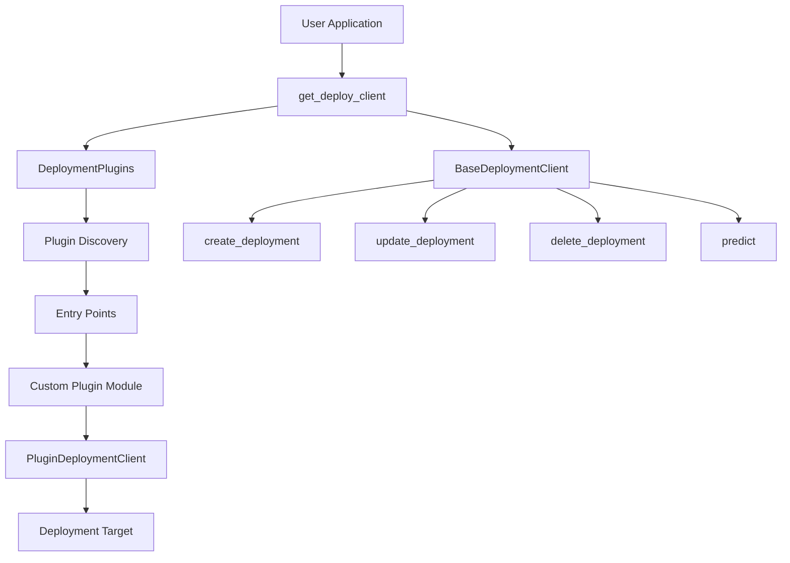
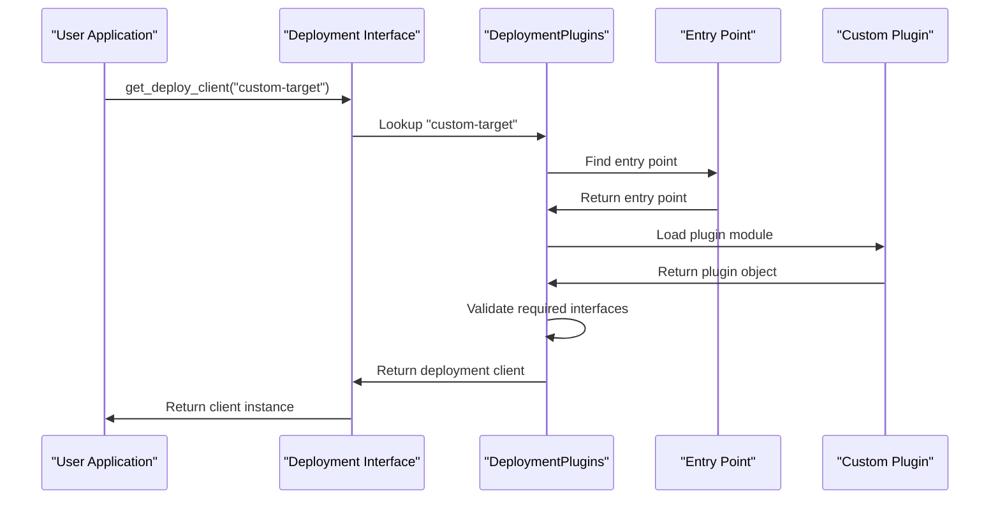
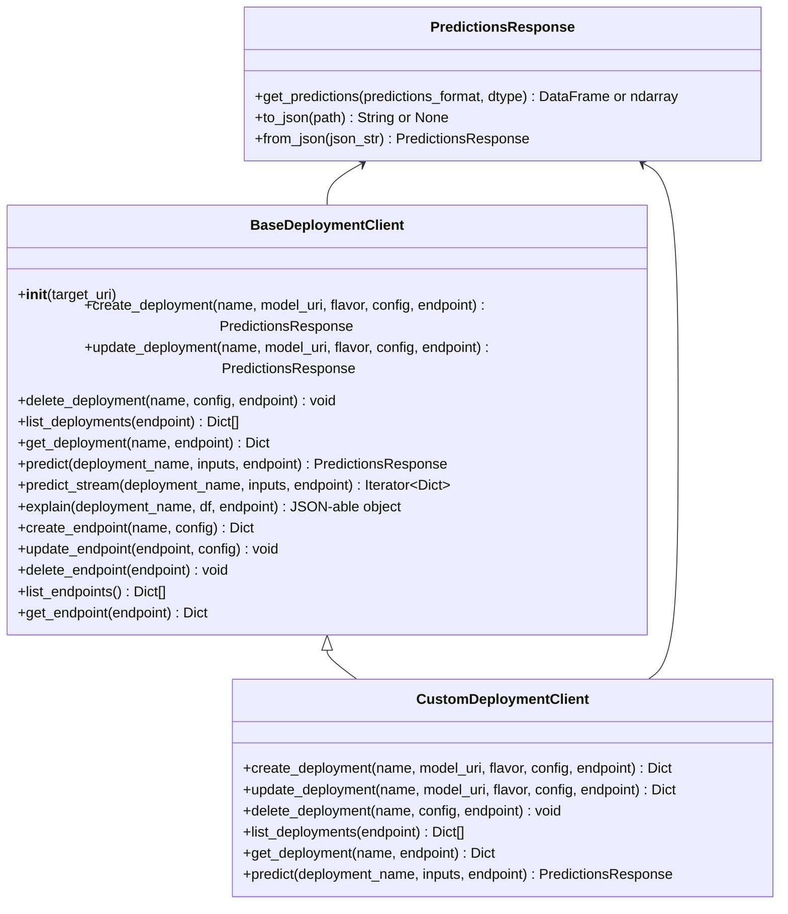
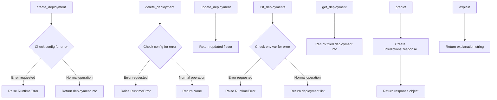
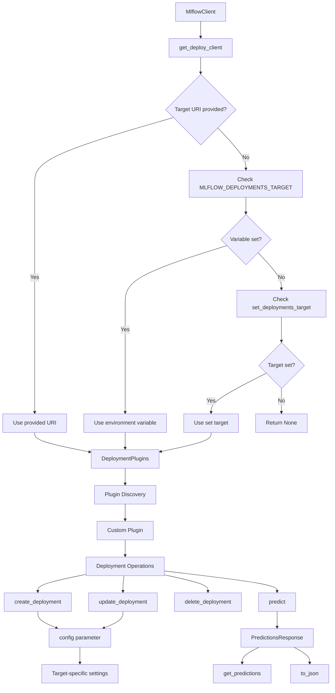
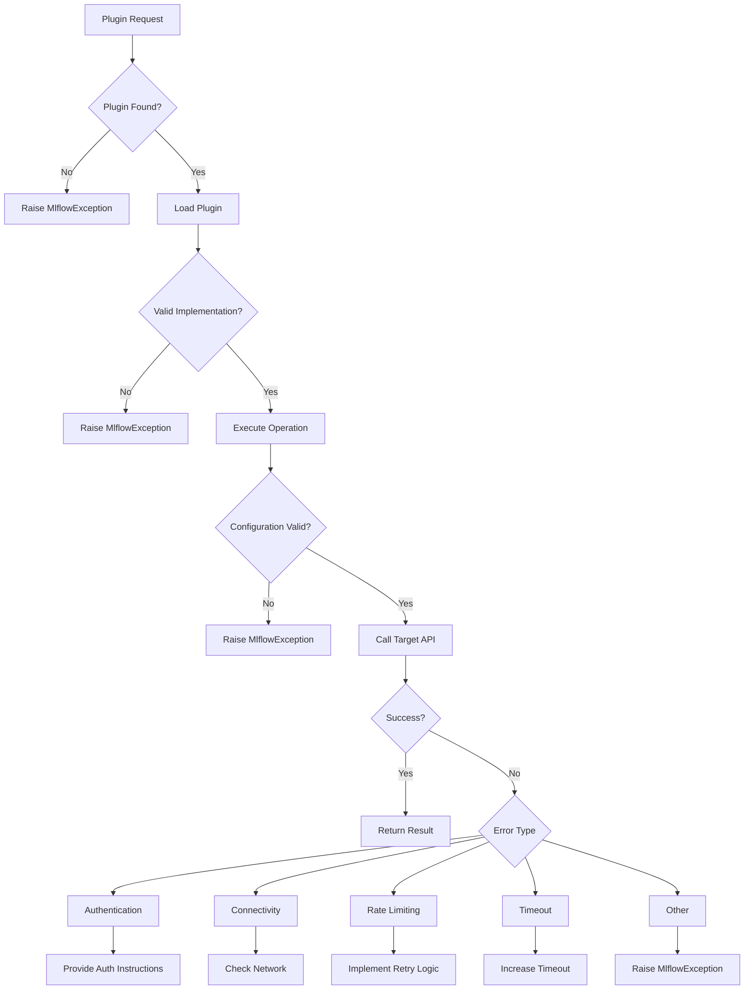
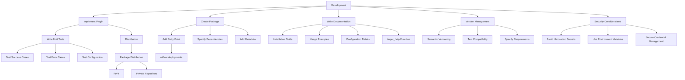

# Custom Deployment Plugins

<cite>
**Referenced Files in This Document**   
- [mlflow/deployments/__init__.py](file://mlflow/deployments/__init__.py)
- [mlflow/deployments/base.py](file://mlflow/deployments/base.py)
- [mlflow/deployments/interface.py](file://mlflow/deployments/interface.py)
- [mlflow/deployments/plugin_manager.py](file://mlflow/deployments/plugin_manager.py)
- [mlflow/deployments/utils.py](file://mlflow/deployments/utils.py)
- [mlflow/deployments/databricks/__init__.py](file://mlflow/deployments/databricks/__init__.py)
- [mlflow/deployments/mlflow/__init__.py](file://mlflow/deployments/mlflow/__init__.py)
- [mlflow/deployments/openai/__init__.py](file://mlflow/deployments/openai/__init__.py)
- [tests/resources/mlflow-test-plugin/mlflow_test_plugin/fake_deployment_plugin.py](file://tests/resources/mlflow-test-plugin/mlflow_test_plugin/fake_deployment_plugin.py)
</cite>

## Table of Contents
1. [Introduction](#introduction)
2. [Plugin Architecture Overview](#plugin-architecture-overview)
3. [Plugin Discovery and Loading Mechanism](#plugin-discovery-and-loading-mechanism)
4. [Required Interfaces for Custom Deployment Plugins](#required-interfaces-for-custom-deployment-plugins)
5. [Implementation Example](#implementation-example)
6. [Integration with MlflowClient and Configuration System](#integration-with-mlflowclient-and-configuration-system)
7. [Common Issues and Error Handling](#common-issues-and-error-handling)
8. [Best Practices for Testing and Distribution](#best-practices-for-testing-and-distribution)
9. [Conclusion](#conclusion)

## Introduction

MLflow provides a flexible plugin system that enables integration with arbitrary deployment targets through custom deployment plugins. This extensibility mechanism allows users to deploy MLflow models to various serving tools beyond the built-in support for AWS Sagemaker and Azure. The plugin architecture is designed to be modular and extensible, enabling third-party developers to implement support for custom deployment targets.

The deployment plugin system exposes functionality through a well-defined interface that includes methods for creating, updating, deleting, and predicting with deployments. This document provides comprehensive guidance on developing custom deployment plugins, covering the architecture, required interfaces, implementation patterns, and best practices for testing and distribution.

**Section sources**
- [mlflow/deployments/__init__.py](file://mlflow/deployments/__init__.py#L1-L120)

## Plugin Architecture Overview

The MLflow deployment plugin architecture is built around a plugin manager that discovers and loads custom deployment implementations through Python entry points. The core components of this architecture include the `DeploymentPlugins` class, which extends the abstract `PluginManager`, and the `BaseDeploymentClient` interface that defines the contract for deployment operations.

The architecture follows a modular design where each deployment target is implemented as a separate plugin module. These plugins are discovered at runtime through Python's entry point mechanism, specifically using the "mlflow.deployments" group name. When a user requests a deployment client for a specific target, the plugin manager loads the appropriate implementation and returns a client instance that exposes the standard deployment APIs.

The system is designed to be extensible while maintaining consistency across different deployment targets. All plugins must implement the same core interface, ensuring that users can interact with different deployment targets using a uniform API. This design allows MLflow to support a wide variety of deployment targets while providing a consistent user experience.

**Diagram sources **
- [mlflow/deployments/interface.py](file://mlflow/deployments/interface.py#L15-L64)
- [mlflow/deployments/plugin_manager.py](file://mlflow/deployments/plugin_manager.py#L81-L143)

**Section sources**
- [mlflow/deployments/plugin_manager.py](file://mlflow/deployments/plugin_manager.py#L20-L143)
- [mlflow/deployments/base.py](file://mlflow/deployments/base.py#L75-L359)

## Plugin Discovery and Loading Mechanism

The plugin discovery and loading mechanism in MLflow is implemented through the `DeploymentPlugins` class, which extends the abstract `PluginManager` class. This system leverages Python's entry point mechanism to automatically discover and register deployment plugins installed in the environment.

When the `DeploymentPlugins` class is instantiated, it automatically calls `register_entrypoints()` which scans for all packages that declare an entry point in the "mlflow.deployments" group. Each discovered entry point is registered in the plugin registry with its name as the key and the entry point object as the value. This registration process occurs during initialization, making plugins immediately available for use.

The plugin loading process is triggered when a user calls `get_deploy_client()` with a specific target URI. The method first parses the target URI to extract the target name, then looks up the corresponding plugin in the registry. If the plugin is found as an entry point, it is dynamically loaded using the `load()` method, which imports the module and instantiates the deployment client class. The loaded plugin is then cached in the registry for subsequent requests.

The system performs validation on loaded plugins to ensure they implement the required interfaces. Each plugin must provide both the `run_local` function and the `target_help` function, and must contain exactly one class that inherits from `BaseDeploymentClient`. This validation ensures that all plugins adhere to the expected contract and provide a consistent user experience.

**Diagram sources **
- [mlflow/deployments/interface.py](file://mlflow/deployments/interface.py#L15-L64)
- [mlflow/deployments/plugin_manager.py](file://mlflow/deployments/plugin_manager.py#L81-L143)

**Section sources**
- [mlflow/deployments/plugin_manager.py](file://mlflow/deployments/plugin_manager.py#L70-L143)
- [mlflow/deployments/interface.py](file://mlflow/deployments/interface.py#L15-L64)

## Required Interfaces for Custom Deployment Plugins

Custom deployment plugins must implement a specific set of interfaces to integrate with the MLflow deployment system. The primary interface is the `BaseDeploymentClient` class, which defines the core methods for deployment operations. Additionally, plugins must provide two top-level functions: `run_local` and `target_help`.

The `BaseDeploymentClient` class is an abstract base class that defines the following required methods:
- `create_deployment`: Creates a new deployment with the specified name and model URI
- `update_deployment`: Updates an existing deployment with a new model or configuration
- `delete_deployment`: Deletes a deployment by name
- `list_deployments`: Lists all deployments in the target
- `get_deployment`: Retrieves information about a specific deployment
- `predict`: Performs inference using the deployed model

In addition to the client class, plugins must implement two top-level functions:
- `run_local`: Deploys the model locally for testing purposes
- `target_help`: Returns a help message describing target-specific configuration options and URI format

Plugins may also implement optional methods such as `create_endpoint`, `update_endpoint`, `delete_endpoint`, and `list_endpoints` for targets that support endpoint management. The `predict_stream` method can be implemented for targets that support streaming responses, and the `explain` method can be implemented for targets that support model explanation capabilities.

All methods should raise `MlflowException` in error cases to ensure consistent error handling across different plugins. The return values should follow the expected formats, with `create_deployment` returning a dictionary containing the deployment name, and `predict` returning a `PredictionsResponse` object.

**Diagram sources **
- [mlflow/deployments/base.py](file://mlflow/deployments/base.py#L75-L359)
- [mlflow/deployments/__init__.py](file://mlflow/deployments/__init__.py#L34-L106)

**Section sources**
- [mlflow/deployments/base.py](file://mlflow/deployments/base.py#L18-L359)
- [mlflow/deployments/__init__.py](file://mlflow/deployments/__init__.py#L34-L106)

## Implementation Example

A concrete example of a custom deployment plugin implementation can be found in the test plugin provided with MLflow. The `PluginDeploymentClient` class demonstrates how to implement the required interfaces for a custom deployment target. This example shows a simplified implementation that could serve as a template for developing real-world deployment plugins.

The example implementation includes all required methods from the `BaseDeploymentClient` interface. The `create_deployment` method returns a dictionary with the deployment name and flavor, while respecting a configuration option to raise an error for testing purposes. The `delete_deployment` method similarly supports error simulation through configuration. The `update_deployment` method returns a dictionary with the updated flavor, and the `list_deployments` method returns a list containing the fake deployment name, with error simulation support through environment variables.

The `get_deployment` method returns a fixed dictionary with sample deployment information, and the `predict` method returns a `PredictionsResponse` object created from a JSON string containing sample predictions. The `explain` method returns a simple string response, demonstrating how model explanation capabilities can be implemented.

This example illustrates several important implementation patterns:
- Using configuration parameters to control behavior
- Implementing error handling and testing scenarios
- Returning properly formatted responses
- Following the expected method signatures and return types

When developing a real deployment plugin, developers would replace the mock implementations with actual integration code for their target deployment system, handling authentication, API calls, and response processing as needed.

**Diagram sources **
- [tests/resources/mlflow-test-plugin/mlflow_test_plugin/fake_deployment_plugin.py](file://tests/resources/mlflow-test-plugin/mlflow_test_plugin/fake_deployment_plugin.py#L9-L35)

**Section sources**
- [tests/resources/mlflow-test-plugin/mlflow_test_plugin/fake_deployment_plugin.py](file://tests/resources/mlflow-test-plugin/mlflow_test_plugin/fake_deployment_plugin.py#L1-L35)

## Integration with MlflowClient and Configuration System

Custom deployment plugins integrate seamlessly with the MLflow client and configuration system through several mechanisms. The `get_deploy_client` function serves as the primary entry point, allowing users to obtain a deployment client instance for a specific target. This function can accept a target URI directly or use a globally set target obtained from the `MLFLOW_DEPLOYMENTS_TARGET` environment variable or through the `set_deployments_target` function.

The configuration system supports target-specific configuration options through the `config` parameter in deployment operations. This dictionary can contain any target-specific settings required for the deployment, such as resource specifications, scaling parameters, or authentication details. The plugin implementation is responsible for interpreting these configuration options and applying them appropriately when interacting with the deployment target.

The `PredictionsResponse` class provides a standardized way to handle prediction results, allowing for consistent post-processing regardless of the underlying deployment target. This class supports conversion to different formats (dataframe or ndarray) and JSON serialization, making it easy to work with prediction results in various contexts.

The system also supports endpoint management for targets that provide this capability. Methods like `create_endpoint`, `update_endpoint`, and `list_endpoints` allow for managing deployment endpoints, which can be useful for organizing and scaling deployments. The endpoint parameter in deployment operations enables targeting specific endpoints within a deployment target.

Environment variables play a crucial role in configuration, with MLflow providing a mechanism to set the default deployments target and other configuration options. This allows for flexible configuration in different environments, from development to production.

**Diagram sources **
- [mlflow/deployments/interface.py](file://mlflow/deployments/interface.py#L15-L64)
- [mlflow/deployments/utils.py](file://mlflow/deployments/utils.py#L55-L86)

**Section sources**
- [mlflow/deployments/interface.py](file://mlflow/deployments/interface.py#L15-L64)
- [mlflow/deployments/utils.py](file://mlflow/deployments/utils.py#L55-L86)
- [mlflow/deployments/__init__.py](file://mlflow/deployments/__init__.py#L34-L106)

## Common Issues and Error Handling

Developing and using custom deployment plugins can present several common issues that require careful error handling. The MLflow deployment system provides a consistent error handling framework through the `MlflowException` class, which should be used by all plugins to report errors in a standardized way.

One common issue is plugin discovery failure, which occurs when a requested deployment target is not available. This is handled by the `DeploymentPlugins` class, which raises an `MlflowException` with a helpful message suggesting how to install the appropriate plugin. Developers should ensure their plugins are properly packaged with the correct entry point declaration to avoid this issue.

Configuration errors are another common problem, particularly when target-specific configuration options are missing or invalid. Plugins should validate configuration parameters and provide clear error messages that help users understand what went wrong. The use of the `config` parameter in deployment operations allows for flexible configuration, but also requires careful validation to prevent runtime errors.

Authentication and connectivity issues can occur when interacting with external deployment targets. Plugins should implement robust error handling for network failures, authentication errors, and rate limiting. The MLflow deployment system includes retry logic for certain HTTP status codes (429, 500, 502, 503), which helps handle transient issues with deployment targets.

Version compatibility is an important consideration, as changes to the deployment interface could break existing plugins. The use of the `@developer_stable` decorator on key classes indicates that the interface is intended to be stable, but developers should still test their plugins with different MLflow versions to ensure compatibility.

Resource limitations and timeout issues can occur during deployment operations, particularly for large models or high-traffic endpoints. Plugins should implement appropriate timeout handling and provide clear error messages when operations exceed time limits. The system provides configuration options for controlling request timeouts, which plugins should respect.

**Diagram sources **
- [mlflow/deployments/plugin_manager.py](file://mlflow/deployments/plugin_manager.py#L92-L98)
- [mlflow/deployments/constants.py](file://mlflow/deployments/constants.py#L6-L12)

**Section sources**
- [mlflow/deployments/plugin_manager.py](file://mlflow/deployments/plugin_manager.py#L92-L143)
- [mlflow/deployments/constants.py](file://mlflow/deployments/constants.py#L1-L14)

## Best Practices for Testing and Distribution

Developing robust custom deployment plugins requires following best practices for testing and distribution. These practices ensure that plugins are reliable, maintainable, and easy for users to install and use.

For testing, developers should create comprehensive unit tests that cover all methods of the deployment client. These tests should verify both successful operations and error conditions, including configuration validation, authentication failures, and network errors. The use of mock objects can help isolate the plugin code from external dependencies during testing. Integration tests should also be developed to verify the plugin works correctly with the actual deployment target in different configurations.

When distributing plugins, developers should package them as Python packages with proper metadata and dependencies. The package should declare the "mlflow.deployments" entry point in its setup configuration, pointing to the module containing the deployment client implementation. This allows MLflow to automatically discover and load the plugin when it is installed.

Documentation is crucial for plugin distribution. Developers should provide clear installation instructions, usage examples, and detailed descriptions of configuration options. The `target_help` function should return comprehensive documentation that explains the target-specific URI format and configuration parameters, helping users understand how to use the plugin effectively.

Versioning should follow semantic versioning principles, with clear communication about backward compatibility. Developers should test their plugins with multiple versions of MLflow to ensure compatibility and should specify MLflow version requirements in their package metadata.

For error handling, plugins should provide clear, actionable error messages that help users diagnose and resolve issues. The use of `MlflowException` with appropriate error codes ensures consistent error handling across different plugins and integration with MLflow's error reporting system.

Finally, developers should consider security implications, particularly when handling authentication credentials. Sensitive information should never be hardcoded in the plugin code, and mechanisms should be provided for securely managing credentials, such as environment variables or credential stores.

**Diagram sources **
- [tests/resources/mlflow-test-plugin/pyproject.toml](file://tests/resources/mlflow-test-plugin/pyproject.toml)
- [tests/resources/mlflow-test-plugin/mlflow_test_plugin/fake_deployment_plugin.py](file://tests/resources/mlflow-test-plugin/mlflow_test_plugin/fake_deployment_plugin.py)

**Section sources**
- [tests/resources/mlflow-test-plugin/pyproject.toml](file://tests/resources/mlflow-test-plugin/pyproject.toml)
- [tests/resources/mlflow-test-plugin/mlflow_test_plugin/fake_deployment_plugin.py](file://tests/resources/mlflow-test-plugin/mlflow_test_plugin/fake_deployment_plugin.py)

## Conclusion

The MLflow custom deployment plugin system provides a powerful and flexible mechanism for integrating with arbitrary deployment targets. By implementing the required interfaces and following the plugin architecture, developers can extend MLflow's deployment capabilities to support a wide variety of serving tools and platforms.

The plugin system is built on a robust foundation of plugin discovery through Python entry points, standardized interfaces through the `BaseDeploymentClient` class, and consistent error handling through `MlflowException`. This architecture ensures that custom deployment plugins integrate seamlessly with the MLflow ecosystem while providing a consistent user experience across different deployment targets.

Developers creating custom deployment plugins should focus on implementing the required methods, providing comprehensive documentation through the `target_help` function, and ensuring robust error handling. Following best practices for testing, distribution, and security will help create high-quality plugins that are reliable and easy for users to adopt.

The examples and patterns demonstrated in this document provide a solid foundation for developing custom deployment plugins. By leveraging the existing infrastructure and adhering to the established conventions, developers can create plugins that extend MLflow's capabilities while maintaining compatibility and usability.