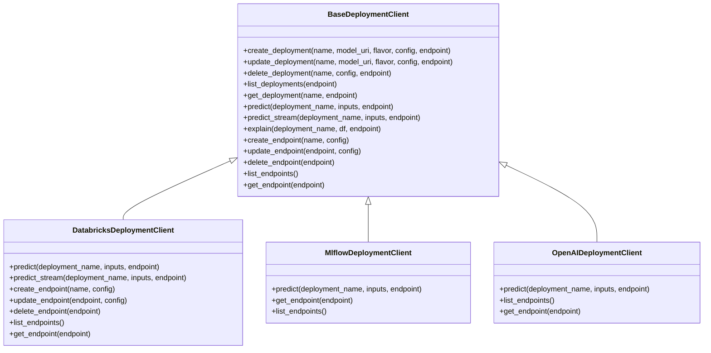
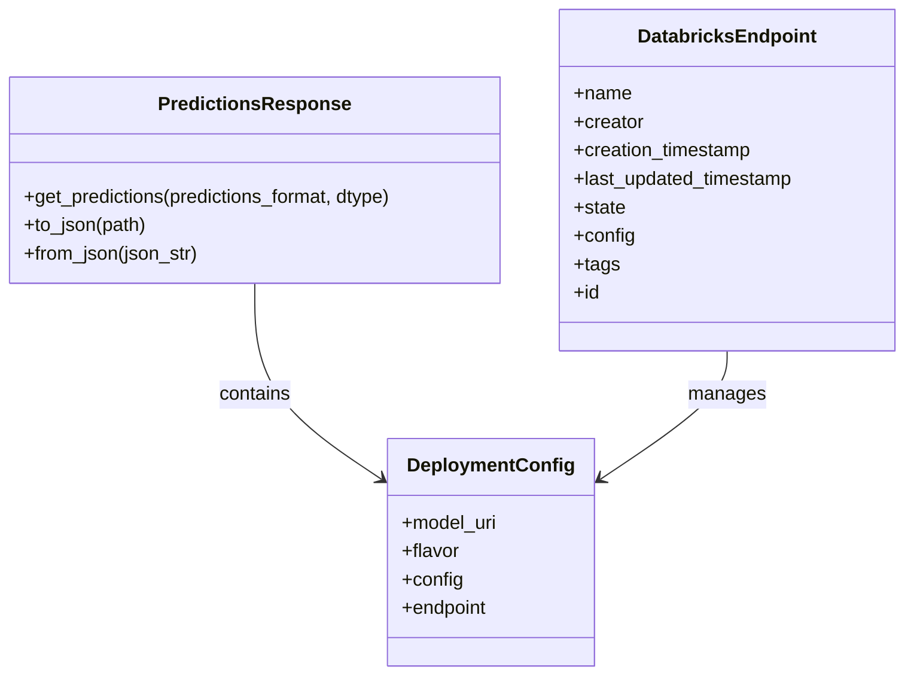
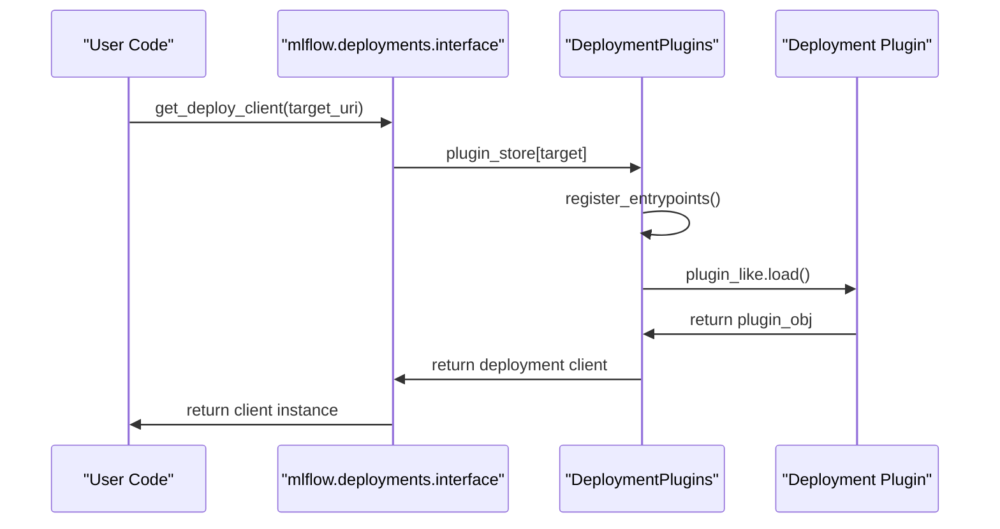

# Deployment Targets

<cite>
**Referenced Files in This Document**   
- [mlflow/deployments/__init__.py](file://mlflow/deployments/__init__.py)
- [mlflow/deployments/interface.py](file://mlflow/deployments/interface.py)
- [mlflow/deployments/base.py](file://mlflow/deployments/base.py)
- [mlflow/deployments/plugin_manager.py](file://mlflow/deployments/plugin_manager.py)
- [mlflow/deployments/utils.py](file://mlflow/deployments/utils.py)
- [mlflow/deployments/databricks/__init__.py](file://mlflow/deployments/databricks/__init__.py)
- [mlflow/deployments/mlflow/__init__.py](file://mlflow/deployments/mlflow/__init__.py)
- [mlflow/deployments/openai/__init__.py](file://mlflow/deployments/openai/__init__.py)
- [mlflow/client.py](file://mlflow/client.py)
</cite>

## Table of Contents
1. [Introduction](#introduction)
2. [Deployment Interface and Abstraction Layer](#deployment-interface-and-abstraction-layer)
3. [Domain Model](#domain-model)
4. [Plugin Architecture and Invocation](#plugin-architecture-and-invocation)
5. [Deployment Operations](#deployment-operations)
6. [Configuration and Error Handling](#configuration-and-error-handling)
7. [Integration with MLflow Components](#integration-with-mlflow-components)
8. [Conclusion](#conclusion)

## Introduction

MLflow provides a standardized interface for deploying machine learning models across various platforms through its deployment targets system. This abstraction layer enables consistent deployment operations regardless of the underlying platform, allowing users to create, update, delete, and predict using the same API across different backends. The system is designed to be extensible through plugins, supporting both built-in targets like Databricks and OpenAI, as well as third-party deployment platforms.

The deployment system integrates with MLflow's model registry and tracking components, enabling seamless model deployment from registered models. This document details the implementation of the deployment interface, the domain model, plugin architecture, and practical usage examples for deploying models to different targets.

**Section sources**
- [mlflow/deployments/__init__.py](file://mlflow/deployments/__init__.py#L1-L120)

## Deployment Interface and Abstraction Layer

The MLflow deployment system is built around a consistent interface that abstracts away platform-specific details, providing a uniform API for model deployment operations. The core of this abstraction is the `BaseDeploymentClient` class defined in `mlflow/deployments/base.py`, which establishes the contract for all deployment operations.

The primary entry point for the deployment system is the `get_deploy_client()` function from `mlflow/deployments/interface.py`, which returns a deployment client instance for a specified target. This function serves as a factory method that instantiates the appropriate client based on the target URI:

```python
from mlflow.deployments import get_deploy_client

# Get client for a specific target
client = get_deploy_client("databricks")
```

The deployment interface standardizes operations across all platforms with methods for:
- `create_deployment()`: Deploy a model to the specified target
- `update_deployment()`: Update an existing deployment with a new model
- `delete_deployment()`: Remove a deployment from the target
- `list_deployments()`: Retrieve all deployments on the target
- `get_deployment()`: Get details about a specific deployment
- `predict()`: Compute predictions using a deployed model

This abstraction allows users to write deployment code that works across different platforms without modification. The interface handles the translation of these standardized operations to platform-specific API calls, ensuring consistency in the user experience regardless of the deployment target.



**Diagram sources**
- [mlflow/deployments/base.py](file://mlflow/deployments/base.py#L76-L359)
- [mlflow/deployments/databricks/__init__.py](file://mlflow/deployments/databricks/__init__.py#L48-L852)
- [mlflow/deployments/mlflow/__init__.py](file://mlflow/deployments/mlflow/__init__.py#L30-L332)
- [mlflow/deployments/openai/__init__.py](file://mlflow/deployments/openai/__init__.py#L14-L253)

**Section sources**
- [mlflow/deployments/interface.py](file://mlflow/deployments/interface.py#L15-L84)
- [mlflow/deployments/base.py](file://mlflow/deployments/base.py#L76-L359)

## Domain Model

The MLflow deployment system defines a clear domain model that represents the key entities and their relationships in the deployment process. The primary components of this model include the `PredictionsResponse` class, deployment configuration objects, and endpoint representations.

The `PredictionsResponse` class, defined in `mlflow/deployments/__init__.py`, encapsulates the response from a prediction request, providing methods to access predictions in different formats:

```python
class PredictionsResponse(dict):
    def get_predictions(self, predictions_format="dataframe", dtype=None):
        """Get the predictions returned from the MLflow Model Server in the specified format."""
    
    def to_json(self, path=None):
        """Get the JSON representation of the MLflow Predictions Response."""
    
    @classmethod
    def from_json(cls, json_str):
        """Create a PredictionsResponse from a JSON string."""
```

For Databricks deployments, the `DatabricksEndpoint` class represents a serving endpoint as a dictionary-like object with attributes such as name, creator, creation timestamp, state, and configuration. This class provides a consistent way to interact with endpoint metadata regardless of the underlying API response format.

The deployment configuration model varies by target but generally includes:
- Model URI: Location of the model to deploy (e.g., "runs:/run_id/artifact_path")
- Flavor: Specific model flavor to deploy (e.g., pyfunc, sklearn)
- Configuration: Target-specific parameters for the deployment
- Endpoint: Optional endpoint name for deployments that support endpoints

The domain model also includes error handling mechanisms through the `MlflowException` class, which is used to represent deployment-related errors consistently across different platforms. This ensures that error conditions are handled uniformly, regardless of the underlying deployment target.



**Diagram sources**
- [mlflow/deployments/__init__.py](file://mlflow/deployments/__init__.py#L34-L106)
- [mlflow/deployments/databricks/__init__.py](file://mlflow/deployments/databricks/__init__.py#L26-L45)

**Section sources**
- [mlflow/deployments/__init__.py](file://mlflow/deployments/__init__.py#L34-L106)
- [mlflow/deployments/databricks/__init__.py](file://mlflow/deployments/databricks/__init__.py#L26-L45)

## Plugin Architecture and Invocation

The MLflow deployment system is built on a plugin architecture that enables extensibility to various deployment targets. The core of this architecture is the `DeploymentPlugins` class in `mlflow/deployments/plugin_manager.py`, which manages the registration and loading of deployment plugins.

The plugin system works through Python entry points defined in the `setup.py` or `pyproject.toml` of deployment plugin packages. These entry points are registered under the `mlflow.deployments` group, allowing MLflow to discover and load available deployment targets dynamically:



The `get_deploy_client()` function follows this invocation chain:
1. Parse the target URI to extract the target name
2. Look up the plugin in the `DeploymentPlugins` registry
3. Load the plugin module if not already loaded
4. Validate that the plugin implements required interfaces
5. Instantiate and return the appropriate `BaseDeploymentClient` subclass

The plugin manager performs validation to ensure that each plugin implements the required interfaces:
- A `run_local()` function for testing deployments locally
- A `target_help()` function for providing target-specific documentation
- Exactly one subclass of `BaseDeploymentClient` for the actual deployment operations

This architecture allows third-party developers to create deployment plugins for new platforms by implementing these interfaces and registering their plugin via Python entry points. The system automatically discovers and loads these plugins, making them available through the standard deployment API.

**Diagram sources**
- [mlflow/deployments/plugin_manager.py](file://mlflow/deployments/plugin_manager.py#L20-L144)
- [mlflow/deployments/interface.py](file://mlflow/deployments/interface.py#L15-L65)

**Section sources**
- [mlflow/deployments/plugin_manager.py](file://mlflow/deployments/plugin_manager.py#L20-L144)
- [mlflow/deployments/interface.py](file://mlflow/deployments/interface.py#L15-L65)

## Deployment Operations

The MLflow deployment system provides a comprehensive set of operations for managing model deployments across different platforms. While the core interface defines standard operations, the actual implementation varies by deployment target, with some targets supporting a subset of operations.

### Databricks Deployment Operations

The Databricks deployment client focuses on endpoint-based operations rather than individual deployments. Key operations include:

- **Endpoint Management**: Create, update, and delete serving endpoints
- **Prediction**: Query deployed models through endpoints
- **Streaming Prediction**: Receive streaming responses from LLM endpoints
- **Endpoint Configuration**: Update endpoint configuration, tags, and rate limits

```python
client = get_deploy_client("databricks")

# Create an endpoint for an external model
endpoint = client.create_endpoint(
    config={
        "name": "chat",
        "config": {
            "served_entities": [
                {
                    "external_model": {
                        "name": "gpt-4",
                        "provider": "openai",
                        "task": "llm/v1/chat",
                        "openai_config": {
                            "openai_api_key": "{{secrets/scope/key}}"
                        }
                    }
                }
            ]
        }
    }
)

# Query the endpoint
response = client.predict(
    endpoint="chat",
    inputs={"messages": [{"role": "user", "content": "Hello!"}]}
)
```

### MLflow AI Gateway Operations

The MLflow deployment client interacts with the MLflow AI Gateway, providing operations for:

- **Endpoint Management**: List and retrieve configured endpoints
- **Prediction**: Submit queries to configured provider endpoints
- **Configuration**: Access endpoint configuration and routing information

```python
client = get_deploy_client("http://localhost:5000")

# List available endpoints
endpoints = client.list_endpoints()

# Get details about a specific endpoint
endpoint = client.get_endpoint("chat")

# Make predictions
response = client.predict(
    endpoint="chat",
    inputs={"messages": [{"role": "user", "content": "Hello!"}]}
)
```

### OpenAI Operations

The OpenAI deployment client provides direct access to OpenAI endpoints:

- **Prediction**: Query OpenAI models directly
- **Model Discovery**: List available OpenAI models
- **Model Information**: Retrieve details about specific models

```python
client = get_deploy_client("openai")

# List available models
models = client.list_endpoints()

# Query a specific model
response = client.predict(
    endpoint="gpt-4o-mini",
    inputs={"messages": [{"role": "user", "content": "Hello!"}]}
)
```

Each deployment target implements only the operations that make sense for its platform, while maintaining a consistent interface for the operations it does support.

**Section sources**
- [mlflow/deployments/databricks/__init__.py](file://mlflow/deployments/databricks/__init__.py#L353-L777)
- [mlflow/deployments/mlflow/__init__.py](file://mlflow/deployments/mlflow/__init__.py#L143-L324)
- [mlflow/deployments/openai/__init__.py](file://mlflow/deployments/openai/__init__.py#L88-L209)

## Configuration and Error Handling

The MLflow deployment system includes robust configuration management and error handling mechanisms to ensure reliable deployment operations across different platforms.

### Configuration Management

Configuration is handled through the `config` parameter in deployment operations, which accepts a dictionary of target-specific configuration options. The system provides utilities for parsing and validating configuration:

- **Target URI Parsing**: The `parse_target_uri()` function in `mlflow/deployments/utils.py` extracts the target name from the URI
- **Configuration Validation**: Each deployment plugin validates its configuration options and raises appropriate errors for invalid configurations
- **Environment Variables**: Configuration can be overridden using environment variables like `MLFLOW_DEPLOYMENTS_TARGET`

The system also supports setting a default deployment target through the `set_deployments_target()` function, which allows users to avoid specifying the target URI for every operation:

```python
from mlflow.deployments import set_deployments_target, get_deploy_client

# Set default target
set_deployments_target("databricks")

# Get client without specifying target
client = get_deploy_client()
```

### Error Handling

The deployment system uses consistent error handling through the `MlflowException` class, with specific error codes for different failure modes:

- **Configuration Errors**: Invalid parameter values or missing required configuration
- **Connection Errors**: Issues connecting to the deployment target
- **Deployment Conflicts**: Attempts to create deployments that already exist
- **Permission Errors**: Insufficient permissions to perform operations

The system also implements retry logic for transient errors, with retryable error codes defined in `mlflow/deployments/constants.py`:

```python
MLFLOW_DEPLOYMENT_CLIENT_REQUEST_RETRY_CODES = frozenset([
    429,  # Too many requests
    500,  # Server Error
    502,  # Bad Gateway
    503,  # Service Unavailable
])
```

Error messages are designed to be informative and actionable, guiding users toward resolving configuration issues or connectivity problems. For example, when no deployment target is set, the system provides clear instructions on how to configure the target:

```python
try:
    target_uri = get_deployments_target()
except MlflowException:
    _logger.info(
        "No deployments target has been set. Please either set the MLflow deployments "
        "target via `mlflow.deployments.set_deployments_target()` or set the environment "
        "variable MLFLOW_DEPLOYMENTS_TARGET to the running deployment server's uri"
    )
```

This comprehensive error handling ensures that users receive meaningful feedback when deployment operations fail, facilitating troubleshooting and resolution.

**Section sources**
- [mlflow/deployments/utils.py](file://mlflow/deployments/utils.py#L11-L87)
- [mlflow/deployments/constants.py](file://mlflow/deployments/constants.py#L6-L13)
- [mlflow/deployments/interface.py](file://mlflow/deployments/interface.py#L49-L58)

## Integration with MLflow Components

The deployment system integrates closely with other MLflow components, particularly the model registry and tracking system, enabling a seamless workflow from model development to deployment.

### Model Registry Integration

The deployment system can deploy models directly from the MLflow model registry using the "models:/" URI scheme:

```python
# Deploy a specific version of a registered model
client.create_deployment(
    name="my-model",
    model_uri="models:/my-model/production"
)

# Deploy the latest version with a specific stage
client.create_deployment(
    name="my-model",
    model_uri="models:/my-model/staging"
)
```

This integration allows teams to implement deployment workflows that promote models through different stages (e.g., staging to production) by updating the deployment to point to the appropriate model version.

### Tracking System Integration

The deployment system leverages the MLflow tracking system to locate model artifacts for deployment. When using "runs:/" URIs, the system retrieves model artifacts from the tracking server:

```python
# Deploy a model from a specific run
client.create_deployment(
    name="my-model",
    model_uri="runs:/abc123/model"
)
```

This integration ensures that deployed models are traceable back to their source experiments, maintaining the lineage from training to deployment.

### Client Integration

The deployment system is accessible through both the high-level `mlflow.deployments` interface and the `MlflowClient` class, providing flexibility for different use cases:

```python
# Using the deployments interface
from mlflow.deployments import get_deploy_client
client = get_deploy_client("databricks")

# Using the MlflowClient
from mlflow import MlflowClient
client = MlflowClient()
# Note: MlflowClient doesn't directly expose deployment operations
# but can be used in conjunction with deployment clients
```

The integration with the broader MLflow ecosystem enables comprehensive model lifecycle management, from experiment tracking and model registration to deployment and monitoring. This unified approach reduces the complexity of managing machine learning models in production environments.

**Section sources**
- [mlflow/deployments/interface.py](file://mlflow/deployments/interface.py#L37-L47)
- [mlflow/client.py](file://mlflow/client.py#L8-L12)

## Conclusion

The MLflow deployment targets system provides a powerful abstraction layer that standardizes model deployment operations across different platforms. By defining a consistent interface through the `BaseDeploymentClient` class and implementing it for various targets, MLflow enables users to deploy models using the same API regardless of the underlying platform.

The plugin architecture allows for extensibility to new deployment targets while maintaining compatibility with the core interface. This design enables both built-in support for popular platforms like Databricks and OpenAI, as well as community-developed plugins for other targets.

Key features of the system include:
- Standardized operations for create, update, delete, and predict
- Consistent domain model with `PredictionsResponse` and configuration objects
- Flexible plugin architecture with automatic discovery and loading
- Robust configuration management and error handling
- Deep integration with MLflow's model registry and tracking system

The system's design prioritizes usability and consistency, allowing data scientists and machine learning engineers to focus on their models rather than the intricacies of different deployment platforms. By providing a unified interface for model deployment, MLflow reduces the complexity of operationalizing machine learning models in production environments.