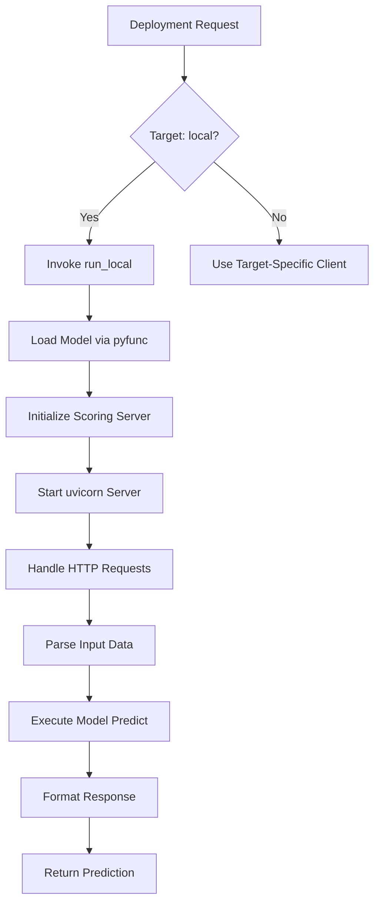
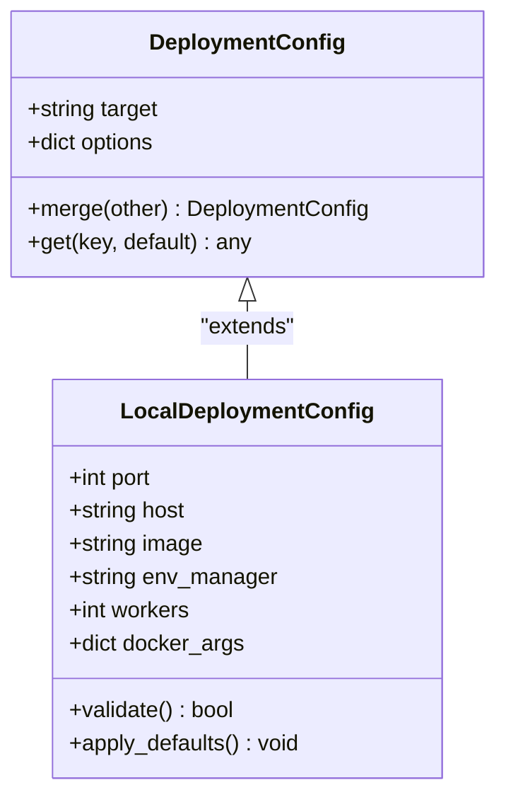
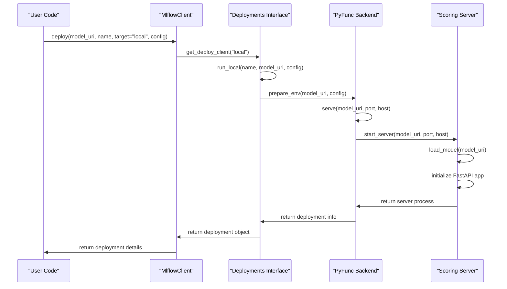
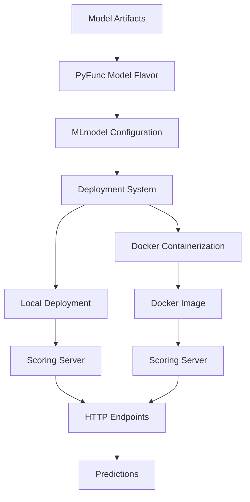

# Local Deployment

<cite>
**Referenced Files in This Document**   
- [mlflow/deployments/base.py](file://mlflow/deployments/base.py)
- [mlflow/deployments/interface.py](file://mlflow/deployments/interface.py)
- [mlflow/deployments/utils.py](file://mlflow/deployments/utils.py)
- [mlflow/pyfunc/__init__.py](file://mlflow/pyfunc/__init__.py)
- [mlflow/pyfunc/backend.py](file://mlflow/pyfunc/backend.py)
- [mlflow/pyfunc/scoring_server/__init__.py](file://mlflow/pyfunc/scoring_server/__init__.py)
- [mlflow/pyfunc/scoring_server/app.py](file://mlflow/pyfunc/scoring_server/app.py)
</cite>

## Table of Contents
1. [Introduction](#introduction)
2. [Local Deployment Backend Implementation](#local-deployment-backend-implementation)
3. [Configuration Options for Local Deployments](#configuration-options-for-local-deployments)
4. [Deploying Models Locally Using MlflowClient.deploy()](#deploying-models-locally-using-mlflowclientdeploy)
5. [Relationships with PyFunc Model Flavor and Containerization](#relationships-with-pyfunc-model-flavor-and-containerization)
6. [Common Issues in Local Environments](#common-issues-in-local-environments)
7. [Troubleshooting Guidance](#troubleshooting-guidance)
8. [Conclusion](#conclusion)

## Introduction
MLflow provides built-in capabilities for deploying machine learning models directly on the local machine or within local Docker containers. This local deployment functionality enables developers and data scientists to test models in a production-like environment before deploying to cloud platforms or production servers. The system leverages MLflow's deployment plugins architecture, with the 'local' target allowing for straightforward testing and development workflows. This document explores the implementation details of the local deployment backend, configuration options, practical usage patterns, and troubleshooting strategies for common issues encountered during local deployment operations.

## Local Deployment Backend Implementation

The local deployment backend in MLflow is implemented through the deployment plugins system, which provides a standardized interface for deploying models across different targets. The core implementation resides in the `mlflow.deployments` module, which defines the base classes and interfaces that all deployment plugins must implement.

The `BaseDeploymentClient` class serves as the foundation for all deployment clients, defining abstract methods for creating, updating, deleting, and listing deployments. For local deployments, the system uses the `run_local` function from the deployment interface, which is specifically designed for testing deployments in a local environment. This function is available through the `mlflow.deployments` module and can be invoked directly or through the MLflow client API.

When deploying locally, MLflow leverages the pyfunc model flavor as the default interface for model serving. The pyfunc flavor provides a unified API for loading and scoring models regardless of the underlying framework. The scoring server implementation in `mlflow.pyfunc.scoring_server` handles HTTP requests and model inference, exposing endpoints for health checks, version information, and model invocations.

The scoring server is implemented using FastAPI and uvicorn, providing a robust and performant HTTP server for model serving. It initializes by loading the specified model and setting up the necessary environment variables. The server exposes three primary endpoints:
- `/ping` and `/health` for health checks
- `/version` for retrieving the MLflow version
- `/invocations` for performing model inference



**Diagram sources**
- [mlflow/deployments/interface.py](file://mlflow/deployments/interface.py#L67-L83)
- [mlflow/pyfunc/scoring_server/__init__.py](file://mlflow/pyfunc/scoring_server/__init__.py#L572-L574)

**Section sources**
- [mlflow/deployments/base.py](file://mlflow/deployments/base.py#L18-L45)
- [mlflow/deployments/interface.py](file://mlflow/deployments/interface.py#L67-L83)

## Configuration Options for Local Deployments

Local deployments in MLflow support various configuration options that allow users to customize the deployment environment and behavior. These configuration options are passed as a dictionary to the deployment functions and can include settings for port assignment, environment isolation, and resource constraints.

The primary configuration options for local deployments include:

- **Port**: Specifies the port number on which the scoring server will listen. If not specified, the system will attempt to find an available port.
- **Host**: Specifies the host interface to bind the server to. By default, this is set to localhost (127.0.0.1).
- **Image**: When deploying with Docker, specifies the base image to use for the container.
- **Environment Manager**: Specifies the environment management system to use (conda, virtualenv, or local).
- **Workers**: Specifies the number of worker processes for handling requests in parallel.

The configuration is passed as a dictionary to the `run_local` function or through the `config` parameter in the `create_deployment` method when using the 'local' target. The system validates these configuration options and applies them during the deployment process.

For Docker-based local deployments, additional configuration options are available, including container name, memory limits, and CPU constraints. These options are passed through the deployment configuration and used when building and running the Docker container.



**Diagram sources**
- [mlflow/deployments/interface.py](file://mlflow/deployments/interface.py#L67-L83)
- [mlflow/pyfunc/backend.py](file://mlflow/pyfunc/backend.py#L67-L306)

**Section sources**
- [mlflow/deployments/interface.py](file://mlflow/deployments/interface.py#L67-L83)
- [mlflow/pyfunc/backend.py](file://mlflow/pyfunc/backend.py#L67-L306)

## Deploying Models Locally Using MlflowClient.deploy()

Deploying models locally using the MlflowClient.deploy() API with the 'local' target follows a straightforward pattern. The process begins by creating an instance of the MlflowClient and specifying the 'local' target for deployment. The client then uses the deployment plugins system to route the deployment request to the appropriate handler for local deployments.

The deployment process involves several key steps:
1. Resolving the model URI to locate the model artifacts
2. Validating the deployment configuration
3. Setting up the execution environment (conda, virtualenv, or local)
4. Starting the scoring server with the specified configuration
5. Returning a deployment object with connection details

The MlflowClient.deploy() method provides a high-level interface for deployment operations, abstracting away the complexities of the underlying implementation. When using the 'local' target, the method delegates to the `run_local` function in the deployment interface, which handles the specifics of local deployment.

Here's an example of deploying a model locally using the MlflowClient API:

```python
from mlflow.client import MlflowClient

client = MlflowClient()
deployment = client.deploy(
    model_uri="runs:/<run_id>/model",
    name="my-local-model",
    target="local",
    config={
        "port": 5001,
        "host": "127.0.0.1",
        "env_manager": "conda"
    }
)
```

The deployment object returned by the deploy() method contains information about the deployed model, including the URL endpoint for making predictions. This allows for immediate testing and validation of the deployed model.



**Diagram sources**
- [mlflow/client.py](file://mlflow/client.py#L8-L12)
- [mlflow/deployments/interface.py](file://mlflow/deployments/interface.py#L67-L83)
- [mlflow/pyfunc/backend.py](file://mlflow/pyfunc/backend.py#L229-L327)

**Section sources**
- [mlflow/client.py](file://mlflow/client.py#L8-L12)
- [mlflow/deployments/interface.py](file://mlflow/deployments/interface.py#L67-L83)

## Relationships with PyFunc Model Flavor and Containerization

The local deployment system in MLflow is closely integrated with the pyfunc model flavor and containerization capabilities. The pyfunc flavor serves as the default interface for model serving, providing a consistent API across different machine learning frameworks. When a model is deployed locally, MLflow uses the pyfunc flavor to load and serve the model, regardless of the original framework used to train the model.

The pyfunc model flavor defines a standard directory structure and configuration format that includes the model artifacts, code dependencies, and environment specifications. This structure ensures that models are self-contained and can be deployed consistently across different environments. The MLmodel file in the model directory specifies the loader module, data path, code path, and environment configuration, which are used during the deployment process.

For containerized deployments, MLflow can build Docker images that encapsulate the model and its dependencies. The containerization system uses the model's environment configuration to create a reproducible execution environment. When deploying locally with Docker, MLflow generates a Dockerfile that installs the required dependencies and sets up the scoring server.

The relationship between these components can be summarized as follows:
- The pyfunc flavor provides the model interface and loading mechanism
- The deployment system manages the deployment lifecycle (create, update, delete)
- The containerization system packages the model and dependencies for consistent execution
- The scoring server handles HTTP requests and model inference

This architecture enables seamless transitions between local testing and production deployment, as the same model package can be deployed locally for testing and then deployed to cloud platforms for production use.



**Diagram sources**
- [mlflow/pyfunc/__init__.py](file://mlflow/pyfunc/__init__.py#L1-L188)
- [mlflow/pyfunc/backend.py](file://mlflow/pyfunc/backend.py#L67-L306)
- [mlflow/pyfunc/scoring_server/__init__.py](file://mlflow/pyfunc/scoring_server/__init__.py#L1-L604)

**Section sources**
- [mlflow/pyfunc/__init__.py](file://mlflow/pyfunc/__init__.py#L1-L188)
- [mlflow/pyfunc/backend.py](file://mlflow/pyfunc/backend.py#L67-L306)

## Common Issues in Local Environments

Local deployment operations in MLflow can encounter several common issues related to dependency conflicts, port availability, and performance limitations. Understanding these issues and their solutions is crucial for successful local model deployment.

**Dependency Conflicts**: One of the most common issues is dependency conflicts between the model's required packages and the local environment. This can occur when the model was trained in an environment with specific package versions that differ from those in the local environment. MLflow addresses this through environment management using conda or virtualenv, but conflicts can still arise when system-level dependencies differ.

**Port Availability**: Port conflicts occur when the specified port is already in use by another process. The scoring server attempts to bind to the specified port, and if it's unavailable, the deployment will fail. This is particularly common when running multiple local deployments or when other services are using common ports like 5000 or 8080.

**Performance Limitations**: Local environments often have limited computational resources compared to production servers. This can lead to performance issues when serving models that require significant memory or processing power. Large models or models with high inference latency may perform poorly in local environments.

**Environment Isolation**: Inadequate environment isolation can lead to unexpected behavior when deploying models. If the local environment has packages installed that conflict with the model's requirements, the model may behave differently than expected.

**File Path Issues**: Cross-platform file path differences can cause issues when deploying models created on different operating systems. This is particularly relevant when using Windows hosts, as path separators and drive letters can cause problems.

These issues can be mitigated through proper configuration and environment management practices, such as using isolated environments, checking port availability before deployment, and monitoring resource usage during inference.

**Section sources**
- [mlflow/pyfunc/backend.py](file://mlflow/pyfunc/backend.py#L108-L165)
- [mlflow/pyfunc/scoring_server/__init__.py](file://mlflow/pyfunc/scoring_server/__init__.py#L572-L574)

## Troubleshooting Guidance

When encountering issues during local deployment operations, several troubleshooting strategies can help identify and resolve problems. The following guidance addresses common error scenarios and their solutions.

**Dependency Resolution Errors**: When dependency conflicts occur, verify that the environment manager specified in the deployment configuration matches the environment type used when the model was saved. Check the conda.yaml or python_env.yaml file in the model directory to ensure compatibility with the local environment. If using conda, ensure that conda is properly installed and accessible in the system PATH.

**Port Conflicts**: To resolve port conflicts, either specify an alternative port in the deployment configuration or identify and terminate the process using the desired port. Use system tools like `netstat` (Linux/Mac) or `Get-NetTCPConnection` (PowerShell) to check port availability. Alternatively, configure the deployment to use a random available port by omitting the port specification.

**Model Loading Failures**: If the model fails to load, verify that the model URI is correct and accessible. Check the model directory structure to ensure all required files are present. Examine the MLmodel file to confirm the loader module and data paths are correctly specified. Enable verbose logging to capture detailed error messages during the loading process.

**Performance Issues**: For performance problems, monitor system resource usage during inference to identify bottlenecks. Consider reducing the number of worker processes if memory is limited, or increase the timeout settings if inference is slow. For large models, ensure sufficient memory is available and consider using a machine with more resources.

**Environment Issues**: When encountering environment-related problems, ensure that the Python version in the local environment matches the version specified in the model configuration. Verify that all required system dependencies (like Java for certain model flavors) are installed and accessible. Use isolated environments to prevent conflicts with globally installed packages.

**Debugging Tips**:
- Enable verbose logging by setting the MLFLOW_VERBOSITY environment variable
- Use the `mlflow models serve` command with the `--debug` flag for detailed output
- Check the scoring server logs for error messages and stack traces
- Validate the model locally using `mlflow.pyfunc.load_model()` before deployment
- Test the model with sample data to ensure it works outside the deployment context

**Section sources**
- [mlflow/pyfunc/backend.py](file://mlflow/pyfunc/backend.py#L108-L165)
- [mlflow/pyfunc/scoring_server/__init__.py](file://mlflow/pyfunc/scoring_server/__init__.py#L278-L297)
- [tests/helper_functions.py](file://tests/helper_functions.py#L272-L302)

## Conclusion
Local model deployment in MLflow provides a powerful and flexible way to test and validate models in a production-like environment. The system's integration with the pyfunc model flavor and containerization capabilities enables consistent deployment workflows from development to production. By understanding the implementation details, configuration options, and common issues, users can effectively leverage MLflow's local deployment features for model testing and validation. The comprehensive troubleshooting guidance helps resolve common problems, ensuring smooth deployment operations. As MLflow continues to evolve, these local deployment capabilities will remain a critical component of the model development and deployment lifecycle.