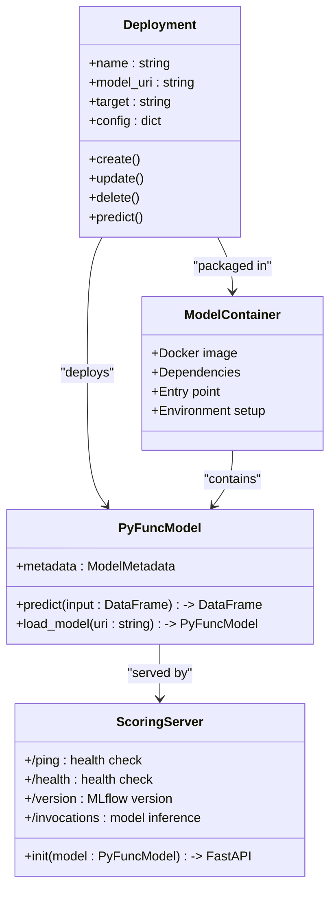
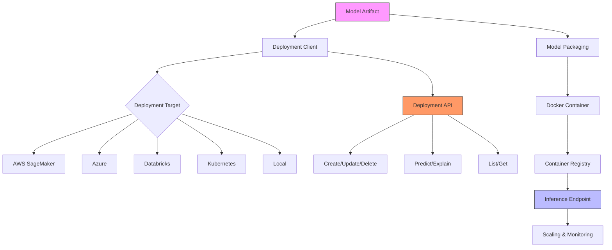
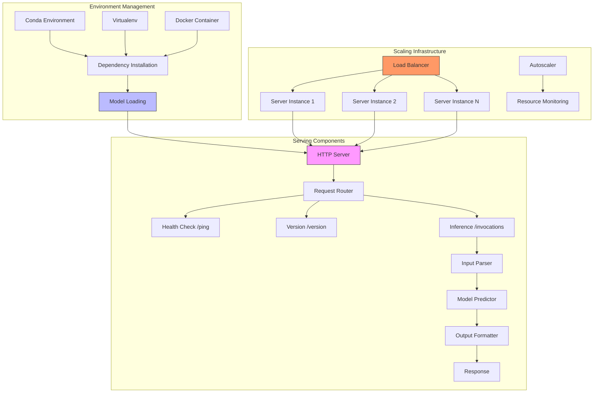
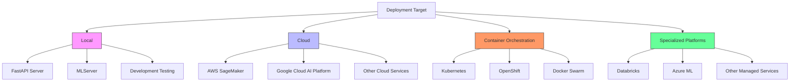
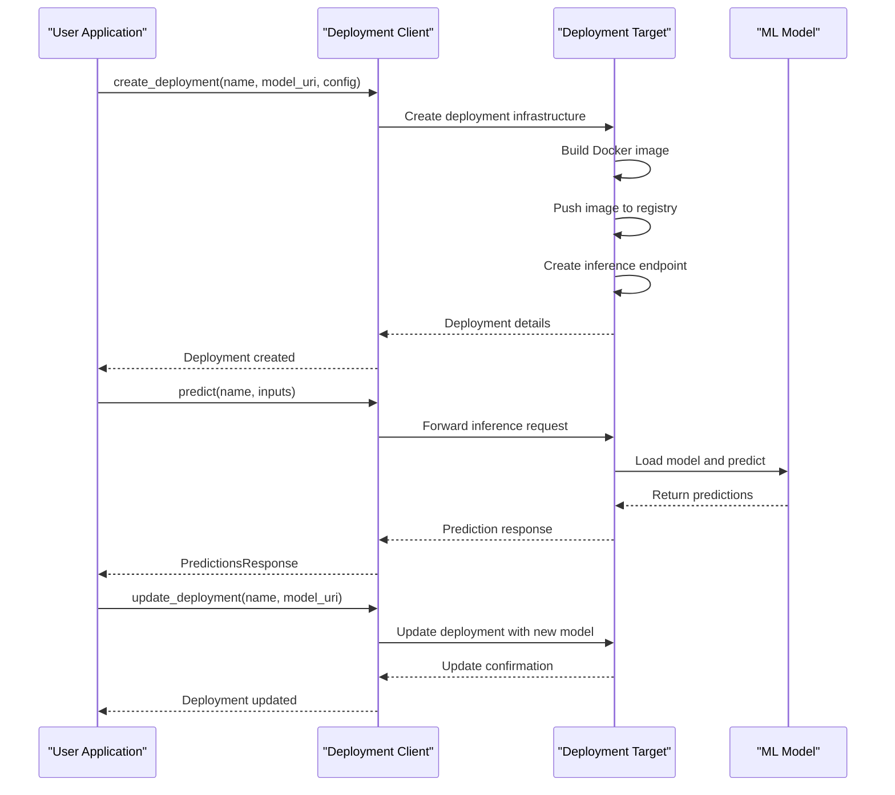
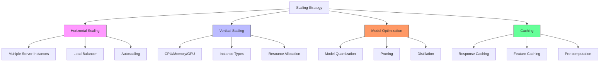

# Model Deployment

<cite>
**Referenced Files in This Document**   
- [mlflow/deployments/__init__.py](file://mlflow/deployments/__init__.py)
- [mlflow/deployments/interface.py](file://mlflow/deployments/interface.py)
- [mlflow/deployments/base.py](file://mlflow/deployments/base.py)
- [mlflow/pyfunc/__init__.py](file://mlflow/pyfunc/__init__.py)
- [mlflow/pyfunc/scoring_server/__init__.py](file://mlflow/pyfunc/scoring_server/__init__.py)
- [mlflow/pyfunc/backend.py](file://mlflow/pyfunc/backend.py)
- [mlflow/models/container/__init__.py](file://mlflow/models/container/__init__.py)
- [mlflow/sagemaker/__init__.py](file://mlflow/sagemaker/__init__.py)
- [docs/docs/classic-ml/deployment/index.mdx](file://docs/docs/classic-ml/deployment/index.mdx)
- [docs/docs/classic-ml/deployment/deploy-model-to-sagemaker/index.mdx](file://docs/docs/classic-ml/deployment/deploy-model-to-sagemaker/index.mdx)
- [docs/docs/classic-ml/deployment/deploy-model-to-kubernetes/index.mdx](file://docs/docs/classic-ml/deployment/deploy-model-to-kubernetes/index.mdx)
- [docs/docs/genai/serving/index.mdx](file://docs/docs/genai/serving/index.mdx)
- [examples/docker/train.py](file://examples/docker/train.py)
- [examples/docker/Dockerfile](file://examples/docker/Dockerfile)
</cite>

## Table of Contents
1. [Introduction](#introduction)
2. [Core Concepts](#core-concepts)
3. [Deployment Architecture](#deployment-architecture)
4. [Serving Infrastructure](#serving-infrastructure)
5. [Deployment Targets](#deployment-targets)
6. [Practical Examples](#practical-examples)
7. [Public Interfaces and Parameters](#public-interfaces-and-parameters)
8. [Scaling Considerations](#scaling-considerations)
9. [Troubleshooting Guide](#troubleshooting-guide)
10. [Conclusion](#conclusion)

## Introduction

Model deployment in MLflow bridges the gap between model development and operationalization, enabling seamless transition from experimentation to production. MLflow provides a comprehensive framework for deploying machine learning models to various environments, from local servers to cloud platforms and container orchestration systems. The deployment system is designed to standardize the process of taking trained models and making them available for inference through REST APIs and other interfaces.

MLflow's deployment capabilities center around the concept of "deployments" - managed instances of models that can be served for inference. The system supports multiple deployment targets through a plugin architecture, allowing for extensibility to various serving platforms. At its core, MLflow uses the "pyfunc" (Python function) model flavor as a universal interface for model serving, which can wrap models from any framework and provide a consistent API for prediction.

The deployment process involves packaging models with their dependencies, creating serving infrastructure, and exposing standardized endpoints for inference. MLflow automates much of this process, handling environment management, containerization, and server configuration. This enables data scientists and ML engineers to focus on model development while ensuring consistent and reliable deployment patterns across different environments.

**Section sources**
- [docs/docs/classic-ml/deployment/index.mdx](file://docs/docs/classic-ml/deployment/index.mdx#L1-L56)
- [mlflow/deployments/__init__.py](file://mlflow/deployments/__init__.py#L1-L120)

## Core Concepts

MLflow's model deployment system is built on several key concepts that enable flexible and standardized model serving. The foundation is the "pyfunc" (Python function) model flavor, which serves as a universal interface for MLflow models. Any MLflow model is expected to be loadable as a pyfunc model, providing a consistent prediction interface regardless of the underlying framework. The pyfunc model flavor defines a generic filesystem format that includes the model implementation, metadata, and dependencies in a self-contained package.

The scoring server is the runtime component that handles inference requests for deployed models. It provides REST endpoints for model invocation, health checks, and version information. The server parses incoming requests, converts input data to the appropriate format, invokes the model's predict method, and returns predictions in a standardized format. MLflow supports multiple serving frameworks, including FastAPI for local development and MLServer for production-scale deployments with Kubernetes.

Deployments refer to the managed instances of models that are made available for inference. Each deployment has a unique name and can be created, updated, deleted, and queried through MLflow's deployment APIs. The deployment system supports various targets, including local environments, cloud platforms like AWS SageMaker, and container orchestration systems like Kubernetes. The target-specific configuration is handled through plugins, allowing for extensibility to different serving platforms.

Model serving involves the complete infrastructure for hosting models in production, including the serving container, web server, and scaling mechanisms. MLflow uses Docker containers to package models with their dependencies, ensuring environment consistency across different deployment targets. The containers include the necessary components to load the model, manage the serving environment, and handle inference requests through standardized APIs.



**Diagram sources **
- [mlflow/pyfunc/__init__.py](file://mlflow/pyfunc/__init__.py#L1-L200)
- [mlflow/pyfunc/scoring_server/__init__.py](file://mlflow/pyfunc/scoring_server/__init__.py#L1-L604)
- [mlflow/models/container/__init__.py](file://mlflow/models/container/__init__.py#L1-L304)

**Section sources**
- [mlflow/pyfunc/__init__.py](file://mlflow/pyfunc/__init__.py#L1-L200)
- [mlflow/pyfunc/scoring_server/__init__.py](file://mlflow/pyfunc/scoring_server/__init__.py#L1-L604)
- [mlflow/models/container/__init__.py](file://mlflow/models/container/__init__.py#L1-L304)

## Deployment Architecture

The MLflow deployment architecture follows a modular design that separates the deployment interface from the target-specific implementation. At the core is the deployment client interface, which provides a consistent API for managing deployments across different targets. The architecture uses a plugin system to support various deployment targets, allowing for extensibility without modifying the core deployment logic.

The deployment process begins with the model artifact, which contains the trained model, its metadata, and dependencies. MLflow packages this artifact into a deployment-ready format, typically a Docker container that includes the model, its environment, and the serving infrastructure. The containerization ensures that the model can be deployed consistently across different environments, from local development to production cloud infrastructure.

For cloud deployments like AWS SageMaker, MLflow automates the entire process of building a Docker image, pushing it to a container registry, uploading the model artifacts to object storage, and creating the inference endpoint. This abstraction eliminates the need for users to write Dockerfiles or manage cloud infrastructure directly. The deployment target handles scaling, monitoring, and other operational aspects of the serving infrastructure.

The architecture supports both synchronous and asynchronous deployment operations. Synchronous deployments block until the deployment process completes, providing immediate feedback on success or failure. Asynchronous deployments return immediately after initiating the deployment process, allowing for long-running operations without blocking the client. This flexibility accommodates different deployment scenarios and user requirements.



**Diagram sources **
- [mlflow/deployments/interface.py](file://mlflow/deployments/interface.py#L1-L103)
- [mlflow/sagemaker/__init__.py](file://mlflow/sagemaker/__init__.py#L1-L800)
- [docs/docs/classic-ml/deployment/deploy-model-to-sagemaker/index.mdx](file://docs/docs/classic-ml/deployment/deploy-model-to-sagemaker/index.mdx#L1-L24)

**Section sources**
- [mlflow/deployments/interface.py](file://mlflow/deployments/interface.py#L1-L103)
- [mlflow/sagemaker/__init__.py](file://mlflow/sagemaker/__init__.py#L1-L800)
- [docs/docs/classic-ml/deployment/deploy-model-to-sagemaker/index.mdx](file://docs/docs/classic-ml/deployment/deploy-model-to-sagemaker/index.mdx#L1-L24)

## Serving Infrastructure

The serving infrastructure in MLflow consists of several components that work together to provide reliable model inference. At the heart of the infrastructure is the scoring server, which handles HTTP requests and manages the model lifecycle. The scoring server provides standardized endpoints for health checks (/ping and /health), version information (/version), and model inference (/invocations). These endpoints follow a consistent API pattern across all deployment targets, ensuring a uniform experience for clients.

MLflow supports multiple serving frameworks to accommodate different deployment scenarios. For local development and testing, the default FastAPI-based server provides a simple and efficient solution. FastAPI is an ASGI web framework that offers high performance and easy integration with Python models. However, for production-scale deployments, MLflow integrates with MLServer, a specialized inference server designed for Kubernetes environments. MLServer provides advanced features like model mesh, canary deployments, and autoscaling, making it suitable for large-scale production workloads.

The serving infrastructure includes mechanisms for environment management and dependency resolution. When a model is deployed, MLflow ensures that the required dependencies are installed in the serving environment. This can be achieved through conda environments, virtualenv, or Docker containers, depending on the deployment target and configuration. The environment management ensures that the model runs in a consistent environment that matches the training environment, preventing compatibility issues.

Containerization plays a crucial role in the serving infrastructure, packaging the model, its dependencies, and the serving components into a portable unit. MLflow uses Docker containers to encapsulate the entire serving stack, from the base operating system to the web server and model code. This approach ensures that the model can be deployed consistently across different environments and provides isolation from the host system.



**Diagram sources **
- [mlflow/pyfunc/scoring_server/__init__.py](file://mlflow/pyfunc/scoring_server/__init__.py#L1-L604)
- [mlflow/models/container/__init__.py](file://mlflow/models/container/__init__.py#L1-L304)
- [docs/docs/classic-ml/deployment/deploy-model-to-kubernetes/index.mdx](file://docs/docs/classic-ml/deployment/deploy-model-to-kubernetes/index.mdx#L1-L22)

**Section sources**
- [mlflow/pyfunc/scoring_server/__init__.py](file://mlflow/pyfunc/scoring_server/__init__.py#L1-L604)
- [mlflow/models/container/__init__.py](file://mlflow/models/container/__init__.py#L1-L304)
- [docs/docs/classic-ml/deployment/deploy-model-to-kubernetes/index.mdx](file://docs/docs/classic-ml/deployment/deploy-model-to-kubernetes/index.mdx#L1-L22)

## Deployment Targets

MLflow supports a variety of deployment targets, each designed for specific use cases and environments. The deployment target determines the infrastructure and operational characteristics of the deployed model. MLflow's plugin architecture allows for extensibility to different targets while maintaining a consistent deployment interface.

Local deployment is the simplest target, designed for development and testing purposes. It runs the model on the local machine using the default FastAPI server or MLServer. Local deployments are useful for validating model behavior, testing inference APIs, and debugging issues before deploying to production environments. They provide immediate feedback and easy access to logs and metrics, making them ideal for the development workflow.

Cloud platforms like AWS SageMaker offer managed infrastructure for model serving. SageMaker deployments provide automatic scaling, monitoring, and integration with other AWS services. MLflow automates the process of creating SageMaker endpoints by building Docker images, pushing them to ECR, and configuring the inference endpoint. This abstraction eliminates the complexity of cloud infrastructure management while providing enterprise-grade reliability and performance.

Container orchestration systems like Kubernetes enable scalable and resilient model serving. MLflow integrates with Kubernetes through MLServer, which is designed to run on Kubernetes and provides advanced features like model mesh, canary deployments, and autoscaling. Kubernetes deployments are suitable for production workloads that require high availability, fault tolerance, and dynamic scaling based on traffic patterns.

Specialized platforms like Databricks and Azure provide integrated environments for model serving within their respective ecosystems. These targets leverage the native capabilities of the platforms, such as Databricks' managed ML infrastructure or Azure's machine learning services. They offer seamless integration with other platform features, such as data pipelines, monitoring, and security.



**Diagram sources **
- [mlflow/deployments/__init__.py](file://mlflow/deployments/__init__.py#L1-L120)
- [mlflow/sagemaker/__init__.py](file://mlflow/sagemaker/__init__.py#L1-L800)
- [docs/docs/classic-ml/deployment/index.mdx](file://docs/docs/classic-ml/deployment/index.mdx#L46-L49)

**Section sources**
- [mlflow/deployments/__init__.py](file://mlflow/deployments/__init__.py#L1-L120)
- [mlflow/sagemaker/__init__.py](file://mlflow/sagemaker/__init__.py#L1-L800)
- [docs/docs/classic-ml/deployment/index.mdx](file://docs/docs/classic-ml/deployment/index.mdx#L46-L49)

## Practical Examples

MLflow provides practical examples that demonstrate the deployment process for various scenarios. These examples illustrate how to deploy models to different targets using the MLflow deployment APIs and command-line interface.

For local deployment, the process involves using the `mlflow deployments` CLI commands to create and manage deployments on the local machine. The following example shows how to deploy a model locally using the pyfunc flavor:

```bash
mlflow deployments create --target local --model-uri "runs:/<run-id>/model" --name "my-model"
```

This command creates a local deployment of the model stored in the specified run, making it available for inference through a local REST API. The deployment can be tested using the predict command:

```bash
mlflow deployments predict --target local --name "my-model" --input-path "input.json"
```

For AWS SageMaker deployment, MLflow automates the entire process of creating a SageMaker endpoint. The following example demonstrates how to deploy a model to SageMaker:

```bash
mlflow deployments create --target sagemaker --model-uri "runs:/<run-id>/model" --name "my-sagemaker-model" --config "execution_role_arn=<role-arn>,instance_type=ml.m4.xlarge"
```

This command builds a Docker image from the MLflow model, pushes it to ECR, uploads the model artifacts to S3, and creates a SageMaker endpoint with the specified configuration. The model is then available for inference through the SageMaker API.

Container-based deployments can be achieved using the `mlflow models build-docker` command, which creates a Docker image containing the model and its dependencies. This image can be deployed to any Docker-compatible environment, including Kubernetes clusters:

```bash
mlflow models build-docker -m "runs:/<run-id>/model" -n "my-model-image"
docker run -p 8080:8080 my-model-image
```

These examples demonstrate the simplicity and consistency of MLflow's deployment interface across different targets. The same model can be deployed to various environments with minimal changes to the deployment commands, enabling a smooth transition from development to production.

**Section sources**
- [examples/docker/train.py](file://examples/docker/train.py#L1-L71)
- [examples/docker/Dockerfile](file://examples/docker/Dockerfile#L1-L7)
- [docs/docs/classic-ml/deployment/deploy-model-to-sagemaker/index.mdx](file://docs/docs/classic-ml/deployment/deploy-model-to-sagemaker/index.mdx#L1-L24)

## Public Interfaces and Parameters

MLflow's deployment system exposes a comprehensive set of public interfaces and parameters for managing deployments. The primary interface is the `mlflow.deployments` module, which provides functions for creating, updating, deleting, and querying deployments. The key functions include `get_deploy_client()`, which returns a deployment client for a specific target, and `run_local()`, which deploys a model locally for testing.

The deployment client interface defines several methods for managing deployments:
- `create_deployment(name, model_uri, flavor=None, config=None)`: Creates a new deployment with the specified name and model URI
- `update_deployment(name, model_uri=None, flavor=None, config=None)`: Updates an existing deployment with a new model or configuration
- `delete_deployment(name)`: Deletes the specified deployment
- `list_deployments()`: Returns a list of all deployments in the target
- `get_deployment(name)`: Returns detailed information about a specific deployment
- `predict(name, inputs)`: Sends inference requests to the specified deployment

Each method accepts parameters that control the deployment behavior. The `model_uri` parameter specifies the location of the model to deploy, supporting various URI schemes including local paths, S3 buckets, and MLflow run artifacts. The `flavor` parameter allows specifying which model flavor to use for deployment, with pyfunc being the default. The `config` parameter accepts a dictionary of target-specific configuration options, such as instance type for cloud deployments or container resources for Kubernetes.

The predict method accepts input data in various formats, including JSON, CSV, and Python data structures. It returns a `PredictionsResponse` object that contains the model predictions and metadata. The response can be converted to different formats, such as pandas DataFrames or NumPy arrays, for further processing.



**Diagram sources **
- [mlflow/deployments/base.py](file://mlflow/deployments/base.py#L75-L359)
- [mlflow/deployments/interface.py](file://mlflow/deployments/interface.py#L15-L103)

**Section sources**
- [mlflow/deployments/base.py](file://mlflow/deployments/base.py#L75-L359)
- [mlflow/deployments/interface.py](file://mlflow/deployments/interface.py#L15-L103)

## Scaling Considerations

Scaling model deployments in MLflow involves several considerations to ensure performance, reliability, and cost efficiency. The scaling strategy depends on the deployment target and the expected traffic patterns. For local deployments, scaling is limited to the resources of the host machine, while cloud and containerized deployments offer more sophisticated scaling options.

Horizontal scaling is achieved by running multiple instances of the model server behind a load balancer. This approach distributes incoming requests across multiple server instances, improving throughput and providing fault tolerance. MLflow integrates with Kubernetes to enable automatic horizontal scaling based on metrics like CPU utilization or request rate. The autoscaler can dynamically adjust the number of server instances to match the current demand, optimizing resource utilization.

Vertical scaling involves increasing the resources allocated to each server instance, such as CPU, memory, or GPU. This approach is suitable for models with high computational requirements or large memory footprints. Cloud platforms like AWS SageMaker allow specifying instance types with different resource configurations, enabling vertical scaling based on the model's needs.

Model optimization plays a crucial role in scaling efficiency. Techniques like model quantization, pruning, and distillation can reduce the model's size and computational requirements, enabling higher throughput and lower latency. MLflow supports various model optimization frameworks and provides tools for measuring the performance impact of optimizations.

Caching strategies can significantly improve scaling performance for models with repetitive inference patterns. Response caching stores the results of previous predictions and returns them for identical requests, reducing the computational load. Feature caching pre-computes and stores frequently used input features, minimizing data processing overhead. MLflow's serving infrastructure can be extended with custom caching layers to implement these strategies.



**Diagram sources **
- [mlflow/pyfunc/backend.py](file://mlflow/pyfunc/backend.py#L67-L525)
- [mlflow/models/container/__init__.py](file://mlflow/models/container/__init__.py#L51-L304)

**Section sources**
- [mlflow/pyfunc/backend.py](file://mlflow/pyfunc/backend.py#L67-L525)
- [mlflow/models/container/__init__.py](file://mlflow/models/container/__init__.py#L51-L304)

## Troubleshooting Guide

Common issues in MLflow model deployment can be categorized into environment, configuration, and runtime problems. Environment issues typically arise from missing dependencies or version conflicts between the training and serving environments. To resolve these, ensure that the model's conda or pip dependencies are correctly specified in the model configuration and that the serving environment matches the training environment.

Configuration issues often occur when deploying to cloud platforms or container orchestration systems. These may include incorrect IAM roles, insufficient permissions, or invalid deployment parameters. For AWS SageMaker deployments, verify that the execution role has the necessary permissions to access S3 buckets and ECR repositories. For Kubernetes deployments, ensure that the service account has the required RBAC permissions.

Runtime issues can manifest as failed predictions, high latency, or server crashes. These problems may be caused by input data format mismatches, memory leaks, or resource constraints. To diagnose runtime issues, examine the server logs for error messages and stack traces. MLflow's scoring server provides detailed logging that can help identify the root cause of prediction failures.

Performance bottlenecks can occur due to inefficient model code, inadequate server resources, or network latency. To address performance issues, profile the model's inference time and identify optimization opportunities. Consider using model optimization techniques like quantization or pruning to reduce computational requirements. For high-traffic deployments, implement caching strategies to reduce the load on the model server.

When troubleshooting deployment issues, follow a systematic approach:
1. Verify that the model can be loaded and predicted locally
2. Check the deployment configuration and target-specific requirements
3. Examine server logs for error messages and warnings
4. Test the inference API with sample requests
5. Monitor resource utilization and performance metrics
6. Gradually increase the complexity of the deployment scenario

**Section sources**
- [mlflow/pyfunc/scoring_server/__init__.py](file://mlflow/pyfunc/scoring_server/__init__.py#L278-L297)
- [mlflow/sagemaker/__init__.py](file://mlflow/sagemaker/__init__.py#L361-L370)
- [mlflow/pyfunc/backend.py](file://mlflow/pyfunc/backend.py#L168-L221)

## Conclusion

MLflow's model deployment capabilities provide a comprehensive solution for operationalizing machine learning models across various environments. By standardizing the deployment process and abstracting away infrastructure complexity, MLflow enables data scientists and ML engineers to focus on model development while ensuring consistent and reliable deployment patterns. The system's modular architecture, support for multiple deployment targets, and integration with containerization technologies make it suitable for both development and production use cases.

The key strengths of MLflow's deployment system include its universal pyfunc interface, flexible plugin architecture, and automation of complex deployment workflows. These features enable seamless transition from experimentation to production, reducing the time and effort required to deploy models. The integration with cloud platforms and container orchestration systems provides scalability and reliability for production workloads, while local deployment options support rapid development and testing.

As machine learning continues to evolve, MLflow's deployment capabilities will play an increasingly important role in bridging the gap between model development and operationalization. By providing a standardized and extensible framework for model serving, MLflow helps organizations accelerate their ML initiatives and realize the full potential of their machine learning investments.

[No sources needed since this section summarizes without analyzing specific files]