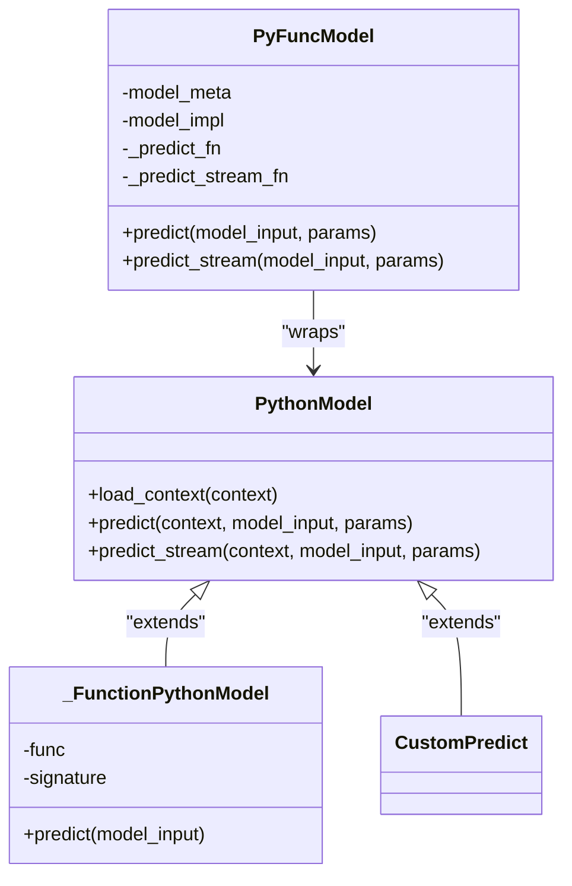
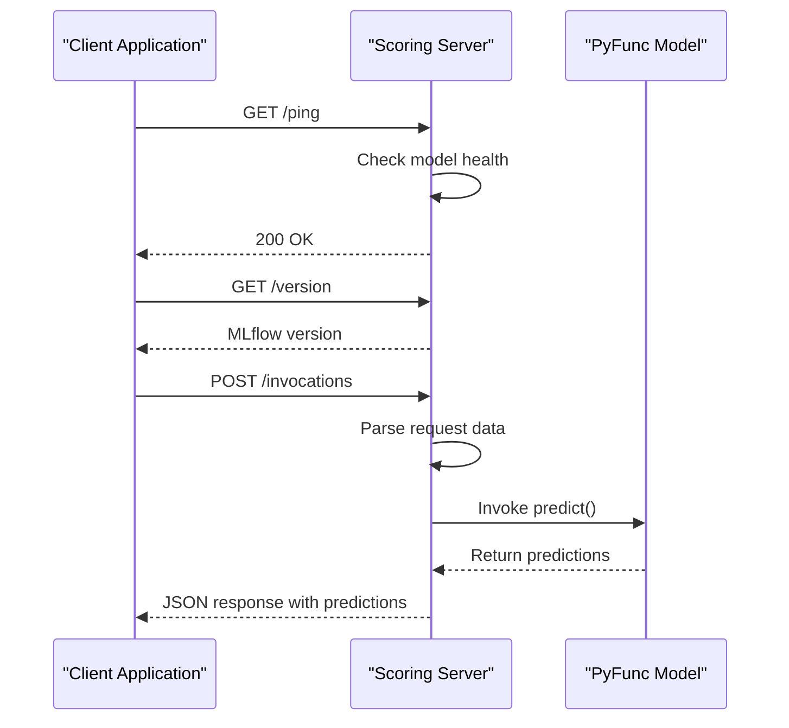
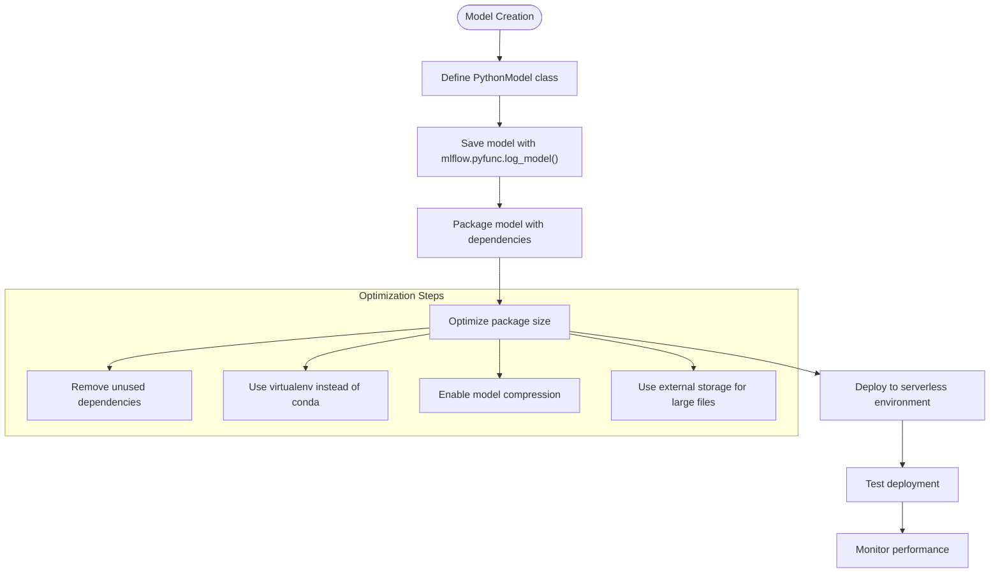
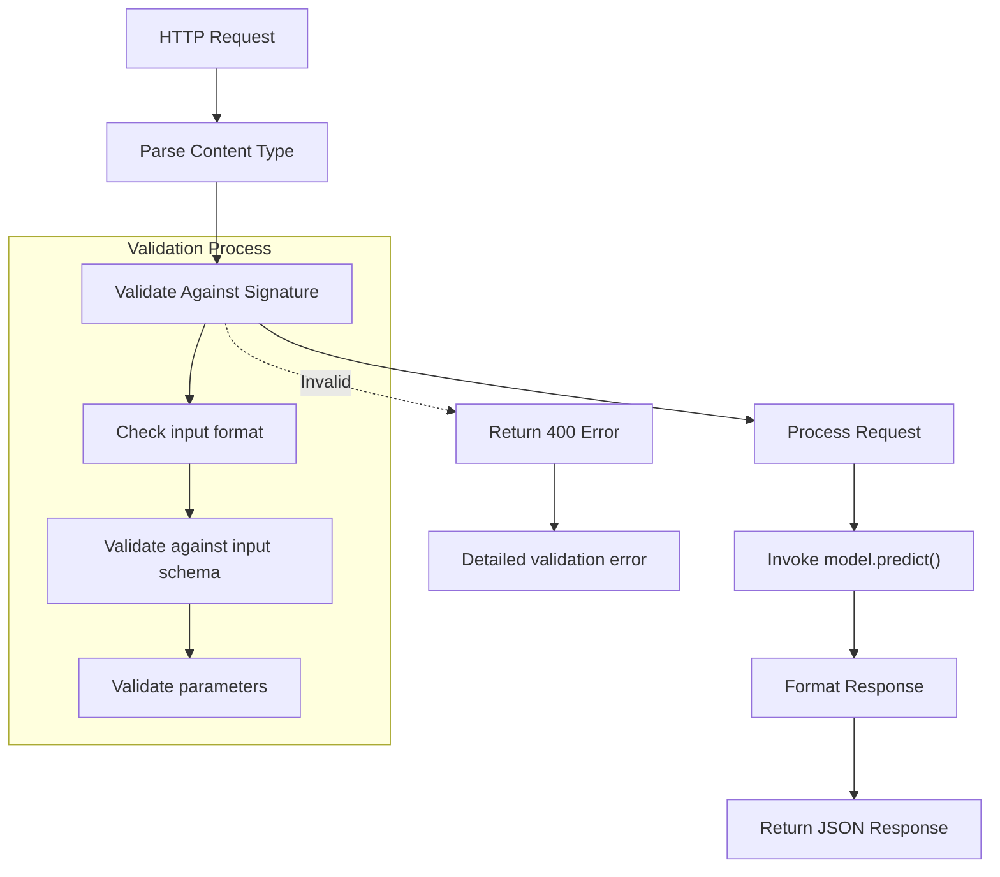
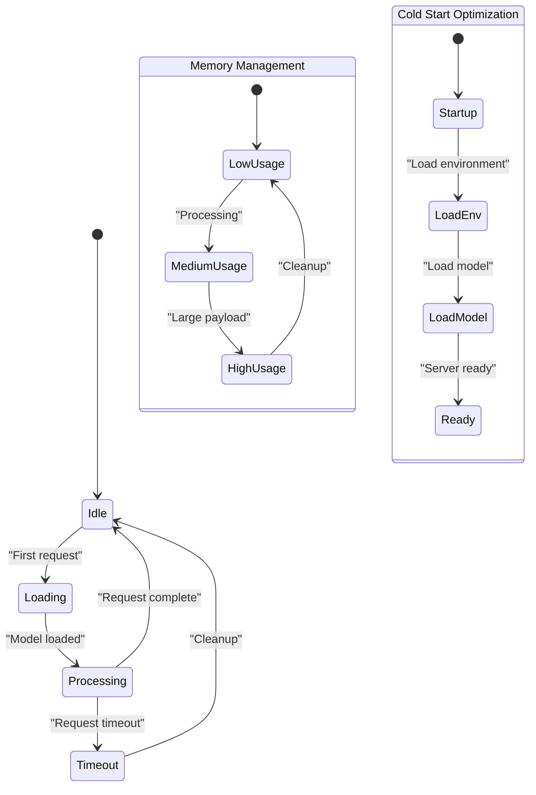
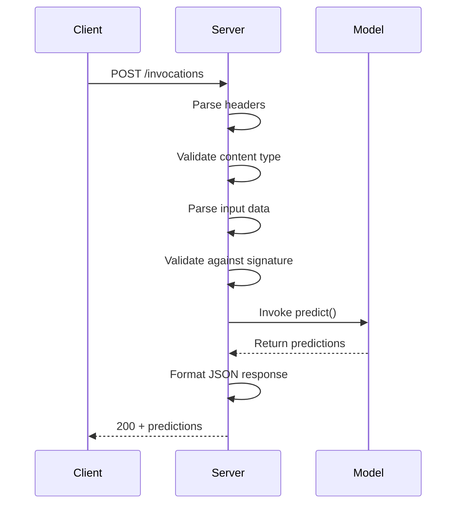
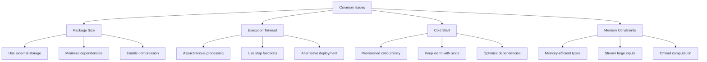

# Serverless Deployment

<cite>
**Referenced Files in This Document**   
- [mlflow/pyfunc/__init__.py](file://mlflow/pyfunc/__init__.py)
- [mlflow/pyfunc/model.py](file://mlflow/pyfunc/model.py)
- [mlflow/pyfunc/backend.py](file://mlflow/pyfunc/backend.py)
- [mlflow/pyfunc/scoring_server/__init__.py](file://mlflow/pyfunc/scoring_server/__init__.py)
- [mlflow/pyfunc/scoring_server/app.py](file://mlflow/pyfunc/scoring_server/app.py)
- [mlflow/pyfunc/scoring_server/client.py](file://mlflow/pyfunc/scoring_server/client.py)
- [examples/pyfunc/train.py](file://examples/pyfunc/train.py)
</cite>

## Table of Contents
1. [Introduction](#introduction)
2. [PyFunc Model Flavor](#pyfunc-model-flavor)
3. [Serverless Scoring Server](#serverless-scoring-server)
4. [Model Packaging for Serverless](#model-packaging-for-serverless)
5. [Input Validation and Model Signatures](#input-validation-and-model-signatures)
6. [Cold Start and Memory Management](#cold-start-and-memory-management)
7. [HTTP Request Handling](#http-request-handling)
8. [Common Issues and Limitations](#common-issues-and-limitations)
9. [Conclusion](#conclusion)

## Introduction
This document details serverless deployment patterns for MLflow models, focusing on lightweight model serving without container orchestration. It explains the implementation of the pyfunc model flavor as the universal interface for model loading and prediction, and how the scoring server can be deployed in serverless environments like AWS Lambda or Azure Functions. The document covers concrete examples from the codebase showing how to package models for serverless execution and handle HTTP requests in function-as-a-service platforms.

## PyFunc Model Flavor
The pyfunc model flavor serves as the default model interface for MLflow Python models. Any MLflow Python model is expected to be loadable as a pyfunc model, making it the universal interface for model loading and prediction. The pyfunc module defines a generic filesystem format for Python models and provides utilities for saving to and loading from this format.

The pyfunc model flavor supports two primary interfaces for creating custom models: function-based and class-based models. Function-based models are recommended for simple use cases where inference logic can be encapsulated in a single predict function. Class-based models, which inherit from the PythonModel class, are recommended when more complex functionality is needed, such as custom serialization, data processing, or overriding additional methods.



**Diagram sources**
- [mlflow/pyfunc/model.py](file://mlflow/pyfunc/model.py#L143-L244)
- [mlflow/pyfunc/__init__.py](file://mlflow/pyfunc/__init__.py#L753-L800)

**Section sources**
- [mlflow/pyfunc/__init__.py](file://mlflow/pyfunc/__init__.py#L1-L800)
- [mlflow/pyfunc/model.py](file://mlflow/pyfunc/model.py#L1-L800)

## Serverless Scoring Server
The MLflow scoring server provides a lightweight HTTP server for serving pyfunc models in serverless environments. The server is implemented using FastAPI and uvicorn, providing endpoints for health checks, version information, and model invocations. The scoring server can be deployed in serverless environments like AWS Lambda or Azure Functions with minimal configuration.

The scoring server architecture consists of several key components:
- The main application entry point in `app.py` that initializes the server
- The scoring server module that handles request parsing and model invocation
- Client utilities for testing and interacting with the scoring server



**Diagram sources**
- [mlflow/pyfunc/scoring_server/app.py](file://mlflow/pyfunc/scoring_server/app.py#L1-L8)
- [mlflow/pyfunc/scoring_server/__init__.py](file://mlflow/pyfunc/scoring_server/__init__.py#L459-L519)

**Section sources**
- [mlflow/pyfunc/scoring_server/__init__.py](file://mlflow/pyfunc/scoring_server/__init__.py#L1-L604)
- [mlflow/pyfunc/scoring_server/app.py](file://mlflow/pyfunc/scoring_server/app.py#L1-L8)

## Model Packaging for Serverless
Packaging models for serverless execution involves creating a self-contained model directory that includes all necessary code, data, and configuration. The pyfunc model format defines a directory structure containing all required components:

```
./model/
    ./MLmodel: configuration
    <code>: code packaged with the model
    <data>: data packaged with the model
    <env>: Conda environment definition
```

The MLmodel configuration file contains key parameters for loading and executing the model:
- loader_module: Python module that can load the model
- code: Relative path to a directory containing the code packaged with this model
- data: Relative path to a file or directory containing model data
- env: Relative path to an exported Conda environment

When deploying to serverless environments, it's critical to minimize package size by:
1. Using virtualenv instead of conda for smaller footprint
2. Including only essential dependencies
3. Using model compression when possible
4. Leveraging external storage for large artifacts



**Diagram sources**
- [mlflow/pyfunc/model.py](file://mlflow/pyfunc/model.py#L114-L188)
- [mlflow/pyfunc/backend.py](file://mlflow/pyfunc/backend.py#L390-L458)

**Section sources**
- [mlflow/pyfunc/model.py](file://mlflow/pyfunc/model.py#L1-L800)
- [mlflow/pyfunc/backend.py](file://mlflow/pyfunc/backend.py#L1-L525)

## Input Validation and Model Signatures
Model signatures play a crucial role in serverless deployments by defining the expected input and output schema for the model. This enables automatic input validation, ensuring that requests conform to the expected format before being processed by the model.

The scoring server performs input validation based on the model signature, supporting various input formats:
- JSON with dataframe_split or dataframe_records orientation
- JSON with instances or inputs format
- CSV format

When a model signature is defined, the scoring server validates incoming requests against the signature's input schema. This helps prevent errors caused by malformed input data and provides clear error messages when validation fails.



**Diagram sources**
- [mlflow/pyfunc/scoring_server/__init__.py](file://mlflow/pyfunc/scoring_server/__init__.py#L107-L237)
- [mlflow/pyfunc/scoring_server/__init__.py](file://mlflow/pyfunc/scoring_server/__init__.py#L306-L400)

**Section sources**
- [mlflow/pyfunc/scoring_server/__init__.py](file://mlflow/pyfunc/scoring_server/__init__.py#L1-L604)

## Cold Start and Memory Management
Cold start performance and memory management are critical considerations for serverless deployments. The scoring server implements several optimizations to minimize cold start times and memory usage:

1. **Lazy loading**: Model components are loaded on-demand rather than at startup
2. **Environment optimization**: Using virtualenv instead of conda reduces startup time
3. **Package size reduction**: Minimizing dependencies and using compression
4. **Memory-efficient data parsing**: Streaming input parsing to avoid loading entire payloads into memory

The scoring server also includes timeout handling to prevent long-running requests from consuming resources. The MLFLOW_SCORING_SERVER_REQUEST_TIMEOUT environment variable controls the maximum request processing time.



**Diagram sources**
- [mlflow/pyfunc/scoring_server/__init__.py](file://mlflow/pyfunc/scoring_server/__init__.py#L472-L482)
- [mlflow/pyfunc/backend.py](file://mlflow/pyfunc/backend.py#L108-L166)

**Section sources**
- [mlflow/pyfunc/scoring_server/__init__.py](file://mlflow/pyfunc/scoring_server/__init__.py#L1-L604)
- [mlflow/pyfunc/backend.py](file://mlflow/pyfunc/backend.py#L1-L525)

## HTTP Request Handling
The scoring server handles HTTP requests through three primary endpoints:
- /ping: Health check endpoint that returns 200 if the server is ready
- /version: Returns the MLflow version
- /invocations: Main endpoint for model inference

The request handling process involves several steps:
1. Content type parsing and validation
2. Input data parsing based on content type
3. Model signature validation
4. Model prediction execution
5. Response formatting and serialization

The server supports both synchronous and streaming prediction modes. For large models or long-running predictions, streaming responses can improve user experience by providing partial results as they become available.



**Diagram sources**
- [mlflow/pyfunc/scoring_server/__init__.py](file://mlflow/pyfunc/scoring_server/__init__.py#L483-L518)
- [mlflow/pyfunc/scoring_server/__init__.py](file://mlflow/pyfunc/scoring_server/__init__.py#L306-L400)

**Section sources**
- [mlflow/pyfunc/scoring_server/__init__.py](file://mlflow/pyfunc/scoring_server/__init__.py#L1-L604)

## Common Issues and Limitations
Serverless deployment of MLflow models presents several common challenges:

**Package Size Limitations**: Serverless platforms often have strict package size limits (e.g., 50MB for AWS Lambda deployment package, 250MB for container images). Strategies to address this include:
- Using external storage for large model files
- Minimizing dependencies
- Using model compression
- Leveraging container registries for larger models

**Execution Timeouts**: Serverless functions have maximum execution times (e.g., 15 minutes for AWS Lambda). For long-running predictions:
- Implement asynchronous processing
- Use step functions or workflows
- Consider alternative deployment options for long-running models

**Cold Start Latency**: First-time invocation can be slow due to environment initialization. Mitigation strategies include:
- Provisioned concurrency
- Keeping functions warm with periodic pings
- Optimizing package size and dependencies

**Memory Constraints**: Limited memory can affect model loading and inference. Solutions include:
- Using memory-efficient data types
- Streaming large inputs
- Offloading computation to external services



**Diagram sources**
- [mlflow/pyfunc/backend.py](file://mlflow/pyfunc/backend.py#L58-L59)
- [mlflow/pyfunc/scoring_server/__init__.py](file://mlflow/pyfunc/scoring_server/__init__.py#L27-L30)

**Section sources**
- [mlflow/pyfunc/backend.py](file://mlflow/pyfunc/backend.py#L1-L525)
- [mlflow/pyfunc/scoring_server/__init__.py](file://mlflow/pyfunc/scoring_server/__init__.py#L1-L604)

## Conclusion
Serverless deployment of MLflow models using the pyfunc flavor provides a lightweight, flexible approach to model serving without container orchestration. By leveraging the standardized pyfunc interface, models can be deployed across various serverless platforms with minimal configuration. Key considerations for successful deployment include proper model packaging, input validation through model signatures, and addressing common limitations like package size and execution timeouts. The scoring server's design enables efficient HTTP request handling while providing extensibility for custom deployment requirements.