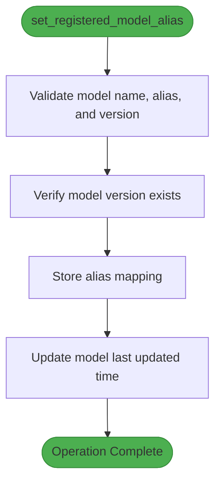
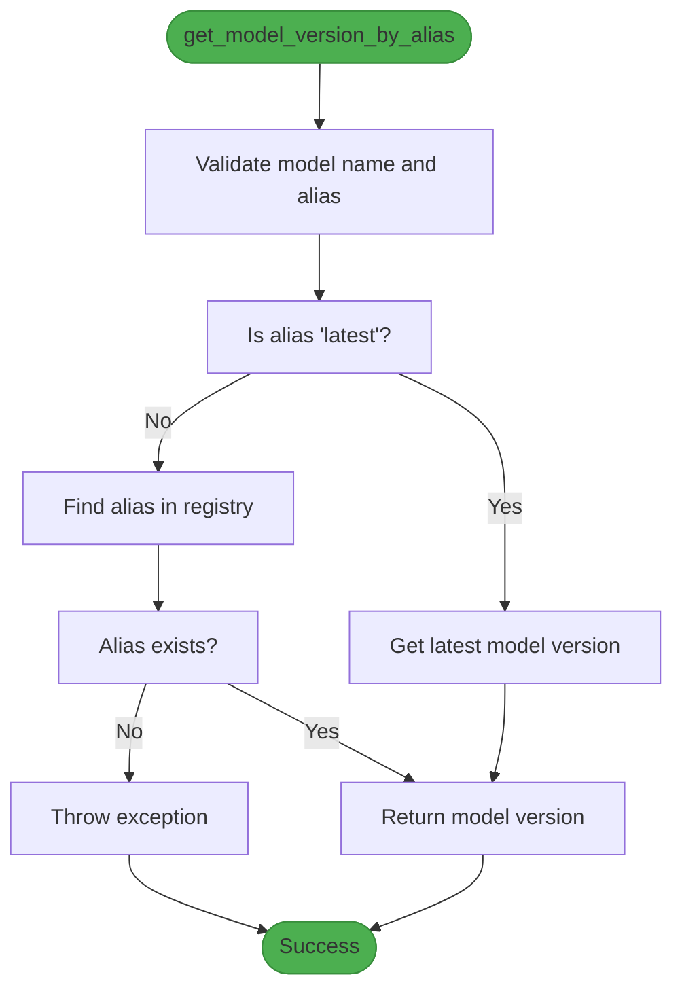
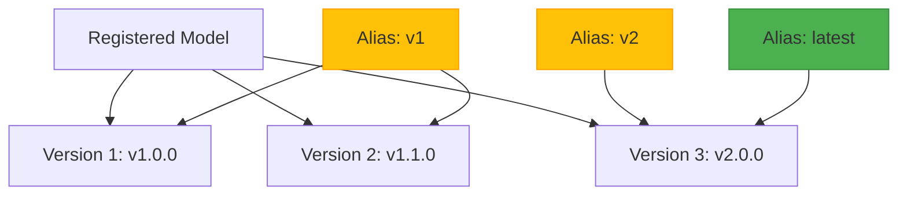
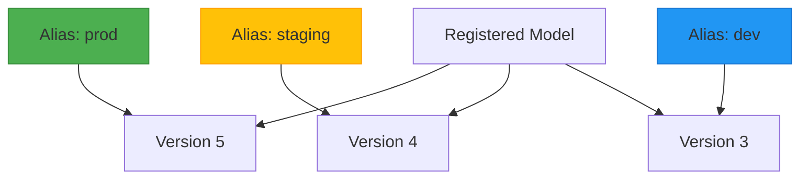
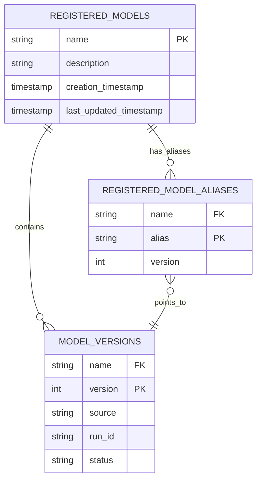
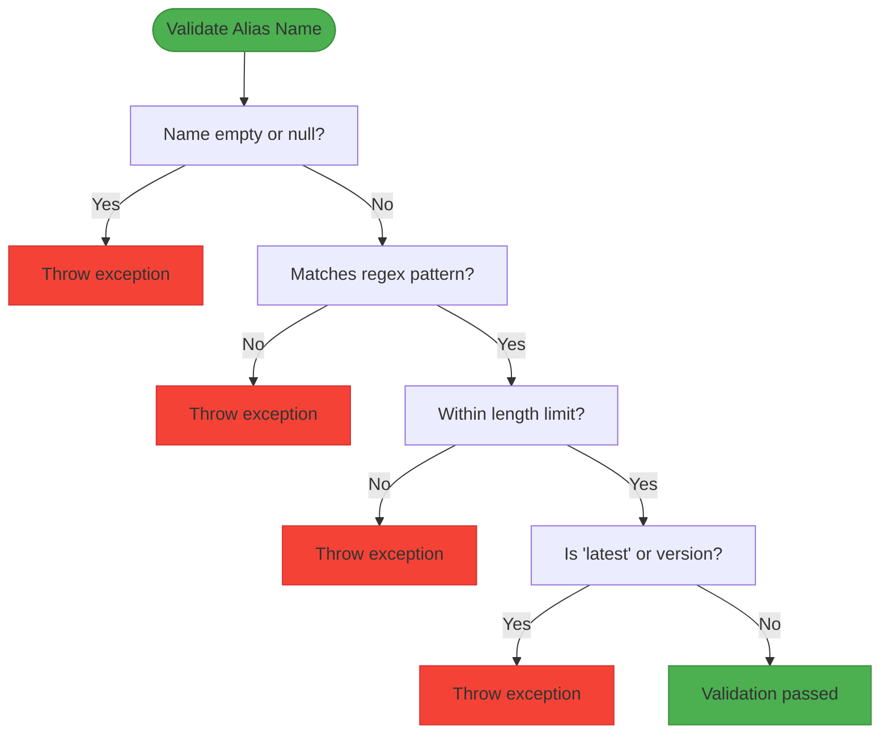
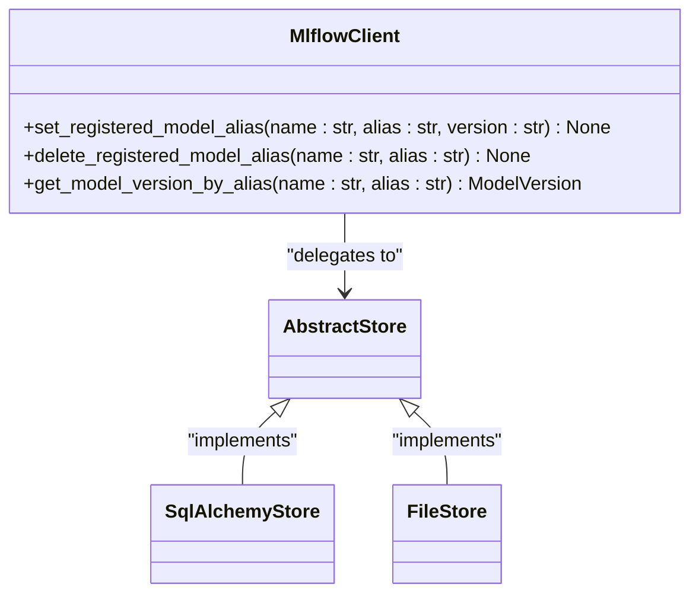

# Model Aliases

<cite>
**Referenced Files in This Document**   
- [registered_model_alias.py](file://mlflow/entities/model_registry/registered_model_alias.py)
- [sqlalchemy_store.py](file://mlflow/store/model_registry/sqlalchemy_store.py)
- [file_store.py](file://mlflow/store/model_registry/file_store.py)
- [abstract_store.py](file://mlflow/store/model_registry/abstract_store.py)
- [validation.py](file://mlflow/utils/validation.py)
- [client.py](file://mlflow/tracking/client.py)
- [3500859a5d39_add_model_aliases_table.py](file://mlflow/store/db_migrations/versions/3500859a5d39_add_model_aliases_table.py)
- [models.py](file://mlflow/store/model_registry/dbmodels/models.py)
</cite>

## Table of Contents
1. [Introduction](#introduction)
2. [Core Concepts](#core-concepts)
3. [Implementation Details](#implementation-details)
4. [Usage Patterns](#usage-patterns)
5. [Database Schema and Constraints](#database-schema-and-constraints)
6. [Validation and Error Handling](#validation-and-error-handling)
7. [Client Interface](#client-interface)
8. [Common Issues and Best Practices](#common-issues-and-best-practices)

## Introduction
Model aliases in MLflow's Model Registry provide stable references to specific model versions, enabling reliable model deployment and rollback scenarios. This documentation details the implementation and usage of model aliases, focusing on the `set_registered_model_alias()` and `get_model_version_by_alias()` methods, their atomic operations, consistency guarantees, and integration with deployment workflows.

## Core Concepts
Model aliases serve as named pointers to specific model versions within the MLflow Model Registry. They enable users to reference models using semantic names rather than version numbers, facilitating more intuitive and stable model management. Key benefits include:

- **Stable References**: Applications can reference models using aliases like "prod" or "latest-staging" instead of version numbers
- **Simplified Deployment**: Deployment workflows can target aliases rather than specific versions
- **Easy Rollbacks**: Switching between model versions becomes a simple alias update operation
- **Semantic Versioning**: Support for versioning schemes like "v1.2.3" through alias naming

The alias system maintains a one-to-one mapping between an alias name and a specific model version, ensuring consistency and predictability in model references.

**Section sources**
- [registered_model_alias.py](file://mlflow/entities/model_registry/registered_model_alias.py)
- [abstract_store.py](file://mlflow/store/model_registry/abstract_store.py)

## Implementation Details
The model alias functionality is implemented across multiple layers of the MLflow architecture, with core operations defined in the abstract store interface and concrete implementations in both SQLAlchemy and file-based stores.

### set_registered_model_alias Method
The `set_registered_model_alias()` method establishes a mapping between an alias name and a model version. The implementation ensures atomicity and consistency through database transactions or file system operations.



**Diagram sources**
- [sqlalchemy_store.py](file://mlflow/store/model_registry/sqlalchemy_store.py#L1250-L1270)
- [file_store.py](file://mlflow/store/model_registry/file_store.py#L1020-L1040)

### get_model_version_by_alias Method
The `get_model_version_by_alias()` method retrieves a model version based on its alias. This operation is optimized for performance and consistency, with special handling for the "latest" alias.



**Diagram sources**
- [sqlalchemy_store.py](file://mlflow/store/model_registry/sqlalchemy_store.py#L1291-L1325)
- [file_store.py](file://mlflow/store/model_registry/file_store.py#L1058-L1080)

**Section sources**
- [sqlalchemy_store.py](file://mlflow/store/model_registry/sqlalchemy_store.py#L1250-L1325)
- [file_store.py](file://mlflow/store/model_registry/file_store.py#L1020-L1080)

## Usage Patterns
Model aliases support various deployment and management patterns, enabling flexible model lifecycle management.

### Semantic Versioning
Aliases can be used to implement semantic versioning schemes, allowing teams to reference models using version identifiers that convey meaning about compatibility and changes.



**Diagram sources**
- [client.py](file://mlflow/tracking/client.py#L5382-L5483)

### Environment-Specific References
Aliases enable environment-specific model references, simplifying deployment across different environments.



**Diagram sources**
- [client.py](file://mlflow/tracking/client.py#L5382-L5483)

**Section sources**
- [client.py](file://mlflow/tracking/client.py#L5382-L5569)

## Database Schema and Constraints
The model alias system is backed by a dedicated database table with specific constraints to ensure data integrity and performance.

### Database Table Structure
The `registered_model_aliases` table stores the mapping between aliases and model versions, with appropriate foreign key constraints.



**Diagram sources**
- [models.py](file://mlflow/store/model_registry/dbmodels/models.py#L191-L203)
- [3500859a5d39_add_model_aliases_table.py](file://mlflow/store/db_migrations/versions/3500859a5d39_add_model_aliases_table.py#L25-L44)

### Migration Script
The database migration script creates the aliases table with appropriate constraints and foreign key relationships.

```python
op.create_table(
    SqlRegisteredModelAlias.__tablename__,
    sa.Column("alias", sa.String(length=256), primary_key=True, nullable=False),
    sa.Column("version", sa.Integer(), nullable=False),
    sa.Column(
        "name",
        sa.String(length=256),
        sa.ForeignKey(
            "registered_models.name",
            onupdate="cascade",
            ondelete="cascade",
            name="registered_model_alias_name_fkey",
        ),
        primary_key=True,
        nullable=False,
    ),
    sa.PrimaryKeyConstraint("name", "alias", name="registered_model_alias_pk"),
)
```

This ensures referential integrity between aliases, models, and versions, with cascading updates and deletions.

**Section sources**
- [3500859a5d39_add_model_aliases_table.py](file://mlflow/store/db_migrations/versions/3500859a5d39_add_model_aliases_table.py#L25-L44)
- [models.py](file://mlflow/store/model_registry/dbmodels/models.py#L191-L203)

## Validation and Error Handling
The model alias system includes comprehensive validation to prevent invalid states and ensure data consistency.

### Validation Rules
Several validation functions enforce constraints on alias names and operations:

- **Name Format**: Alias names must match the pattern `^[a-zA-Z0-9._-]{1,256}$`
- **Reserved Names**: The name "latest" (case-insensitive) is reserved
- **Version Conflicts**: Version numbers cannot be used as alias names
- **Length Limits**: Maximum length of 256 characters for alias names



**Diagram sources**
- [validation.py](file://mlflow/utils/validation.py#L522-L549)

### Error Scenarios
Common error conditions and their handling:

- **Non-existent Model**: Attempting to set an alias for a non-existent model results in a `RESOURCE_DOES_NOT_EXIST` error
- **Non-existent Version**: Referencing a non-existent version returns an `INVALID_PARAMETER_VALUE` error
- **Duplicate Alias**: Setting an alias that already exists updates the mapping to the new version
- **Missing Alias**: Requesting a model version by non-existent alias raises an `INVALID_PARAMETER_VALUE` exception

**Section sources**
- [validation.py](file://mlflow/utils/validation.py#L522-L549)
- [sqlalchemy_store.py](file://mlflow/store/model_registry/sqlalchemy_store.py#L1262-L1265)

## Client Interface
The MLflow client provides a user-friendly interface for working with model aliases, abstracting the underlying store operations.

### API Methods
The client exposes three primary methods for alias management:



**Diagram sources**
- [client.py](file://mlflow/tracking/client.py#L5382-L5569)
- [abstract_store.py](file://mlflow/store/model_registry/abstract_store.py#L389-L416)

### Usage Example
```python
client = MlflowClient()
client.set_registered_model_alias("my-model", "prod", "5")
client.set_registered_model_alias("my-model", "staging", "4")

# Deploy using aliases
prod_model = client.get_model_version_by_alias("my-model", "prod")
staging_model = client.get_model_version_by_alias("my-model", "staging")

# Rollback by updating alias
client.set_registered_model_alias("my-model", "prod", "4")
```

**Section sources**
- [client.py](file://mlflow/tracking/client.py#L5382-L5569)

## Common Issues and Best Practices
Understanding common issues and following best practices ensures effective use of model aliases.

### Common Issues
- **Alias Naming Conflicts**: Using reserved names like "latest" or version numbers as aliases
- **Orphaned Aliases**: Deleting model versions without updating or removing associated aliases
- **Race Conditions**: Concurrent alias updates in distributed environments
- **Overuse of Aliases**: Creating too many aliases that become difficult to manage

### Best Practices
- **Consistent Naming**: Use a consistent naming convention across your organization
- **Limited Scope**: Restrict the number of aliases per model to maintain clarity
- **Documentation**: Document the purpose of each alias in the model description
- **Automation**: Integrate alias management into CI/CD pipelines for consistent deployment
- **Monitoring**: Track alias usage and changes for audit and debugging purposes

The immutability of alias-to-version mappings ensures that once an alias points to a version, that relationship remains stable until explicitly changed, providing reliability for production deployments.

**Section sources**
- [validation.py](file://mlflow/utils/validation.py#L522-L549)
- [client.py](file://mlflow/tracking/client.py#L5382-L5569)
- [sqlalchemy_store.py](file://mlflow/store/model_registry/sqlalchemy_store.py#L1250-L1325)