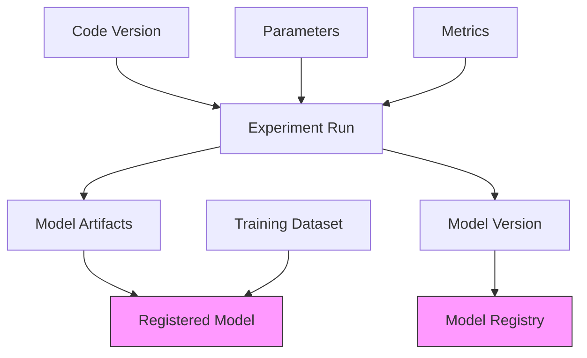
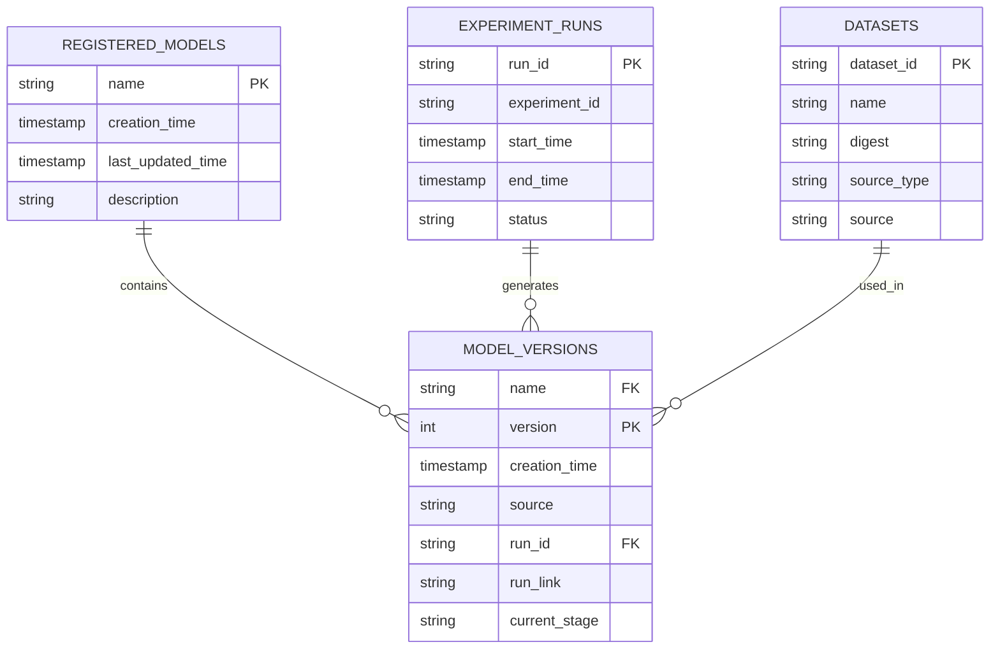

# Model Lineage

<cite>
**Referenced Files in This Document**   
- [model_version.py](file://mlflow/entities/model_registry/model_version.py)
- [sqlalchemy_store.py](file://mlflow/store/model_registry/sqlalchemy_store.py)
- [file_store.py](file://mlflow/store/model_registry/file_store.py)
- [84291f40a231_add_run_link_to_model_version.py](file://mlflow/store/db_migrations/versions/84291f40a231_add_run_link_to_model_version.py)
- [client.py](file://mlflow/tracking/client.py)
- [rest_store.py](file://mlflow/store/_unity_catalog/registry/rest_store.py)
- [unity_catalog_utils.py](file://mlflow/utils/_unity_catalog_utils.py)
- [register_model.py](file://examples/mlflow-3/register_model.py)
</cite>

## Table of Contents
1. [Introduction](#introduction)
2. [Model Lineage Overview](#model-lineage-overview)
3. [Lineage Metadata Storage](#lineage-metadata-storage)
4. [Source Run Metadata Field](#source-run-metadata-field)
5. [Automatic Lineage Capture](#automatic-lineage-capture)
6. [Programmatic Access Through Client API](#programmatic-access-through-client-api)
7. [Reproducibility and Environment Recreation](#reproducibility-and-environment-recreation)
8. [Handling External Models and Version Upgrades](#handling-external-models-and-version-upgrades)
9. [Data Consistency and Referential Integrity](#data-consistency-and-referential-integrity)
10. [Conclusion](#conclusion)

## Introduction
Model lineage tracking in MLflow's Model Registry provides comprehensive provenance for machine learning models, capturing their complete history from experiment runs through datasets to code versions. This documentation details how MLflow implements lineage tracking, focusing on the technical implementation, metadata storage, and practical usage patterns. The system ensures that every registered model maintains a clear connection to its origin, enabling full reproducibility and auditability throughout the model lifecycle.

## Model Lineage Overview
MLflow's Model Registry captures comprehensive lineage information that establishes the complete provenance of registered models. The system automatically tracks relationships between models, experiment runs, datasets, and code versions, creating an auditable trail that supports reproducibility and compliance requirements.

The lineage system is built around several key components:
- **Model Version Entities**: Each model version contains metadata linking it to its source experiment run
- **Run Link References**: Direct URLs to the specific MLflow tracking server run that generated the model
- **Dataset Provenance**: Tracking of input datasets used during model training
- **Code Versioning**: Association with specific code commits or versions

This lineage information is automatically captured when models are registered, whether through the fluent API, REST endpoints, or direct client calls. The system maintains referential integrity between model versions and their source runs, ensuring that the complete context of model creation is preserved.



**Diagram sources**
- [model_version.py](file://mlflow/entities/model_registry/model_version.py#L18-L35)
- [sqlalchemy_store.py](file://mlflow/store/model_registry/sqlalchemy_store.py#L750-L850)

## Lineage Metadata Storage
MLflow implements lineage metadata storage through a combination of database schema design and entity relationships that ensure data consistency and referential integrity. The system uses both relational database storage and file-based storage depending on the backend configuration.

In the relational database implementation, the `model_versions` table contains specific columns dedicated to lineage tracking:

```sql
CREATE TABLE model_versions (
    name VARCHAR(256) REFERENCES registered_models(name) ON UPDATE CASCADE,
    version INTEGER NOT NULL,
    creation_time BIGINT DEFAULT (CURRENT_TIMESTAMP * 1000),
    last_updated_time BIGINT,
    description VARCHAR(5000),
    user_id VARCHAR(256),
    current_stage VARCHAR(20) DEFAULT 'None',
    source VARCHAR(500),
    run_id VARCHAR(32) NOT NULL,
    run_link VARCHAR(500),
    status VARCHAR(20) DEFAULT 'READY',
    status_message VARCHAR(500),
    PRIMARY KEY (name, version)
);
```

The `run_link` column was added through a database migration to provide direct hyperlinks to the source experiment runs. This field complements the `run_id` field by providing a human-readable and clickable reference to the exact run that generated the model.

For file-based storage, MLflow uses YAML files to store model version metadata, including lineage information. The file store implementation maintains the same data structure as the database version, ensuring consistency across different storage backends.



**Diagram sources**
- [84291f40a231_add_run_link_to_model_version.py](file://mlflow/store/db_migrations/versions/84291f40a231_add_run_link_to_model_version.py#L1-L25)
- [sqlalchemy_store.py](file://mlflow/store/model_registry/sqlalchemy_store.py#L44-L67)

## Source Run Metadata Field
The `run_link` metadata field is a critical component of MLflow's model lineage system, providing direct traceability from registered models back to their source experiment runs. This field was introduced through a dedicated database migration and is now an integral part of the model version entity.

The `run_link` field serves several important purposes:
- Provides a clickable hyperlink to the exact experiment run that generated the model
- Enables one-click navigation from the Model Registry to the complete training context
- Supports auditability by preserving the exact URL of the source run
- Facilitates reproducibility by connecting models to their full experimental context

In the ModelVersion entity implementation, the `run_link` field is defined as an optional string property:

```python
@property
def run_link(self) -> str | None:
    """String. MLflow run link referring to the exact run that generated this model version."""
    return self._run_link
```

When a model version is created, the `run_link` is captured alongside other metadata:

```python
def create_model_version(
    self,
    name: str,
    source: str,
    run_id: str | None = None,
    tags: list[ModelVersionTag] | None = None,
    run_link: str | None = None,
    description: str | None = None,
    local_model_path: str | None = None,
    model_id: str | None = None,
) -> ModelVersion:
    """
    Create a new model version from given source and run ID.
    
    Args:
        name: Registered model name.
        source: URI indicating the location of the model artifacts.
        run_id: Run ID from MLflow tracking server that generated the model.
        tags: A list of :py:class:`mlflow.entities.model_registry.ModelVersionTag`
            instances associated with this model version.
        run_link: Link to the run from an MLflow tracking server that generated this model.
        description: Description of the version.
        local_model_path: Unused.
        model_id: The ID of the model (from an Experiment) that is being promoted to a
            registered model version, if applicable.
    """
```

The implementation ensures that both `run_id` and `run_link` are stored together, providing both programmatic access (via run_id) and human-friendly navigation (via run_link).

**Section sources**
- [model_version.py](file://mlflow/entities/model_registry/model_version.py#L18-L35)
- [sqlalchemy_store.py](file://mlflow/store/model_registry/sqlalchemy_store.py#L750-L850)
- [84291f40a231_add_run_link_to_model_version.py](file://mlflow/store/db_migrations/versions/84291f40a231_add_run_link_to_model_version.py#L1-L25)

## Automatic Lineage Capture
MLflow automatically captures lineage information during model registration through several mechanisms that ensure comprehensive provenance tracking. The system integrates with the MLflow Tracking component to extract context from active runs and associate it with registered models.

When a model is logged within an active MLflow run, the system automatically captures the run context:

```python
with mlflow.start_run():
    # Log parameters, metrics, and artifacts
    mlflow.log_param("learning_rate", 0.01)
    mlflow.log_metric("accuracy", 0.95)
    
    # Log the model - this automatically captures the current run context
    mlflow.sklearn.log_model(sklearn_model, "model")
    
    # Register the model - lineage is automatically established
    model_details = mlflow.register_model(
        model_uri=f"runs:/{mlflow.active_run().info.run_id}/model", 
        name="sklearn-model"
    )
```

The automatic capture process works as follows:
1. When `mlflow.register_model()` is called, the system extracts the run ID from the model URI
2. The run ID is used to retrieve the complete run context from the tracking server
3. The run link is generated based on the tracking server URI and run ID
4. Both run_id and run_link are stored with the model version metadata

For Unity Catalog integration, additional lineage information is captured, including notebook IDs, job IDs, and input datasets:

```python
def _create_model_version_lineage_info(self, run_id, source_workspace_id=None):
    """Create lineage header info for model version registration."""
    headers, run = self._get_run_and_headers(run_id)
    notebook_id = self._get_notebook_id(run)
    lineage_securable_list = self._get_lineage_input_sources(run)
    job_id = self._get_job_id(run)
    job_run_id = self._get_job_run_id(run)
    
    entity_list = []
    if notebook_id is not None:
        notebook_entity = Notebook(id=str(notebook_id))
        entity_list.append(Entity(notebook=notebook_entity))
    if job_id is not None:
        job_entity = Job(id=job_id, job_run_id=job_run_id)
        entity_list.append(Entity(job=job_entity))
    
    return LineageHeaderInfo(entities=entity_list, lineages=lineage_list)
```

This automatic capture ensures that all relevant context is preserved without requiring manual intervention from the user.

**Section sources**
- [rest_store.py](file://mlflow/store/_unity_catalog/registry/rest_store.py#L954-L980)
- [client.py](file://mlflow/tracking/client.py#L1-L200)
- [register_model.py](file://examples/mlflow-3/register_model.py#L1-L50)

## Programmatic Access Through Client API
MLflow provides comprehensive programmatic access to model lineage information through its client API, enabling users to retrieve and manipulate lineage data programmatically. The API exposes methods to access both high-level model information and detailed lineage metadata.

The primary methods for accessing lineage information are:

```python
from mlflow import MlflowClient

client = MlflowClient()

# Get a specific model version and its lineage information
model_version = client.get_model_version(
    name="sklearn-model",
    version=1
)

print(f"Model name: {model_version.name}")
print(f"Model version: {model_version.version}")
print(f"Source run ID: {model_version.run_id}")
print(f"Run link: {model_version.run_link}")
print(f"Source: {model_version.source}")
```

Additional methods provide more detailed lineage access:

```python
# Get the download URI for model artifacts
download_uri = client.get_model_version_download_uri(
    name="sklearn-model",
    version=1
)

# Get all model versions for a registered model
versions = client.search_model_versions(
    filter_string="name='sklearn-model'"
)

# Access lineage information for each version
for version in versions:
    print(f"Version {version.version}:")
    print(f"  Run ID: {version.run_id}")
    print(f"  Run Link: {version.run_link}")
    print(f"  Creation: {version.creation_timestamp}")
```

The API also supports programmatic model registration with explicit lineage specification:

```python
# Register a model with explicit run link
model_version = client.create_model_version(
    name="external-model",
    source="s3://my-bucket/models/model-v1",
    run_id="1234567890abcdef",
    run_link="https://mlflow.example.com/path/to/run/1234567890abcdef",
    description="Model imported from external system"
)
```

These API methods provide complete programmatic control over model lineage, enabling integration with automated workflows, custom UIs, and advanced analytics.

**Section sources**
- [client.py](file://mlflow/tracking/client.py#L1-L200)
- [test_model_registry_client.py](file://tests/tracking/_model_registry/test_model_registry_client.py#L214-L392)

## Reproducibility and Environment Recreation
Model lineage in MLflow directly supports reproducibility by preserving the complete context needed to recreate the exact training environment. The system captures not only the model artifacts but also the parameters, code version, and data used during training.

To recreate a training environment from a registered model:

```python
from mlflow import MlflowClient
import mlflow

client = MlflowClient()

# Get the model version to recreate
model_version = client.get_model_version(
    name="sklearn-model",
    version=1
)

# Use the run_id to access the original experiment run
run_id = model_version.run_id
run = client.get_run(run_id)

# Access the original parameters and metrics
original_params = run.data.params
original_metrics = run.data.metrics

# Recreate the training environment
with mlflow.start_run() as new_run:
    # Log the same parameters
    for key, value in original_params.items():
        mlflow.log_param(key, value)
    
    # Train the model using the same configuration
    # ...
    
    # The lineage is automatically captured
```

For models registered with MLflow autologging, the system captures additional environment information:

```python
# When autologging is enabled, MLflow captures:
# - Package versions (requirements.txt or conda environment)
# - System metrics during training
# - Code source (git commit, notebook, etc.)
# - Input datasets

# This information is stored with the run and preserved in the lineage
run_data = client.get_run(model_version.run_id)
print("Autologged information:")
print(f"Parameters: {run_data.data.params}")
print(f"Tags: {run_data.data.tags}")
print(f"System metrics: {[k for k in run_data.data.metrics.keys() if k.startswith('system/')]}")
```

The run link provides direct access to the complete training context, including:
- All logged parameters and metrics
- Artifact files (models, plots, reports)
- System performance metrics
- Code version information
- Input dataset references

This comprehensive context enables true reproducibility, allowing data scientists to exactly recreate previous results and build upon existing work with confidence.

**Section sources**
- [client.py](file://mlflow/tracking/client.py#L1-L200)
- [model_version.py](file://mlflow/entities/model_registry/model_version.py#L18-L35)

## Handling External Models and Version Upgrades
MLflow's model lineage system accommodates models imported from external systems and manages lineage across model version upgrades through flexible metadata handling and referential integrity mechanisms.

For models imported from external systems where source run information is unavailable:

```python
# Register an external model without run_id
model_version = client.create_model_version(
    name="external-model",
    source="s3://my-external-bucket/models/v1",
    run_id=None,  # No source run available
    run_link=None,  # No run link available
    description="Model imported from external training system"
)

print(f"External model registered with version {model_version.version}")
print(f"Source: {model_version.source}")
print(f"Run ID: {model_version.run_id}")  # Will be None
```

The system gracefully handles missing lineage information by allowing null values for `run_id` and `run_link` while still preserving other metadata. This ensures that externally developed models can be managed in the registry without compromising the integrity of models with complete lineage.

When upgrading model versions, MLflow maintains lineage for each version independently:

```python
# Original model version with complete lineage
v1 = client.create_model_version(
    name="my-model",
    source="runs:/abc123/model",
    run_id="abc123",
    run_link="https://mlflow.example.com/runs/abc123"
)

# New version with different lineage
v2 = client.create_model_version(
    name="my-model",
    source="runs:/def456/model",
    run_id="def456",
    run_link="https://mlflow.example.com/runs/def456"
)

# Both versions maintain their respective lineage
versions = client.search_model_versions("name='my-model'")
for v in versions:
    print(f"Version {v.version}: Run ID={v.run_id}, Run Link={v.run_link}")
```

The system also supports batch operations that preserve lineage:

```python
# Search for models by source run
models_from_run = client.search_model_versions(
    filter_string=f"run_id='abc123'"
)

# This returns all model versions created from the same source run
for model in models_from_run:
    print(f"Model: {model.name}, Version: {model.version}")
```

These capabilities ensure that model lineage remains accurate and useful throughout the model lifecycle, even as models evolve and new versions are created.

**Section sources**
- [sqlalchemy_store.py](file://mlflow/store/model_registry/sqlalchemy_store.py#L750-L850)
- [file_store.py](file://mlflow/store/model_registry/file_store.py#L714-L743)

## Data Consistency and Referential Integrity
MLflow ensures data consistency and referential integrity in its model lineage system through a combination of database constraints, transactional operations, and validation mechanisms. The system is designed to maintain the integrity of lineage relationships even in distributed environments.

The database schema enforces referential integrity through foreign key constraints:

```sql
-- The model_versions table references registered_models
ALTER TABLE model_versions 
ADD CONSTRAINT fk_model_name 
FOREIGN KEY (name) REFERENCES registered_models(name) ON UPDATE CASCADE;

-- This ensures that model versions cannot exist without a corresponding registered model
```

Transactional operations protect against data corruption during model version creation:

```python
def create_model_version(self, name, source, run_id=None, tags=None, run_link=None, description=None):
    """
    Create a new model version with transactional integrity.
    """
    with self.ManagedSessionMaker() as session:
        creation_time = get_current_time_millis()
        
        # Retrieve the registered model within the same transaction
        sql_registered_model = self._get_registered_model(session, name)
        sql_registered_model.last_updated_time = creation_time
        
        # Calculate the next version number
        version = next_version(sql_registered_model)
        
        # Create the model version record
        model_version = SqlModelVersion(
            name=name,
            version=version,
            creation_time=creation_time,
            last_updated_time=creation_time,
            source=source,
            run_id=run_id,
            run_link=run_link,
            description=description,
        )
        
        # Add tags if provided
        if tags:
            model_version.model_version_tags = [
                SqlModelVersionTag(key=tag.key, value=tag.value) for tag in tags
            ]
        
        # Commit both changes in a single transaction
        session.add_all([sql_registered_model, model_version])
        session.flush()
        
        return model_version.to_mlflow_entity()
```

The system also implements retry mechanisms to handle transient failures:

```python
def create_model_version(self, name, source, run_id=None, tags=None, run_link=None, description=None):
    """
    Create a new model version with retry logic for transient failures.
    """
    for attempt in range(self.CREATE_MODEL_VERSION_RETRIES):
        try:
            # Transactional operation with retry
            with self.ManagedSessionMaker() as session:
                # ... create model version ...
                session.flush()
                return model_version.to_mlflow_entity()
                
        except sqlalchemy.exc.IntegrityError:
            if attempt < self.CREATE_MODEL_VERSION_RETRIES - 1:
                _logger.info(f"Retry {attempt + 1} for model version creation")
                continue
            else:
                raise MlflowException(
                    f"Model Version creation error (name={name}). Giving up after "
                    f"{self.CREATE_MODEL_VERSION_RETRIES} attempts."
                )
```

Additionally, the system validates input data to prevent inconsistent states:

```python
def _validate_model_name(name):
    """Validate model name to ensure consistency."""
    if not name:
        raise MlflowException("Model name cannot be empty or None.", INVALID_PARAMETER_VALUE)
    if len(name) > 64:
        raise MlflowException(f"Model name is too long (length={len(name)}). Maximum length is 64.",
                            INVALID_PARAMETER_VALUE)
    if not re.match(r'^[a-zA-Z0-9\-\_\.]+$', name):
        raise MlflowException(
            f"Model name '{name}' contains invalid characters. "
            "Model name must only contain alphanumeric characters, dashes, underscores, and dots.",
            INVALID_PARAMETER_VALUE
        )
```

These mechanisms work together to ensure that model lineage data remains consistent, accurate, and reliable throughout the model lifecycle.

**Section sources**
- [sqlalchemy_store.py](file://mlflow/store/model_registry/sqlalchemy_store.py#L750-L850)
- [file_store.py](file://mlflow/store/model_registry/file_store.py#L714-L743)

## Conclusion
MLflow's model lineage tracking system provides a comprehensive solution for capturing and maintaining the provenance of machine learning models throughout their lifecycle. By automatically recording relationships between models, experiment runs, datasets, and code versions, the system enables full reproducibility, auditability, and collaboration.

The implementation combines robust database design with flexible API access, ensuring that lineage information is both reliably stored and easily accessible. Key features like the `run_link` metadata field provide direct traceability to source runs, while the system's handling of external models and version upgrades maintains integrity across diverse use cases.

For data scientists and machine learning engineers, this lineage system reduces the cognitive load of tracking model provenance manually, allowing them to focus on model development while maintaining rigorous standards of reproducibility. The programmatic API access enables integration with automated workflows and custom tooling, making model lineage an integral part of the machine learning lifecycle rather than an afterthought.

As machine learning systems become increasingly complex and regulated, comprehensive lineage tracking will continue to grow in importance. MLflow's approach provides a solid foundation for meeting these challenges, combining technical robustness with user-friendly access to lineage information.