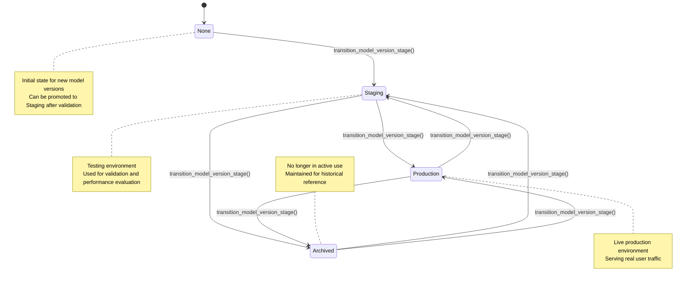
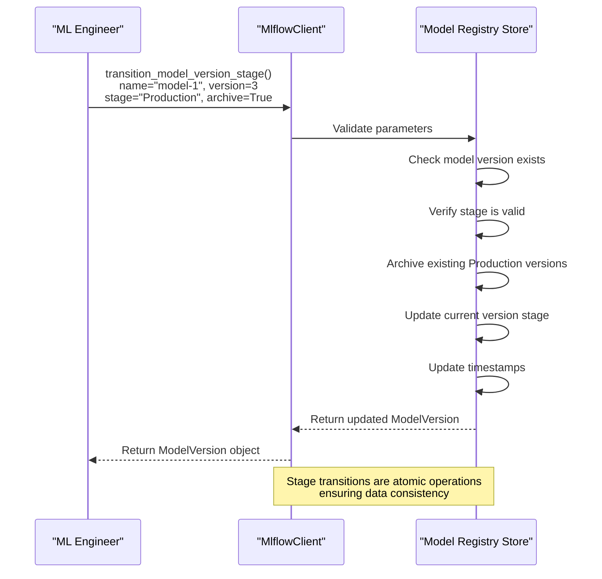
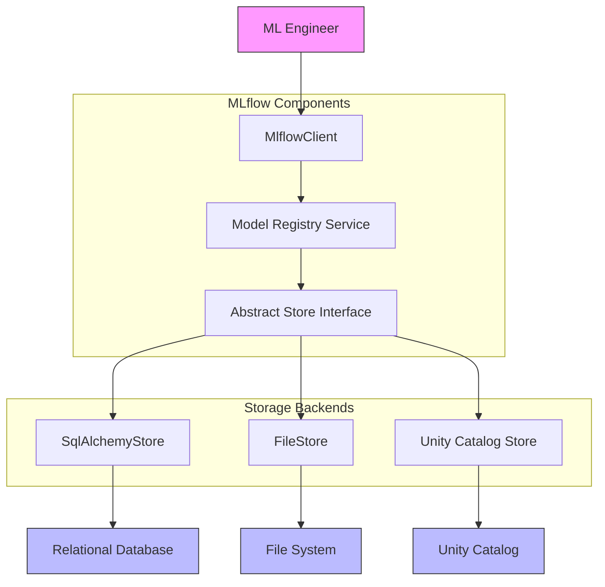

# Model Registry

<cite>
**Referenced Files in This Document**   
- [registered_model.py](file://mlflow/entities/model_registry/registered_model.py)
- [model_version.py](file://mlflow/entities/model_registry/model_version.py)
- [model_version_stages.py](file://mlflow/entities/model_registry/model_version_stages.py)
- [registered_model_alias.py](file://mlflow/entities/model_registry/registered_model_alias.py)
- [client.py](file://mlflow/client.py)
- [tracking/client.py](file://mlflow/tracking/client.py)
- [sqlalchemy_store.py](file://mlflow/store/model_registry/sqlalchemy_store.py)
- [file_store.py](file://mlflow/store/model_registry/file_store.py)
- [abstract_store.py](file://mlflow/store/model_registry/abstract_store.py)
</cite>

## Table of Contents
1. [Introduction](#introduction)
2. [Core Concepts](#core-concepts)
3. [Model Version Lifecycle](#model-version-lifecycle)
4. [Stage Transitions](#stage-transitions)
5. [Model Aliases](#model-aliases)
6. [Lineage Tracking](#lineage-tracking)
7. [Public Interfaces](#public-interfaces)
8. [Practical Examples](#practical-examples)
9. [Architecture Overview](#architecture-overview)
10. [Conclusion](#conclusion)

## Introduction

The MLflow Model Registry provides a centralized store for managing machine learning models throughout their lifecycle. It enables teams to collaborate on model development, ensure reproducibility, and streamline the deployment process from development to production. The registry serves as a single source of truth for all models, allowing data scientists and ML engineers to track model versions, manage stage transitions, and maintain model lineage.

The Model Registry architecture is built around two core entities: `RegisteredModel` and `ModelVersion`. A `RegisteredModel` represents a logical grouping of models with the same name, while each `ModelVersion` represents a specific iteration of that model with its own artifacts, metrics, and parameters. This structure enables comprehensive version control and facilitates collaboration across teams.

**Section sources**
- [registered_model.py](file://mlflow/entities/model_registry/registered_model.py#L1-L180)
- [model_version.py](file://mlflow/entities/model_registry/model_version.py#L1-L242)

## Core Concepts

### Registered Model and Model Version

The MLflow Model Registry is built on two fundamental entities: `RegisteredModel` and `ModelVersion`. A `RegisteredModel` serves as a container for organizing multiple versions of a model, providing a logical grouping mechanism. Each `RegisteredModel` has a unique name within the registry and contains metadata such as creation timestamp, last updated timestamp, description, and tags.

Each `RegisteredModel` can have multiple `ModelVersion` instances, representing different iterations of the model. The `ModelVersion` entity contains specific information about a particular model iteration, including:
- Version number
- Creation and update timestamps
- Source path to model artifacts
- Associated MLflow run ID
- Current stage (None, Staging, Production, Archived)
- Description and user-defined tags
- Status and status messages

The relationship between these entities enables comprehensive model versioning, allowing teams to track the evolution of models over time and maintain reproducibility across experiments.

### Model Version Stages

The Model Registry implements a stage-based workflow to manage the model lifecycle. The available stages are defined in the `model_version_stages.py` file and include:

- **None**: The default stage for newly created model versions
- **Staging**: Indicates a model version ready for testing in a staging environment
- **Production**: Denotes a model version deployed to production
- **Archived**: Represents a model version that is no longer in use

These stages provide a standardized workflow for promoting models through different environments, ensuring proper validation before production deployment. The stages are case-insensitive and automatically corrected to canonical form (e.g., "staging", "STAGING", and "StAgInG" all resolve to "Staging").

**Section sources**
- [registered_model.py](file://mlflow/entities/model_registry/registered_model.py#L1-L180)
- [model_version.py](file://mlflow/entities/model_registry/model_version.py#L1-L242)
- [model_version_stages.py](file://mlflow/entities/model_registry/model_version_stages.py#L1-L26)

## Model Version Lifecycle

The lifecycle of a model version in MLflow follows a structured progression from creation to potential archiving. When a new model is registered, it begins in the "None" stage, indicating it has been created but not yet assigned to a specific environment. As the model progresses through validation and testing, it can be transitioned to the "Staging" stage for further evaluation.

Once a model version has been thoroughly tested and approved, it can be promoted to "Production" where it serves live traffic. If a model version is found to be problematic or superseded by a better version, it can be moved to the "Archived" stage, indicating it should no longer be used. This lifecycle management ensures that only validated models are deployed to production environments.

The lifecycle is designed to support common ML workflows, including A/B testing, canary deployments, and rollback scenarios. Each transition is recorded with timestamps, providing an audit trail of model promotions and demotions.



**Diagram sources**
- [model_version_stages.py](file://mlflow/entities/model_registry/model_version_stages.py#L4-L7)
- [model_version.py](file://mlflow/entities/model_registry/model_version.py#L26-L27)

**Section sources**
- [model_version_stages.py](file://mlflow/entities/model_registry/model_version_stages.py#L1-L26)
- [model_version.py](file://mlflow/entities/model_registry/model_version.py#L1-L242)

## Stage Transitions

### Transition Workflow

The stage transition mechanism in MLflow provides a controlled process for moving model versions between different environments. The primary function for managing stage transitions is `transition_model_version_stage()`, which allows users to change the current stage of a model version.

The transition process includes several important features:
- Case-insensitive stage names that are automatically normalized
- Timestamp tracking for both model version and registered model updates
- Optional archiving of existing versions in the target stage
- Comprehensive audit logging of all transitions

When transitioning a model version to "Staging" or "Production", users can specify whether existing versions in that stage should be automatically archived. This feature is particularly useful for implementing blue-green deployment strategies or canary releases.

### Transition Rules and Constraints

The Model Registry enforces several rules to maintain data integrity during stage transitions:
- Only "Staging" and "Production" stages support the `archive_existing_versions` parameter
- Transitions to "Archived" and "None" stages do not affect other versions in the registry
- All stage names are validated against the canonical set of stages
- Each transition updates the `last_updated_timestamp` for both the model version and its parent registered model

The system also handles edge cases such as concurrent transitions and invalid stage combinations, ensuring the registry remains in a consistent state.



**Diagram sources**
- [abstract_store.py](file://mlflow/store/model_registry/abstract_store.py#L277-L293)
- [sqlalchemy_store.py](file://mlflow/store/model_registry/sqlalchemy_store.py#L1239-L1277)

**Section sources**
- [abstract_store.py](file://mlflow/store/model_registry/abstract_store.py#L277-L293)
- [test_file_store.py](file://tests/store/model_registry/test_file_store.py#L552-L643)
- [test_sqlalchemy_store.py](file://tests/store/model_registry/test_sqlalchemy_store.py#L579-L670)

## Model Aliases

### Alias Management

Model aliases provide an alternative to stage-based deployment management, offering more flexible model version referencing. The `set_registered_model_alias()` function allows users to create named pointers to specific model versions, enabling more sophisticated deployment patterns.

Aliases offer several advantages over traditional stage-based workflows:
- Multiple aliases can point to the same model version
- Aliases can be used to implement semantic versioning (e.g., "v1", "v2")
- They support canary deployment patterns (e.g., "canary", "control")
- Aliases can be changed without affecting the underlying model version

The alias system is designed to be lightweight and efficient, with minimal overhead compared to stage transitions. Each alias is stored as a simple name-to-version mapping, making lookups fast and reliable.

### Alias Operations

The Model Registry supports three primary operations for managing aliases:
- `set_registered_model_alias()`: Creates or updates an alias pointing to a specific model version
- `delete_registered_model_alias()`: Removes an alias from the registered model
- `get_model_version_by_alias()`: Retrieves a model version using its alias

These operations maintain consistency between the registered model's alias mapping and the model version's reverse alias list. When an alias is set, both the registered model's alias dictionary and the target model version's aliases list are updated atomically.

```mermaid
classDiagram
class RegisteredModel {
+string name
+int creation_timestamp
+int last_updated_timestamp
+string description
+dict tags
+dict aliases
+list latest_versions
+set_registered_model_alias(alias, version)
+delete_registered_model_alias(alias)
+get_model_version_by_alias(alias)
}
class ModelVersion {
+string name
+string version
+int creation_timestamp
+int last_updated_timestamp
+string current_stage
+string source
+string run_id
+string description
+dict tags
+list aliases
+string status
}
RegisteredModel "1" *-- "0..*" ModelVersion : contains
RegisteredModel "1" -- "0..*" ModelVersion : aliases → version
note right of RegisteredModel : : aliases
Dictionary mapping alias names<br>to version numbers<br>e.g., {"prod" : "3", "dev" : "4"}
end note
note left of ModelVersion : : aliases
List of alias names pointing<br>to this version<br>e.g., ["prod", "latest"]
end note
```

**Diagram sources**
- [registered_model_alias.py](file://mlflow/entities/model_registry/registered_model_alias.py#L1-L36)
- [sqlalchemy_store.py](file://mlflow/store/model_registry/sqlalchemy_store.py#L1250-L1277)
- [file_store.py](file://mlflow/store/model_registry/file_store.py#L1025-L1064)

**Section sources**
- [registered_model_alias.py](file://mlflow/entities/model_registry/registered_model_alias.py#L1-L36)
- [test_file_store.py](file://tests/store/model_registry/test_file_store.py#L1497-L1525)
- [test_sqlalchemy_store.py](file://tests/store/model_registry/test_sqlalchemy_store.py#L1675-L1708)

## Lineage Tracking

### Model Lineage and Provenance

The Model Registry maintains comprehensive lineage information for each model version, enabling full traceability from development to production. Each `ModelVersion` entity includes references to its source MLflow run, allowing users to trace back to the exact experiment that produced the model.

Key lineage tracking features include:
- Run ID association with each model version
- Run link for direct navigation to the source experiment
- Creation and update timestamps for audit purposes
- Integration with MLflow Tracking to access full experiment context

This lineage information is crucial for reproducibility, allowing teams to recreate models from their original experiments and understand the complete context of model development.

### Metadata and Tags

The Model Registry supports rich metadata through tags, which can be applied at both the registered model and model version levels. These tags enable additional organization and filtering capabilities:

- **RegisteredModelTag**: Applied to the entire model lineage
- **ModelVersionTag**: Specific to individual model versions
- **System tags**: Automatically added by MLflow (e.g., `mlflow.source.type`)
- **User-defined tags**: Custom metadata for organizational purposes

Tags can be used for various purposes, including team ownership, project association, performance metrics, and deployment constraints. The tagging system supports both setting and deleting tags, with appropriate validation to prevent invalid operations.

**Section sources**
- [model_version.py](file://mlflow/entities/model_registry/model_version.py#L28-L32)
- [registered_model.py](file://mlflow/entities/model_registry/registered_model.py#L26-L27)
- [abstract_store.py](file://mlflow/store/model_registry/abstract_store.py#L197-L210)

## Public Interfaces

### Key Functions and Parameters

The Model Registry exposes several public functions through the `MlflowClient` interface. The most important functions include:

#### transition_model_version_stage()
```python
def transition_model_version_stage(
    name: str,
    version: str,
    stage: str,
    archive_existing_versions: bool = False
) -> ModelVersion:
    """
    Update model version stage.
    
    Args:
        name: Registered model name
        version: Registered model version
        stage: New desired stage (None, Staging, Production, Archived)
        archive_existing_versions: Whether to archive existing versions in target stage
    
    Returns:
        Updated ModelVersion object
    """
```

#### set_registered_model_alias()
```python
def set_registered_model_alias(
    name: str,
    alias: str,
    version: str
) -> None:
    """
    Set a registered model alias pointing to a model version.
    
    Args:
        name: Registered model name
        alias: Name of the alias
        version: Registered model version number
    """
```

#### get_latest_versions()
```python
def get_latest_versions(
    name: str,
    stages: Optional[List[str]] = None
) -> List[ModelVersion]:
    """
    Get latest model versions for specified stages.
    
    Args:
        name: Registered model name
        stages: List of desired stages (None returns all stages)
    
    Returns:
        List of latest ModelVersion objects for each requested stage
    """
```

### Return Values and Error Handling

All Model Registry functions return well-defined objects or raise specific exceptions for error conditions. The primary return types include:

- `RegisteredModel`: Returned by model creation and retrieval operations
- `ModelVersion`: Returned by version-specific operations
- `PagedList`: Used for search operations with pagination support
- `None`: Returned by void operations like tag deletion

The system uses `MlflowException` for error handling, with specific error codes for different failure modes:
- `INVALID_PARAMETER_VALUE`: Invalid input parameters
- `RESOURCE_DOES_NOT_EXIST`: Model or version not found
- `RESOURCE_ALREADY_EXISTS`: Attempt to create duplicate resources
- `INVALID_STATE`: Operation not allowed in current state

**Section sources**
- [client.py](file://mlflow/client.py#L1-L13)
- [tracking/client.py](file://mlflow/tracking/client.py#L212-L800)
- [abstract_store.py](file://mlflow/store/model_registry/abstract_store.py#L277-L416)

## Practical Examples

### Promoting Models Between Environments

The following example demonstrates a typical workflow for promoting a model from staging to production:

```python
from mlflow import MlflowClient

client = MlflowClient()

# Register a new model version from a training run
model_version = client.create_model_version(
    name="fraud-detection",
    source="runs:/abc123/model",
    run_id="abc123"
)

# Promote to staging for testing
client.transition_model_version_stage(
    name="fraud-detection",
    version=model_version.version,
    stage="Staging"
)

# After successful testing, promote to production
# Archive existing production versions
client.transition_model_version_stage(
    name="fraud-detection",
    version=model_version.version,
    stage="Production",
    archive_existing_versions=True
)
```

### Implementing Canary Deployments

Model aliases enable sophisticated deployment patterns like canary releases:

```python
from mlflow import MlflowClient

client = MlflowClient()

# Deploy new model version with canary alias
client.set_registered_model_alias(
    name="recommendation-engine",
    alias="canary",
    version="5"
)

# Monitor canary performance
# If successful, promote to production
client.set_registered_model_alias(
    name="recommendation-engine",
    alias="prod",
    version="5"
)

# Update application to use "prod" alias
# Gradually shift traffic from old version
```

These examples illustrate how the Model Registry supports both traditional stage-based workflows and more flexible alias-based deployment strategies.

**Section sources**
- [test_model_registry.py](file://tests/tracking/test_model_registry.py#L485-L545)
- [tracking/client.py](file://mlflow/tracking/client.py#L594-L701)

## Architecture Overview

The MLflow Model Registry architecture follows a layered design pattern with clear separation of concerns. At the core is the abstract store interface that defines the contract for model registry operations. Concrete implementations like `SqlAlchemyStore` and `FileStore` provide persistence for different backend systems.

The architecture includes several key components:
- **Client Layer**: `MlflowClient` provides the primary interface
- **Service Layer**: Handles business logic and validation
- **Store Layer**: Abstract interface for persistence operations
- **Database Layer**: Concrete implementations for different storage backends

This design enables extensibility while maintaining consistency across different deployment scenarios.



**Diagram sources**
- [abstract_store.py](file://mlflow/store/model_registry/abstract_store.py#L51-L474)
- [sqlalchemy_store.py](file://mlflow/store/model_registry/sqlalchemy_store.py#L82-L200)
- [client.py](file://mlflow/client.py#L1-L13)

**Section sources**
- [abstract_store.py](file://mlflow/store/model_registry/abstract_store.py#L51-L474)
- [sqlalchemy_store.py](file://mlflow/store/model_registry/sqlalchemy_store.py#L82-L200)
- [client.py](file://mlflow/client.py#L1-L13)

## Conclusion

The MLflow Model Registry provides a comprehensive solution for managing the machine learning model lifecycle. By combining versioning, stage transitions, aliases, and lineage tracking, it enables teams to maintain reproducibility, ensure model quality, and streamline deployment processes.

The architecture balances flexibility with consistency, supporting both traditional stage-based workflows and more sophisticated alias-based deployment patterns. The public interfaces are designed to be intuitive while providing the necessary control for production ML operations.

As machine learning systems become more complex, the Model Registry's capabilities for tracking model evolution, managing deployments, and maintaining audit trails become increasingly valuable. By adopting these practices, organizations can build more reliable, transparent, and maintainable ML systems.