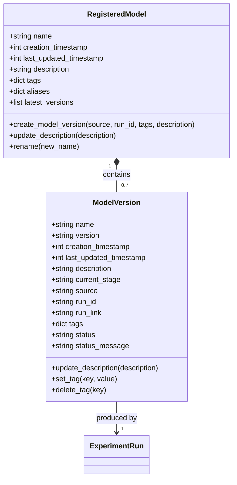
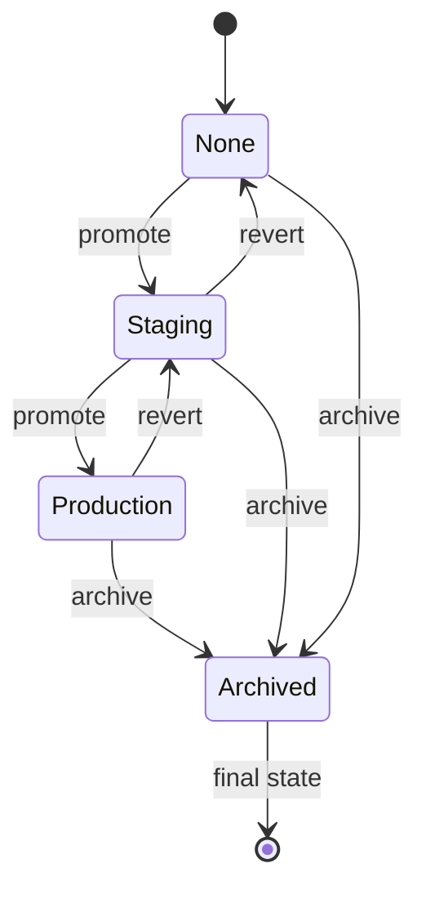
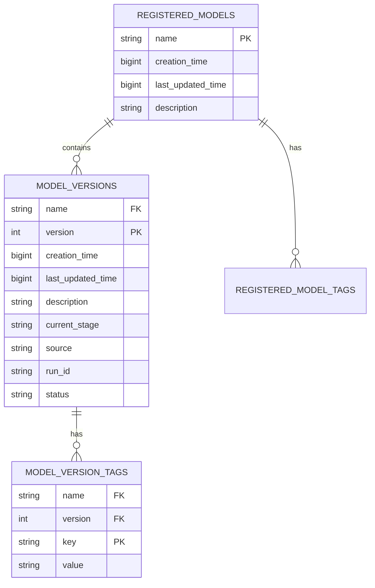

# Model Versioning

<cite>
**Referenced Files in This Document**   
- [registered_model.py](file://mlflow/entities/model_registry/registered_model.py)
- [model_version.py](file://mlflow/entities/model_registry/model_version.py)
- [sqlalchemy_store.py](file://mlflow/store/model_registry/sqlalchemy_store.py)
- [dbmodels/models.py](file://mlflow/store/model_registry/dbmodels/models.py)
- [2b4d017a5e9b_add_model_registry_tables_to_db.py](file://mlflow/store/db_migrations/versions/2b4d017a5e9b_add_model_registry_tables_to_db.py)
- [client.py](file://mlflow/tracking/client.py)
- [register_model.py](file://examples/mlflow-3/register_model.py)
- [model_registry.proto](file://mlflow/protos/model_registry.proto)
</cite>

## Table of Contents
1. [Introduction](#introduction)
2. [Core Entities](#core-entities)
3. [Model Registration Process](#model-registration-process)
4. [Model Versioning Implementation](#model-versioning-implementation)
5. [Storage Mechanisms](#storage-mechanisms)
6. [Relationship with Experiment Runs](#relationship-with-experiment-runs)
7. [Common Issues and Error Handling](#common-issues-and-error-handling)
8. [API Usage Examples](#api-usage-examples)
9. [Conclusion](#conclusion)

## Introduction
MLflow's Model Registry provides a centralized repository for managing machine learning models throughout their lifecycle. This document details the implementation of model versioning in MLflow, focusing on how models are registered, versioned, and stored with immutable snapshots of model artifacts and metadata. The Model Registry enables teams to collaborate around a common model repository, promoting reproducibility and governance in machine learning workflows.

The system is built around two core entities: RegisteredModel and ModelVersion, which work together to provide a comprehensive model management solution. Each model version captures a complete snapshot of the model artifacts and metadata at the time of registration, ensuring immutability and traceability.

**Section sources**
- [registered_model.py](file://mlflow/entities/model_registry/registered_model.py#L1-L180)
- [model_version.py](file://mlflow/entities/model_registry/model_version.py#L1-L242)

## Core Entities

### RegisteredModel Entity
The `RegisteredModel` entity serves as the container for all versions of a particular model. It maintains metadata about the model family and provides methods to manage its lifecycle. Key fields include:

- **name**: Unique identifier for the registered model
- **creation_timestamp**: When the model was first registered
- **last_updated_timestamp**: When the model metadata was last modified
- **description**: Human-readable description of the model purpose
- **tags**: Key-value pairs for additional metadata and classification
- **aliases**: User-defined aliases pointing to specific versions
- **latest_versions**: References to the most recent version in each stage

The RegisteredModel acts as a namespace for model versions, ensuring that all versions of the same logical model are grouped together while maintaining their individual immutability.

### ModelVersion Entity
The `ModelVersion` entity represents a specific iteration of a machine learning model. Each version is immutable and contains a complete snapshot of the model artifacts and metadata. Key fields include:

- **name**: Reference to the parent RegisteredModel
- **version**: Sequential integer identifier (1, 2, 3, ...)
- **creation_timestamp**: When this version was created
- **last_updated_timestamp**: When version metadata was last updated
- **description**: Version-specific description
- **current_stage**: Deployment stage (None, Staging, Production, Archived)
- **source**: URI pointing to the model artifacts
- **run_id**: Reference to the MLflow experiment run that produced the model
- **run_link**: Direct link to view the source run
- **tags**: Version-specific metadata tags
- **status**: Current status of the version (READY, FAILED_REGISTRATION, etc.)
- **status_message**: Error message if registration failed

Each ModelVersion represents a complete, immutable snapshot that can be reliably deployed and reproduced.



**Diagram sources**
- [registered_model.py](file://mlflow/entities/model_registry/registered_model.py#L14-L180)
- [model_version.py](file://mlflow/entities/model_registry/model_version.py#L13-L242)

**Section sources**
- [registered_model.py](file://mlflow/entities/model_registry/registered_model.py#L14-L180)
- [model_version.py](file://mlflow/entities/model_registry/model_version.py#L13-L242)

## Model Registration Process

### Creating Registered Models
The model registration process begins with creating a RegisteredModel container. This can be done explicitly using the `create_registered_model()` method or implicitly when registering the first version of a model. The registration process validates the model name and ensures uniqueness within the registry.

When a new RegisteredModel is created, the system initializes metadata including creation timestamp and sets up the necessary database records. The model name serves as the primary key and must follow naming conventions to ensure compatibility across different storage backends.

### Model Version Creation
Creating a new model version involves several key steps:

1. **Source Validation**: The system validates the source URI pointing to the model artifacts
2. **Run Association**: The version is linked to the experiment run that produced the model
3. **Version Numbering**: The system automatically assigns the next sequential version number
4. **Metadata Capture**: All relevant metadata, tags, and descriptions are captured
5. **Storage**: The version record is persisted in the backend store

The process is designed to be idempotent and includes retry logic to handle transient database issues, with a default retry limit of 3 attempts.

**Section sources**
- [sqlalchemy_store.py](file://mlflow/store/model_registry/sqlalchemy_store.py#L741-L800)
- [model_version.py](file://mlflow/entities/model_registry/model_version.py#L18-L40)

## Model Versioning Implementation

### Version Numbering Strategy
MLflow uses a simple sequential numbering scheme for model versions, starting with version 1 and incrementing by 1 for each new version. The version number is automatically determined by the system based on existing versions within the same RegisteredModel.

The versioning logic is implemented in the `next_version()` function within the SQLAlchemy store, which queries the database for existing versions and calculates the next available number. This approach ensures consistency across distributed systems and prevents version conflicts.

### Immutable Snapshots
Each model version represents an immutable snapshot of the model artifacts and metadata at the time of registration. Once created, the following aspects cannot be modified:

- Model artifacts location (source)
- Associated experiment run (run_id)
- Version number
- Creation timestamp

While certain metadata fields like description and tags can be updated after creation, the core model reference remains immutable, ensuring reproducibility and auditability.

### Lifecycle Management
Model versions progress through a well-defined lifecycle with four possible stages:

- **None**: Initial state after registration
- **Staging**: Model is being tested in a pre-production environment
- **Production**: Model is serving live traffic
- **Archived**: Model is no longer in use but preserved for historical purposes

The transition between stages is explicitly managed through API calls, allowing for controlled promotion of models through the deployment pipeline.



**Diagram sources**
- [model_version_stages.py](file://mlflow/entities/model_registry/model_version_stages.py)
- [model_version.py](file://mlflow/entities/model_registry/model_version.py#L26-L27)

**Section sources**
- [model_version_stages.py](file://mlflow/entities/model_registry/model_version_stages.py)
- [model_version.py](file://mlflow/entities/model_registry/model_version.py#L26-L27)

## Storage Mechanisms

### Database Schema
The Model Registry uses a relational database schema to store model metadata. The core tables are defined in the database migration script and include:

- **registered_models**: Stores information about registered model containers
- **model_versions**: Stores information about individual model versions
- **model_version_tags**: Stores key-value tags for model versions
- **registered_model_tags**: Stores key-value tags for registered models

The schema is designed to support efficient querying by model name, version, and tags, with appropriate indexes to optimize performance.



**Diagram sources**
- [2b4d017a5e9b_add_model_registry_tables_to_db.py](file://mlflow/store/db_migrations/versions/2b4d017a5e9b_add_model_registry_tables_to_db.py)
- [dbmodels/models.py](file://mlflow/store/model_registry/dbmodels/models.py)

### SQLAlchemy Implementation
The SQLAlchemy store provides the primary implementation for the Model Registry backend. It uses SQLAlchemy ORM to map Python objects to database tables and handles all CRUD operations for model entities.

Key implementation features include:

- **Connection pooling**: Reuses database connections to improve performance
- **Transaction management**: Ensures data consistency during model operations
- **Eager loading**: Optimizes queries by loading related entities efficiently
- **Retry logic**: Handles transient database errors during version creation

The store is designed to be thread-safe and supports multiple dialects including MySQL, PostgreSQL, SQLite, and SQL Server.

**Section sources**
- [sqlalchemy_store.py](file://mlflow/store/model_registry/sqlalchemy_store.py)
- [dbmodels/models.py](file://mlflow/store/model_registry/dbmodels/models.py)

## Relationship with Experiment Runs

### Source Run Tracking
Each model version maintains a direct reference to the experiment run that produced it through the `run_id` field. This creates a traceable lineage from the deployed model back to the exact training run, including all parameters, metrics, and artifacts.

The system also captures a `run_link` field that provides a direct URL to view the source run in the MLflow UI, enabling quick navigation from the model registry to the experiment details.

### Artifact Storage
Model artifacts are stored separately from the metadata, typically in an artifact repository such as Amazon S3, Azure Blob Storage, or a local file system. The model version record contains a URI reference to the location of these artifacts.

When registering a model, the source URI can point to:
- A run-relative path (e.g., `runs:/<run_id>/model`)
- A direct artifact path (e.g., `s3://bucket/path/to/model`)
- Another model version (e.g., `models:/<model_name>/<version>`)

This flexible referencing system allows models to be registered from various sources while maintaining traceability.

**Section sources**
- [model_version.py](file://mlflow/entities/model_registry/model_version.py#L28-L29)
- [sqlalchemy_store.py](file://mlflow/store/model_registry/sqlalchemy_store.py#L783-L800)

## Common Issues and Error Handling

### Duplicate Model Names
Attempting to create a registered model with a name that already exists will result in a `RESOURCE_ALREADY_EXISTS` error. The system enforces uniqueness of model names across the registry.

To handle this scenario, applications should:
1. Check if the model exists before attempting creation
2. Use exception handling to catch the specific error
3. Proceed with version creation if the model already exists

```python
try:
    client.create_registered_model(name="my_model")
except mlflow.exceptions.MlflowException as e:
    if "already exists" in str(e):
        print("Model already registered, creating new version")
```

### Version Conflicts
Version conflicts are prevented by the sequential numbering system and database constraints. The system automatically assigns the next available version number, eliminating the possibility of manual version conflicts.

However, race conditions during concurrent version creation are handled through database transactions and retry logic, with up to 3 retry attempts configured by default.

### Error Statuses
Model versions can enter an error state (`FAILED_REGISTRATION`) if the registration process fails. Common causes include:
- Invalid source URI
- Inaccessible artifact storage
- Database connectivity issues
- Permission problems

When a version fails registration, the `status_message` field contains detailed error information to aid in troubleshooting.

**Section sources**
- [sqlalchemy_store.py](file://mlflow/store/model_registry/sqlalchemy_store.py#L225-L230)
- [model_version_status.py](file://mlflow/entities/model_registry/model_version_status.py)

## API Usage Examples

### Registering Models with mlflow.register_model()
The high-level `mlflow.register_model()` function provides a simple interface for registering models from a run:

```python
# Register a model from a run
model_uri = f"runs:/{run.info.run_id}/model"
mlflow.register_model(model_uri, name="my_model")
```

This function automatically handles the creation of the registered model (if it doesn't exist) and the creation of a new model version.

### Creating Model Versions with MlflowClient
The lower-level `MlflowClient` provides more granular control over the model registry:

```python
from mlflow import MlflowClient

client = MlflowClient()

# Create registered model (optional, happens automatically)
client.create_registered_model("my_model")

# Create a new model version
mv = client.create_model_version(
    name="my_model",
    source="runs:/<run_id>/model",
    run_id="<run_id>",
    description="New model version with improved accuracy",
    tags={"training_data": "dataset_v2", "algorithm": "random_forest"}
)
```

### Complete Workflow Example
```python
import mlflow
from sklearn.ensemble import RandomForestRegressor

# Train and log a model
with mlflow.start_run():
    model = RandomForestRegressor(n_estimators=100)
    model.fit(X_train, y_train)
    
    # Log the model
    model_info = mlflow.sklearn.log_model(
        model, 
        "model",
        registered_model_name="production-model"
    )

# The model is now automatically registered
# Additional versions can be created from other runs
mv = mlflow.client.MlflowClient().create_model_version(
    name="production-model",
    source=f"runs:/{other_run_id}/model",
    run_id=other_run_id,
    description="Alternative model with different hyperparameters"
)
```

**Section sources**
- [client.py](file://mlflow/tracking/client.py#L4414-L4424)
- [register_model.py](file://examples/mlflow-3/register_model.py)

## Conclusion
MLflow's Model Registry provides a robust system for managing model versions with immutable snapshots of artifacts and metadata. The implementation centers around the RegisteredModel and ModelVersion entities, which work together to provide a comprehensive model management solution.

Key strengths of the system include:
- Immutable versioning that ensures reproducibility
- Complete traceability from deployed models to source experiments
- Flexible storage backend supporting multiple database systems
- Comprehensive API for both high-level and granular operations
- Built-in error handling and retry logic for production reliability

The architecture balances simplicity with functionality, making it accessible to beginners while providing the depth needed by experienced developers. By understanding the underlying implementation, users can effectively leverage the Model Registry to manage their machine learning models throughout their lifecycle.