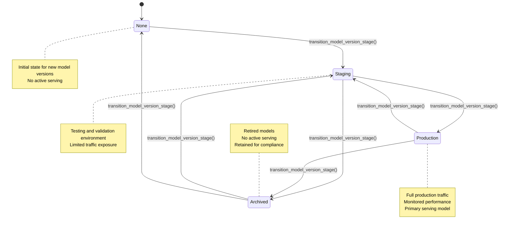
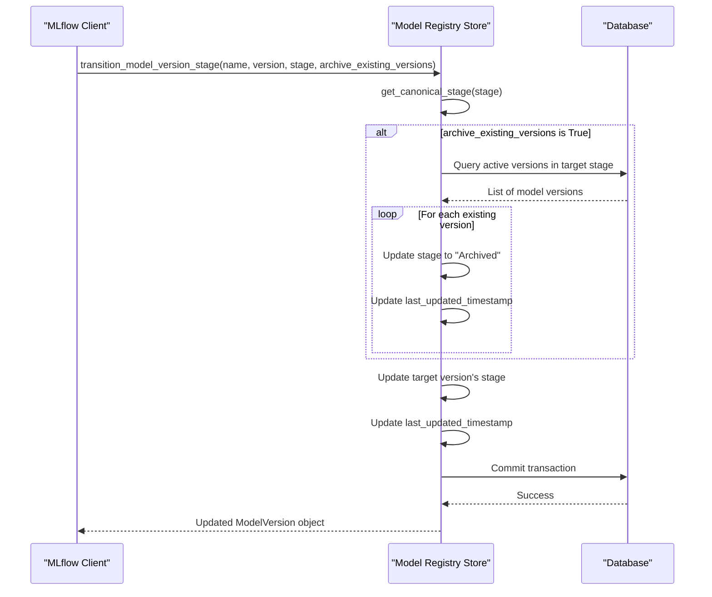
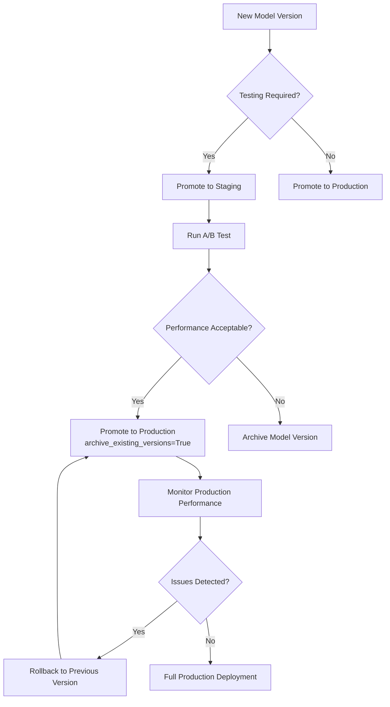

# Stage Transitions

<cite>
**Referenced Files in This Document**   
- [model_version_stages.py](file://mlflow/entities/model_registry/model_version_stages.py)
- [abstract_store.py](file://mlflow/store/model_registry/abstract_store.py)
- [sqlalchemy_store.py](file://mlflow/store/model_registry/sqlalchemy_store.py)
- [file_store.py](file://mlflow/store/model_registry/file_store.py)
- [rest_store.py](file://mlflow/store/model_registry/rest_store.py)
- [test_sqlalchemy_store.py](file://tests/store/model_registry/test_sqlalchemy_store.py)
- [test_file_store.py](file://tests/store/model_registry/test_file_store.py)
- [constants.tsx](file://mlflow/server/js/src/model-registry/constants.tsx)
- [ModelStageTransitionFormModal.tsx](file://mlflow/server/js/src/model-registry/components/ModelStageTransitionFormModal.tsx)
</cite>

## Table of Contents
1. [Introduction](#introduction)
2. [Model Stage Lifecycle](#model-stage-lifecycle)
3. [Implementation of transition_model_version_stage](#implementation-of-transition_model_version_stage)
4. [Validation Rules and State Transitions](#validation-rules-and-state-transitions)
5. [Audit Logging and Activity Tracking](#audit-logging-and-activity-tracking)
6. [Promotion Workflows for Deployment Scenarios](#promotion-workflows-for-deployment-scenarios)
7. [Relationship with Model Serving Configurations](#relationship-with-model-serving-configurations)
8. [Concurrency and Race Condition Handling](#concurrency-and-race-condition-handling)
9. [Backend Store Atomic Operations](#backend-store-atomic-operations)
10. [Conclusion](#conclusion)

## Introduction

MLflow's Model Registry provides a centralized model lifecycle management system that enables teams to collaboratively manage models from development to production. A core component of this system is the stage transition mechanism, which controls how models progress through different environments and deployment states. This document provides a comprehensive analysis of the stage transition system, focusing on the implementation details, validation rules, and practical applications for safe model deployment workflows. The stage transition functionality is implemented through the `transition_model_version_stage()` method across various backend stores, ensuring consistent behavior whether using file-based, SQL-based, or REST-based storage systems.

**Section sources**
- [abstract_store.py](file://mlflow/store/model_registry/abstract_store.py#L276-L293)
- [constants.tsx](file://mlflow/server/js/src/model-registry/constants.tsx#L5-L10)

## Model Stage Lifecycle

MLflow's Model Registry implements a four-stage lifecycle for model versions: None, Staging, Production, and Archived. Each stage serves a specific purpose in the model deployment workflow. The "None" stage represents a newly registered model version that hasn't been assigned to any deployment environment. "Staging" is used for models undergoing testing and validation before production deployment. "Production" indicates models that are actively serving predictions in the production environment. "Archived" is used for models that are no longer in use but need to be retained for compliance or historical purposes.

The stage system enables safe deployment patterns by preventing direct promotion from development to production without intermediate testing. The implementation ensures case-insensitive stage names through canonical mapping, allowing users to specify stages in any case while maintaining consistent internal representation. This lifecycle design supports common deployment strategies like canary deployments and A/B testing by allowing multiple model versions to coexist in different stages simultaneously.

**Diagram sources **
- [model_version_stages.py](file://mlflow/entities/model_registry/model_version_stages.py#L4-L7)
- [constants.tsx](file://mlflow/server/js/src/model-registry/constants.tsx#L5-L10)

**Section sources**
- [model_version_stages.py](file://mlflow/entities/model_registry/model_version_stages.py#L4-L13)
- [constants.tsx](file://mlflow/server/js/src/model-registry/constants.tsx#L5-L10)

## Implementation of transition_model_version_stage

The `transition_model_version_stage()` method is the primary interface for changing a model version's stage in MLflow's Model Registry. This method is implemented across multiple backend stores including SQLAlchemyStore, FileStore, and RESTStore, maintaining a consistent interface while adapting to the specific characteristics of each storage system. The method takes four parameters: the model name, version number, target stage, and a boolean flag indicating whether to archive existing versions in the target stage.

In the SQLAlchemyStore implementation, the transition operation is wrapped in a database transaction to ensure atomicity. The method first validates the target stage using the `get_canonical_stage()` function, which normalizes stage names and verifies they are valid. For active stages (Staging and Production), the method can optionally archive existing model versions in the same stage when the `archive_existing_versions` flag is set to true. This feature enables zero-downtime deployments by automatically retiring older production models when promoting a new version.

The FileStore implementation follows a similar pattern but uses file system operations instead of database transactions. It reads the model version metadata file, updates the stage field, and writes the changes back to disk. The RESTStore implementation acts as a client, serializing the transition request into a JSON payload and sending it to the MLflow server via HTTP. All implementations ensure thread safety and maintain consistency between the model version's stage and the parent registered model's last updated timestamp.

**Diagram sources **
- [sqlalchemy_store.py](file://mlflow/store/model_registry/sqlalchemy_store.py#L940-L990)
- [file_store.py](file://mlflow/store/model_registry/file_store.py#L780-L823)
- [rest_store.py](file://mlflow/store/model_registry/rest_store.py#L304-L330)

**Section sources**
- [sqlalchemy_store.py](file://mlflow/store/model_registry/sqlalchemy_store.py#L940-L990)
- [file_store.py](file://mlflow/store/model_registry/file_store.py#L780-L823)
- [rest_store.py](file://mlflow/store/model_registry/rest_store.py#L304-L330)

## Validation Rules and State Transitions

The stage transition system implements several validation rules to maintain data integrity and enforce proper deployment workflows. The primary validation occurs through the `get_canonical_stage()` function, which ensures that only valid stage names are accepted and normalizes them to a canonical form. This function maintains a mapping of lowercase stage names to their canonical representations, allowing case-insensitive input while ensuring consistent internal storage.

A critical validation rule prevents the use of the `archive_existing_versions` flag with inactive stages (None and Archived). This restriction exists because archiving existing versions is only meaningful for active deployment stages (Staging and Production) where multiple versions might compete for traffic. Attempting to use this flag with inactive stages raises an `MlflowException` with a descriptive error message.

The system also validates that the target model version exists and is not in a deleted state before attempting a transition. This prevents operations on non-existent or deleted model versions. Additionally, the implementation ensures that stage transitions update the parent registered model's last updated timestamp, maintaining consistency across the model registry hierarchy. These validation rules work together to prevent invalid state transitions and maintain the integrity of the model lifecycle.

**Section sources**
- [model_version_stages.py](file://mlflow/entities/model_registry/model_version_stages.py#L16-L25)
- [sqlalchemy_store.py](file://mlflow/store/model_registry/sqlalchemy_store.py#L957-L963)
- [file_store.py](file://mlflow/store/model_registry/file_store.py#L799-L805)

## Audit Logging and Activity Tracking

MLflow's stage transition system includes comprehensive audit logging to track all changes to model versions. Each stage transition updates the model version's `last_updated_timestamp` field with the current time in milliseconds, providing a precise record of when the transition occurred. This timestamp is also propagated to the parent registered model, ensuring that the entire model lineage reflects the most recent change.

The system captures additional metadata about transitions through the activity tracking system. When a stage transition occurs, an activity record is created containing the user ID, creation timestamp, activity type, comment, and system comment. This information is stored in the model version's activity history, enabling full traceability of all changes. The web interface displays these activities in a chronological feed, showing who made each change and when.

For deployments that require formal approval processes, the system supports transition requests with comments. Users can include descriptive comments when promoting models, providing context for the change. This audit trail is essential for compliance requirements and post-incident analysis, allowing teams to reconstruct the history of model deployments and understand the rationale behind each transition.

**Section sources**
- [abstract_store.py](file://mlflow/store/model_registry/abstract_store.py#L931-L934)
- [constants.tsx](file://mlflow/server/js/src/model-registry/constants.tsx#L42-L52)
- [ModelStageTransitionFormModal.tsx](file://mlflow/server/js/src/model-registry/components/ModelStageTransitionFormModal.tsx#L15-L18)

## Promotion Workflows for Deployment Scenarios

The stage transition system enables several common deployment workflows, including canary deployments and A/B testing. For canary deployments, teams can promote a new model version to Production while setting `archive_existing_versions=True`. This automatically archives the previous production version, gradually shifting traffic to the new model. Monitoring systems can then evaluate the new model's performance, with the ability to quickly roll back by promoting the archived version back to Production if issues are detected.

For A/B testing scenarios, multiple model versions can be maintained in the Staging stage simultaneously. Teams can deploy these versions to different user segments and compare their performance metrics. Once the optimal model is identified, it can be promoted to Production while archiving any competing versions. The system's support for multiple versions in non-production stages makes it ideal for experimentation and comparison.

The `get_latest_versions()` method complements these workflows by returning the most recent model version for each stage. This allows deployment systems to automatically detect when a new model has been promoted to Production and initiate a reload of the serving infrastructure. The combination of stage transitions and version discovery enables automated deployment pipelines that respond to registry changes without requiring manual intervention.

**Diagram sources **
- [test_sqlalchemy_store.py](file://tests/store/model_registry/test_sqlalchemy_store.py#L644-L666)
- [test_file_store.py](file://tests/store/model_registry/test_file_store.py#L617-L638)

**Section sources**
- [test_sqlalchemy_store.py](file://tests/store/model_registry/test_sqlalchemy_store.py#L644-L666)
- [test_file_store.py](file://tests/store/model_registry/test_file_store.py#L617-L638)

## Relationship with Model Serving Configurations

Stage transitions are closely integrated with model serving configurations, enabling automated responses to registry changes. Deployment targets monitor the Model Registry for stage changes, particularly promotions to the Production stage. When a new model version is promoted, serving systems can automatically update their configurations to load the new model, ensuring that production traffic is directed to the latest approved version.

The `get_model_version_download_uri()` method plays a crucial role in this integration by providing the artifact location for a specific model version. Serving systems use this URI to download the model artifacts and load them into memory. The method returns either the original source path or a storage location, depending on the backend configuration, ensuring that serving systems can always access the required model files.

For cloud deployments, the system supports temporary credential generation for accessing model artifacts in secure storage locations. This allows serving systems to authenticate and download models without requiring permanent access credentials. The integration between stage transitions and serving configurations enables continuous deployment workflows where model updates are automatically propagated to production environments based on registry state changes.

**Section sources**
- [abstract_store.py](file://mlflow/store/model_registry/abstract_store.py#L321-L334)
- [uc_oss_rest_store.py](file://mlflow/store/_unity_catalog/registry/uc_oss_rest_store.py#L458-L460)

## Concurrency and Race Condition Handling

The stage transition system implements several mechanisms to handle concurrent promotion requests and prevent race conditions. In the SQLAlchemyStore implementation, database transactions with appropriate isolation levels ensure that multiple concurrent transitions are processed atomically. The use of row-level locking prevents two processes from modifying the same model version simultaneously, maintaining data consistency.

For file-based storage, the system relies on the atomicity of file operations and careful ordering of read-modify-write sequences. While less robust than database transactions, this approach provides reasonable protection against race conditions in single-server deployments. The RESTStore implementation delegates concurrency handling to the server, which can implement more sophisticated locking mechanisms.

The system also includes validation checks that prevent invalid state transitions even in the presence of concurrency. For example, attempting to archive existing versions during a transition to an inactive stage will fail regardless of the order of operations. These validation rules act as a safety net, ensuring that the model registry remains in a consistent state even when multiple users are making changes simultaneously.

**Section sources**
- [sqlalchemy_store.py](file://mlflow/store/model_registry/sqlalchemy_store.py#L965-L987)
- [file_store.py](file://mlflow/store/model_registry/file_store.py#L807-L822)

## Backend Store Atomic Operations

The atomicity of stage transitions is implemented differently across backend stores, but with the same goal of ensuring data consistency. In the SQLAlchemyStore, transitions are wrapped in database transactions that encompass all related changes: updating the target model version's stage, archiving existing versions if requested, and updating the parent registered model's timestamp. If any part of the operation fails, the entire transaction is rolled back, preventing partial updates.

The FileStore implementation achieves atomicity through careful file operations and timestamp synchronization. When updating a model version, the system writes the changes to a temporary file and then renames it to the final location, leveraging the atomicity of the rename operation on most file systems. This prevents other processes from reading partially written metadata files.

The RESTStore implementation relies on the server's transactional capabilities, with the client treating the entire HTTP request as an atomic operation. The server processes the transition request in a single transaction, ensuring that all changes are applied together or not at all. This distributed atomicity model allows clients to treat stage transitions as indivisible operations, regardless of the underlying storage mechanism.

**Section sources**
- [sqlalchemy_store.py](file://mlflow/store/model_registry/sqlalchemy_store.py#L965-L987)
- [file_store.py](file://mlflow/store/model_registry/file_store.py#L816-L822)

## Conclusion

MLflow's stage transition system provides a robust foundation for safe and reliable model deployment workflows. By implementing a clear four-stage lifecycle with comprehensive validation rules, audit logging, and atomic operations, the system enables teams to manage model versions with confidence. The `transition_model_version_stage()` method serves as the central mechanism for controlling model progression through the deployment pipeline, supporting common patterns like canary deployments and A/B testing.

The implementation across multiple backend stores demonstrates a thoughtful approach to consistency, ensuring that the same validation rules and behavior are maintained whether using file-based, SQL-based, or REST-based storage. The integration with model serving configurations enables automated deployment pipelines, while the audit logging and activity tracking provide essential traceability for compliance and incident response.

For both beginners and experienced developers, understanding the stage transition system is key to leveraging MLflow's Model Registry effectively. The combination of simple, intuitive stage names with powerful underlying mechanics creates a system that is easy to use but capable of supporting complex deployment scenarios in production environments.