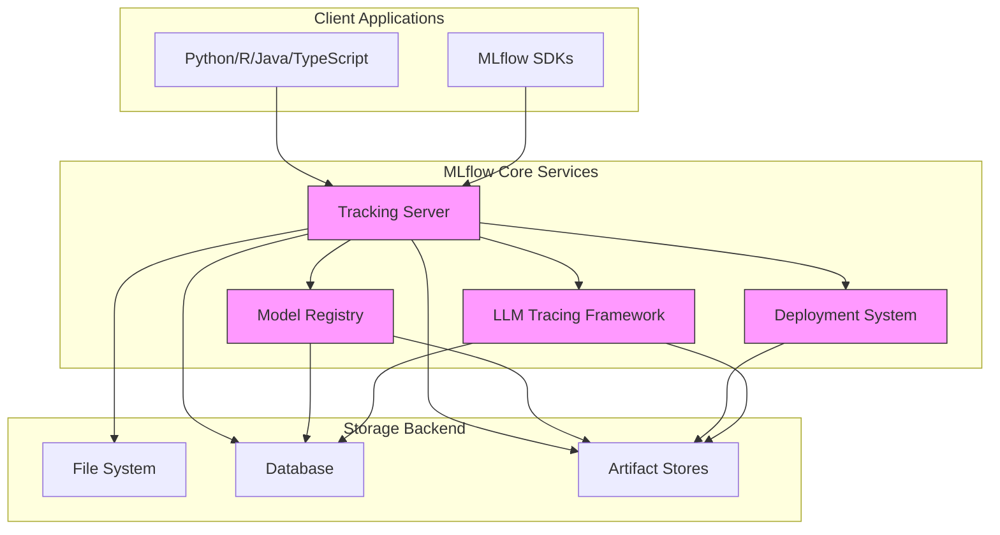
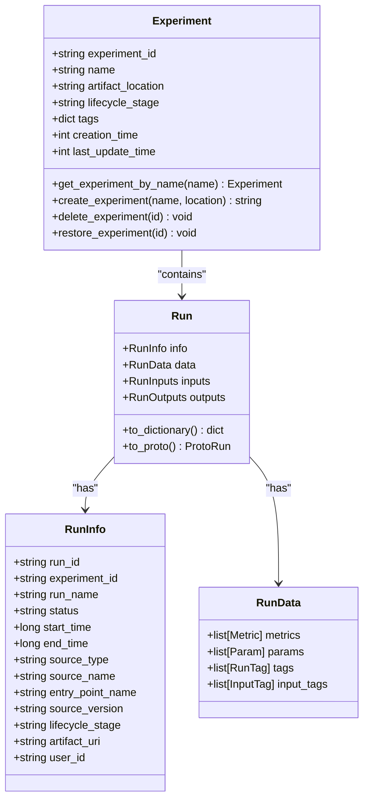
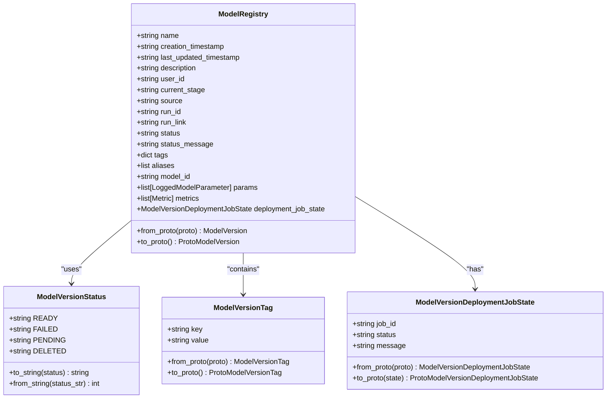
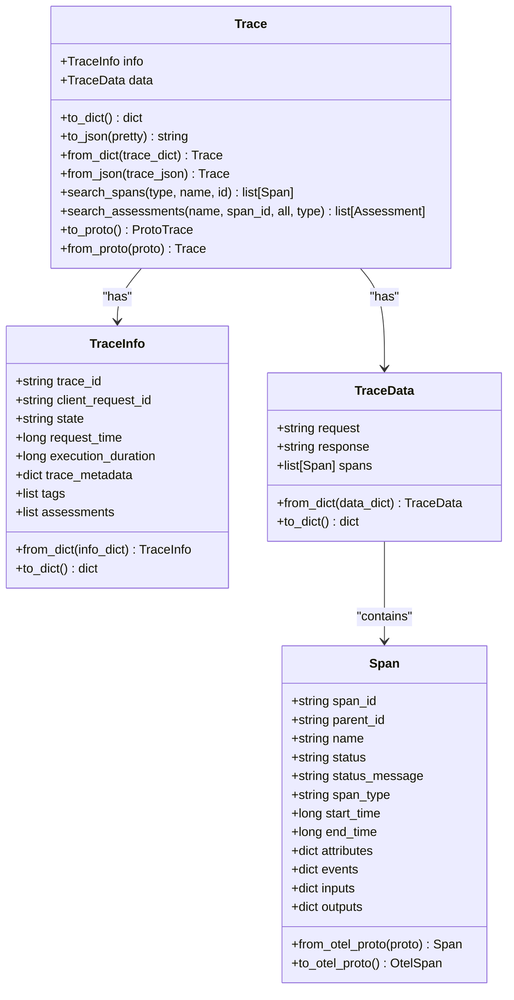
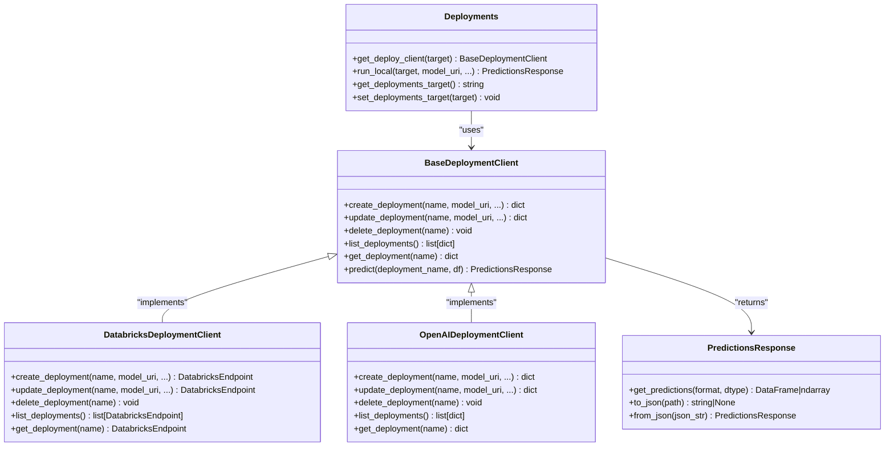

# Project Overview

<cite>
**Referenced Files in This Document**   
- [README.md](file://README.md)
- [mlflow/__init__.py](file://mlflow/__init__.py)
- [mlflow/client.py](file://mlflow/client.py)
- [mlflow/runs.py](file://mlflow/runs.py)
- [mlflow/experiments.py](file://mlflow/experiments.py)
- [mlflow/tracking/__init__.py](file://mlflow/tracking/__init__.py)
- [mlflow/models/__init__.py](file://mlflow/models/__init__.py)
- [mlflow/tracing/__init__.py](file://mlflow/tracing/__init__.py)
- [mlflow/deployments/__init__.py](file://mlflow/deployments/__init__.py)
- [mlflow/server/fastapi_app.py](file://mlflow/server/fastapi_app.py)
- [mlflow/entities/run.py](file://mlflow/entities/run.py)
- [mlflow/entities/experiment.py](file://mlflow/entities/experiment.py)
- [mlflow/entities/trace.py](file://mlflow/entities/trace.py)
- [mlflow/entities/model_registry/model_version.py](file://mlflow/entities/model_registry/model_version.py)
- [mlflow/tracking/fluent.py](file://mlflow/tracking/fluent.py)
</cite>

## Table of Contents
1. [Introduction](#introduction)
2. [Core Components](#core-components)
3. [Architecture Overview](#architecture-overview)
4. [Detailed Component Analysis](#detailed-component-analysis)
5. [Multi-Language Support and Integrations](#multi-language-support-and-integrations)
6. [Practical Use Cases](#practical-use-cases)
7. [Conclusion](#conclusion)

## Introduction

MLflow is an open-source platform designed to streamline the entire machine learning lifecycle, from experimentation to deployment and monitoring. It serves as a comprehensive developer platform for building AI and large language model (LLM) applications with confidence. The platform provides integrated solutions for experiment tracking, model management, deployment, and advanced observability, enabling teams to manage the full lifecycle of machine learning models and AI applications.

The platform is structured around four core components: a tracking server for experiment management, a model registry for version control, a deployment system for production serving, and an LLM tracing framework for application observability. MLflow supports multiple programming languages including Python, R, Java, and TypeScript, and integrates with various ML frameworks and cloud platforms. It enables users to track experiments, reproduce runs, share models, and deploy them to production with comprehensive lineage and metadata tracking.

**Section sources**
- [README.md](file://README.md#L1-L324)

## Core Components

MLflow's architecture is built on four primary components that work together to provide a complete machine learning lifecycle platform. The tracking server manages experiments and runs, storing parameters, metrics, and artifacts. The model registry provides a centralized store for model versioning and lifecycle management. The deployment system enables seamless model serving across various platforms. The LLM tracing framework offers advanced observability for AI and LLM applications, capturing detailed execution traces.

These components are accessible through a fluent API that provides high-level functions for managing MLflow runs, as well as a lower-level CRUD interface that directly translates to REST API calls. The platform supports both automatic and manual instrumentation, allowing developers to track their machine learning workflows with minimal code changes. Each component is designed to work independently while also integrating seamlessly with the others to provide a unified experience.

**Section sources**
- [README.md](file://README.md#L46-L143)
- [mlflow/__init__.py](file://mlflow/__init__.py#L1-L419)
- [mlflow/client.py](file://mlflow/client.py#L1-L13)

## Architecture Overview

The MLflow architecture consists of several interconnected components that work together to provide a comprehensive machine learning platform. At the core is the tracking server, which manages experiments and runs, storing metadata, parameters, metrics, and artifacts. The model registry provides version control and lifecycle management for trained models. The deployment system enables models to be served in production environments. The LLM tracing framework captures detailed execution traces for AI applications.



**Diagram sources **
- [README.md](file://README.md#L46-L143)
- [mlflow/__init__.py](file://mlflow/__init__.py#L1-L419)

## Detailed Component Analysis

### Tracking Server and Experiment Management

The tracking server is the foundation of MLflow's experiment management capabilities. It allows users to organize runs into experiments, track parameters, metrics, and artifacts, and compare results across different runs. Each experiment contains multiple runs, which represent individual executions of a machine learning workflow. The system captures comprehensive metadata including start time, duration, status, and user information.



**Diagram sources **
- [mlflow/entities/experiment.py](file://mlflow/entities/experiment.py#L1-L110)
- [mlflow/entities/run.py](file://mlflow/entities/run.py#L1-L98)
- [mlflow/experiments.py](file://mlflow/experiments.py#L1-L212)
- [mlflow/runs.py](file://mlflow/runs.py#L1-L246)

### Model Registry and Versioning

The model registry provides a centralized store for managing the full lifecycle of machine learning models. It enables versioning of models, stage transitions (e.g., from staging to production), and annotation with metadata. Each model version is associated with a specific run and contains information about its source, metrics, parameters, and tags. The registry supports aliases for model versions, making it easy to reference specific versions in production deployments.



**Diagram sources **
- [mlflow/entities/model_registry/model_version.py](file://mlflow/entities/model_registry/model_version.py#L1-L242)

### LLM Tracing Framework

The LLM tracing framework provides advanced observability for AI and LLM applications by capturing detailed execution traces. A trace represents a single execution of an LLM-powered application and consists of spans that capture individual operations. The framework supports automatic tracing for various GenAI libraries and manual instrumentation for custom workflows. Traces can be linked to runs for comprehensive lineage tracking.



**Diagram sources **
- [mlflow/entities/trace.py](file://mlflow/entities/trace.py#L1-L333)
- [mlflow/tracing/__init__.py](file://mlflow/tracing/__init__.py#L1-L21)

### Deployment System

The deployment system enables models to be served in production environments across various platforms. It provides a unified interface for deploying models to different serving tools, with support for custom deployment targets through plugins. The system includes functionality for local testing of deployments and integration with cloud platforms. The deployment client abstracts the underlying deployment infrastructure, allowing users to deploy models consistently regardless of the target environment.



**Diagram sources **
- [mlflow/deployments/__init__.py](file://mlflow/deployments/__init__.py#L1-L120)

## Multi-Language Support and Integrations

MLflow provides comprehensive support for multiple programming languages, enabling teams to use the platform regardless of their preferred language. The Python SDK is the most feature-complete, providing access to all platform capabilities. The R package allows R users to leverage MLflow's experiment tracking and model management features. The Java client enables integration with Java-based machine learning workflows. The TypeScript/JavaScript package supports tracing capabilities for Node.js applications.

The platform integrates with a wide range of machine learning frameworks and GenAI libraries, including scikit-learn, TensorFlow, PyTorch, Keras, XGBoost, and various LLM frameworks like LangChain, LlamaIndex, and DSPy. These integrations enable automatic logging of model parameters, metrics, and artifacts during training. MLflow also supports deployment to various cloud platforms including Amazon SageMaker, Azure ML, and Databricks, as well as containerized environments using Docker and Kubernetes.

**Section sources**
- [README.md](file://README.md#L162-L175)
- [mlflow/__init__.py](file://mlflow/__init__.py#L63-L111)

## Practical Use Cases

### Training Pipeline Tracking

MLflow enables comprehensive tracking of machine learning training pipelines through its experiment tracking capabilities. Users can organize related runs into experiments, log parameters and metrics automatically through autologging, and compare results across different configurations. The following example demonstrates tracking a simple regression model training with scikit-learn:

```python
import mlflow
from sklearn.model_selection import train_test_split
from sklearn.datasets import load_diabetes
from sklearn.ensemble import RandomForestRegressor

# Enable MLflow's automatic experiment tracking for scikit-learn
mlflow.sklearn.autolog()

# Load the training dataset
db = load_diabetes()
X_train, X_test, y_train, y_test = train_test_split(db.data, db.target)

rf = RandomForestRegressor(n_estimators=100, max_depth=6, max_features=3)
# MLflow triggers logging automatically upon model fitting
rf.fit(X_train, y_train)
```

**Section sources**
- [README.md](file://README.md#L248-L269)

### LLM Application Observability

The LLM tracing framework provides detailed observability for AI applications by capturing execution traces. This enables debugging of quality issues and monitoring of performance. The following example demonstrates enabling tracing for OpenAI LLM queries:

```python
import mlflow
from openai import OpenAI

# Enable tracing for OpenAI
mlflow.openai.autolog()

# Query OpenAI LLM normally
response = OpenAI().chat.completions.create(
    model="gpt-4o-mini",
    messages=[{"role": "user", "content": "Hi!"}],
    temperature=0.1,
)
```

**Section sources**
- [README.md](file://README.md#L177-L194)

### Model Evaluation and Comparison

MLflow provides tools for evaluating and comparing LLMs, prompts, and agents. The evaluation framework supports automatic evaluation with built-in metrics and custom criteria using LLM judges. The following example demonstrates running automatic evaluation for question-answering tasks:

```python
import mlflow
from mlflow.genai.scorers import Correctness, Guidelines

# Define a simple QA dataset
dataset = [
    {
        "inputs": {"question": "Can MLflow manage prompts?"},
        "expectations": {"expected_response": "Yes!"},
    },
    {
        "inputs": {"question": "Can MLflow create a taco for my lunch?"},
        "expectations": {
            "expected_response": "No, unfortunately, MLflow is not a taco maker."
        },
    },
]

# Define a prediction function to generate responses
def predict_fn(question: str) -> str:
    response = client.chat.completions.create(
        model="gpt-4o-mini", messages=[{"role": "user", "content": question}]
    )
    return response.choices[0].message.content

# Run the evaluation
results = mlflow.genai.evaluate(
    data=dataset,
    predict_fn=predict_fn,
    scorers=[
        # Built-in LLM judge
        Correctness(),
        # Custom criteria using LLM judge
        Guidelines(name="is_english", guidelines="The answer must be in English"),
    ],
)
```

**Section sources**
- [README.md](file://README.md#L198-L244)

## Conclusion

MLflow provides a comprehensive platform for managing the entire machine learning lifecycle, from experimentation to deployment and monitoring. Its modular architecture with clear separation between core components enables teams to adopt the platform incrementally while still benefiting from a unified experience. The platform's support for multiple programming languages and integration with various ML frameworks makes it accessible to diverse teams and use cases.

The tracking server, model registry, deployment system, and LLM tracing framework work together to provide end-to-end visibility into machine learning workflows. By standardizing on MLflow, organizations can improve reproducibility, collaboration, and governance across their AI initiatives. The platform continues to evolve with a strong open-source community and support from major cloud providers, ensuring its relevance in the rapidly changing AI landscape.