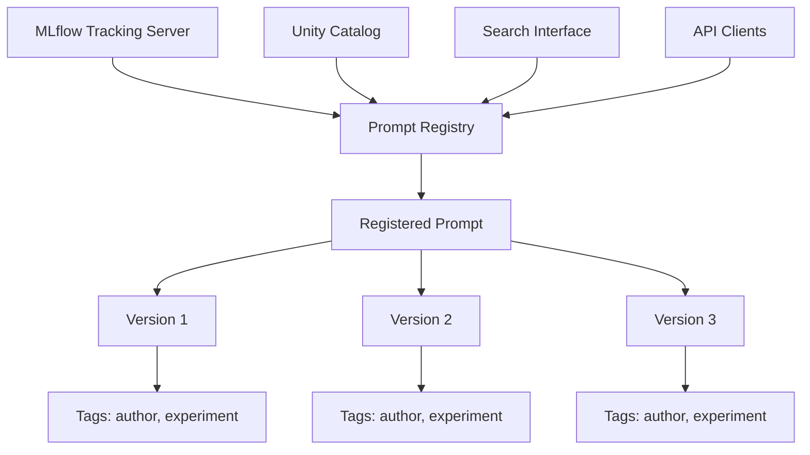
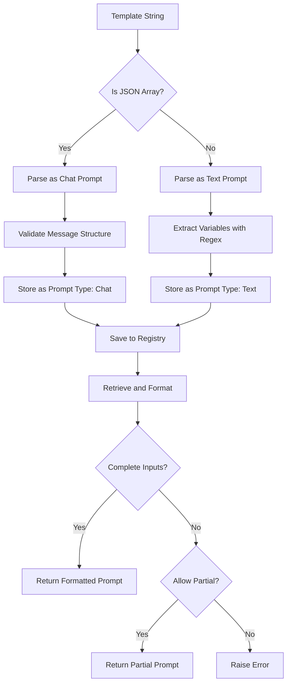
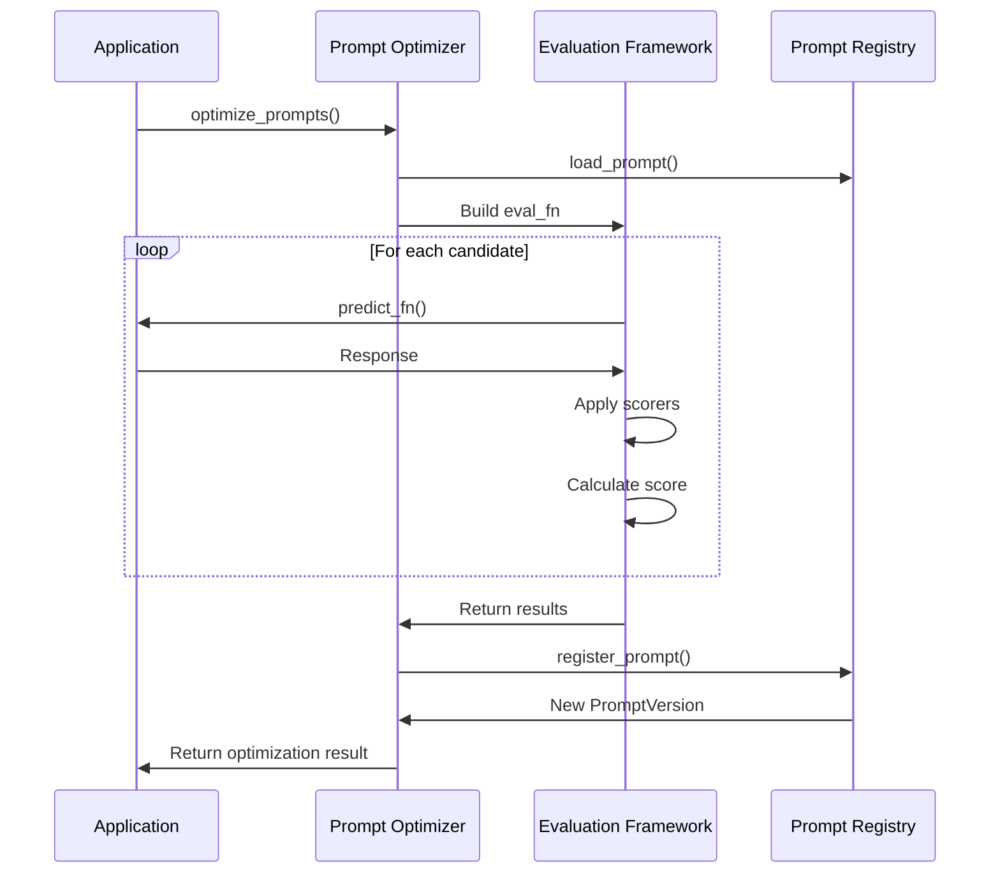
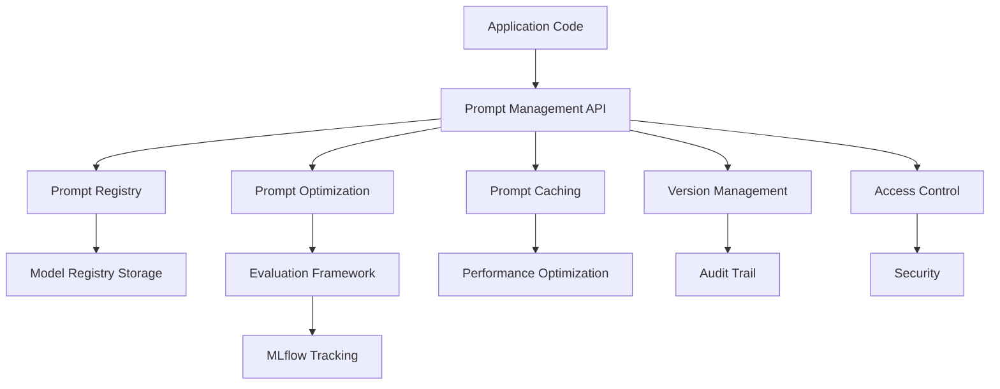

# Prompt Management

<cite>
**Referenced Files in This Document**   
- [constants.py](file://mlflow/prompt/constants.py)
- [promptlab_model.py](file://mlflow/prompt/promptlab_model.py)
- [registry_utils.py](file://mlflow/prompt/registry_utils.py)
- [prompt_version.py](file://mlflow/entities/model_registry/prompt_version.py)
- [optimize.py](file://mlflow/genai/optimize/optimize.py)
- [types.py](file://mlflow/genai/optimize/types.py)
- [util.py](file://mlflow/genai/optimize/util.py)
- [utils.py](file://mlflow/genai/prompts/utils.py)
</cite>

## Table of Contents
1. [Introduction](#introduction)
2. [Core Concepts](#core-concepts)
3. [Prompt Versioning](#prompt-versioning)
4. [Prompt Registry](#prompt-registry)
5. [Prompt Templates](#prompt-templates)
6. [Prompt Testing and Optimization](#prompt-testing-and-optimization)
7. [API Reference](#api-reference)
8. [Practical Examples](#practical-examples)
9. [Architecture Overview](#architecture-overview)
10. [Conclusion](#conclusion)

## Introduction

Prompt Management in MLflow provides a systematic approach to handling prompts used in Large Language Model (LLM) applications. This system brings software engineering practices to prompt engineering, enabling reproducibility, version control, and collaboration. By treating prompts as first-class citizens in the ML lifecycle, MLflow allows teams to manage prompt variants, conduct A/B testing, and implement robust prompt-based workflows with the same rigor applied to traditional machine learning models.

The prompt management system is built on four core pillars: prompt versioning, prompt registry, prompt templates, and prompt testing frameworks. These components work together to create a comprehensive environment for developing, testing, and deploying prompts at scale. The system supports both text and chat prompts, allowing for flexible prompt design and implementation.

**Section sources**
- [constants.py](file://mlflow/prompt/constants.py#L1-L32)
- [prompt_version.py](file://mlflow/entities/model_registry/prompt_version.py#L1-L520)

## Core Concepts

MLflow's prompt management system introduces several key concepts that form the foundation of its functionality. The primary entity is the **prompt**, which represents a reusable piece of text or conversation template used to interact with LLMs. Each prompt can have multiple **prompt versions**, allowing for iterative development and experimentation while maintaining a complete history of changes.

A **prompt template** is the core content of a prompt, containing the actual text with variables enclosed in double curly braces (e.g., {{variable}}). These templates can be either simple text prompts or structured chat prompts consisting of message arrays with role and content fields. The system supports two main prompt types: text prompts (PROMPT_TYPE_TEXT) and chat prompts (PROMPT_TYPE_CHAT), each serving different use cases in LLM applications.

The **prompt registry** serves as a centralized repository for managing prompts, similar to MLflow's model registry for machine learning models. This registry enables teams to discover, share, and collaborate on prompts across projects. Prompts are stored with rich metadata including creation timestamps, user IDs, commit messages, and custom tags, providing comprehensive context for each prompt version.

**Section sources**
- [constants.py](file://mlflow/prompt/constants.py#L4-L22)
- [prompt_version.py](file://mlflow/entities/model_registry/prompt_version.py#L146-L178)

## Prompt Versioning

MLflow's prompt versioning system provides robust capabilities for tracking and managing changes to prompts over time. Each prompt version is a complete snapshot of a prompt at a specific point in time, containing the template content, response format specifications, model configuration, and associated metadata. This approach ensures complete reproducibility, as any previous version of a prompt can be retrieved and used exactly as it existed when created.

The versioning system supports several key operations: creating new versions, retrieving specific versions by number, and using aliases to reference versions symbolically. When a new version is created, it inherits the prompt's name but receives a unique version number, allowing multiple variants to coexist. The system automatically tracks creation and update timestamps, user IDs, and optional commit messages, providing a complete audit trail.

Prompt versions can be retrieved using various methods, including direct version numbers (e.g., "prompts:/name/1") or aliases (e.g., "prompts:/name@production"). This flexibility enables different deployment strategies, from strict version pinning to dynamic alias-based routing. The system also includes a caching mechanism to improve performance when frequently accessed prompts are retrieved.

```mermaid
flowchart TD
A[Create New Prompt] --> B[Version 1]
B --> C[Modify Prompt]
C --> D[Version 2]
D --> E[Add Response Format]
E --> F[Version 3]
F --> G[Set Alias: "production"]
G --> H[Retrieve by Version: /name/2]
G --> I[Retrieve by Alias: /name@production]
H --> J[Use in Application]
I --> J
```

**Diagram sources**
- [prompt_version.py](file://mlflow/entities/model_registry/prompt_version.py#L181-L194)
- [registry_utils.py](file://mlflow/prompt/registry_utils.py#L28-L421)

**Section sources**
- [prompt_version.py](file://mlflow/entities/model_registry/prompt_version.py#L181-L437)
- [registry_utils.py](file://mlflow/prompt/registry_utils.py#L28-L421)

## Prompt Registry

The prompt registry in MLflow serves as a centralized repository for managing and discovering prompts across an organization. Built on the same infrastructure as the model registry, it provides a familiar interface for data scientists and engineers while adding prompt-specific capabilities. The registry supports both open-source MLflow deployments and Unity Catalog, ensuring compatibility across different deployment scenarios.

Prompts in the registry are identified by unique names that follow specific naming rules: they can contain alphanumeric characters, underscores, hyphens, and dots. The registry enforces uniqueness, preventing conflicts between prompts and traditional models—MLflow does not allow a prompt and a model to have the same name. This separation ensures clear boundaries between different types of assets while maintaining a unified management interface.

The registry supports rich metadata through tags, allowing users to add custom information to prompts and their versions. Version-level tags are particularly useful for storing context about changes, such as the author of modifications or experimental conditions. The system also includes special tags for prompt-specific metadata, such as the prompt text, type, and response format, which are automatically managed by the system.



**Diagram sources**
- [registry_utils.py](file://mlflow/prompt/registry_utils.py#L139-L154)
- [constants.py](file://mlflow/prompt/constants.py#L4-L22)

**Section sources**
- [registry_utils.py](file://mlflow/prompt/registry_utils.py#L139-L154)
- [constants.py](file://mlflow/prompt/constants.py#L4-L22)

## Prompt Templates

Prompt templates in MLflow provide a flexible system for creating reusable prompt structures with dynamic variables. Templates use double curly brace syntax ({{variable}}) to define placeholders that can be replaced with actual values at runtime. This templating system supports both simple text prompts and structured chat prompts, accommodating a wide range of LLM interaction patterns.

For text prompts, the template is a string containing variables that will be replaced during formatting. Chat prompts are represented as arrays of message objects, each containing role and content fields, allowing for complex conversation structures. The system automatically detects the prompt type based on the template structure and stores this information as metadata, ensuring proper handling during retrieval and use.

The template system includes robust variable management, automatically extracting and validating variables from the template text. When formatting a template, the system checks for missing variables and can operate in either strict mode (raising an error for missing variables) or partial mode (returning a partially formatted prompt). This flexibility supports different use cases, from production applications requiring complete inputs to development workflows where incremental testing is needed.



**Diagram sources**
- [prompt_version.py](file://mlflow/entities/model_registry/prompt_version.py#L208-L219)
- [utils.py](file://mlflow/genai/prompts/utils.py#L5-L13)

**Section sources**
- [prompt_version.py](file://mlflow/entities/model_registry/prompt_version.py#L208-L219)
- [utils.py](file://mlflow/genai/prompts/utils.py#L5-L13)

## Prompt Testing and Optimization

MLflow's prompt testing and optimization framework provides comprehensive capabilities for evaluating and improving prompt quality. The system supports automated testing through configurable scorers that evaluate prompt outputs against expected results or quality criteria. These scorers can be built-in metrics like correctness or custom functions tailored to specific evaluation needs.

The optimization system, centered around the `optimize_prompts` function, enables automatic improvement of prompts using evaluation metrics and training data. This process involves creating candidate prompts, evaluating their performance against a dataset, and iteratively refining them to maximize a defined objective function. The framework supports various optimization algorithms and allows for custom optimizer implementations.

Testing workflows can incorporate multiple evaluation dimensions, including accuracy, relevance, coherence, and other quality metrics. Results are tracked in MLflow runs, providing complete reproducibility and comparison capabilities. The system also supports A/B testing of prompt variants, allowing teams to compare different approaches and select the best-performing prompts for production use.



**Diagram sources**
- [optimize.py](file://mlflow/genai/optimize/optimize.py#L43-L223)
- [types.py](file://mlflow/genai/optimize/types.py#L128-L145)

**Section sources**
- [optimize.py](file://mlflow/genai/optimize/optimize.py#L43-L223)
- [types.py](file://mlflow/genai/optimize/types.py#L128-L145)

## API Reference

### Public Interfaces

#### `register_prompt`
Registers a new prompt or creates a new version of an existing prompt in the registry.

**Parameters:**
- `name`: The name of the prompt (string, required)
- `template`: The prompt template content (string or list of message objects, required)
- `model_config`: Optional model configuration specifying parameters like temperature and max_tokens
- `response_format`: Optional response format specification for structured outputs
- `tags`: Optional dictionary of version-level tags

**Returns:**
- `PromptVersion` object representing the registered prompt

#### `load_prompt`
Retrieves a prompt from the registry by name, version, or alias.

**Parameters:**
- `name_or_uri`: The prompt name or URI (string, required)
- `version`: Optional version number (integer)

**Returns:**
- `PromptVersion` object with the requested prompt content

#### `optimize_prompts`
Automatically optimizes prompts using evaluation metrics and training data.

**Parameters:**
- `predict_fn`: Function that uses the prompts to be optimized
- `train_data`: Evaluation dataset for optimization
- `prompt_uris`: List of prompt URIs to optimize
- `optimizer`: Prompt optimizer object
- `scorers`: List of scorers for evaluation
- `aggregation`: Optional function to combine scorer outputs
- `enable_tracking`: Whether to create MLflow runs for tracking

**Returns:**
- `PromptOptimizationResult` containing optimized prompts and performance metrics

#### `PromptVersion.format`
Formats a prompt template with provided variable values.

**Parameters:**
- `allow_partial`: Whether to allow partial formatting (boolean, default: False)
- `**kwargs`: Variable values as keyword arguments

**Returns:**
- Formatted prompt string (or list of messages for chat prompts), or a new `PromptVersion` object if partial formatting is enabled

**Section sources**
- [prompt_version.py](file://mlflow/entities/model_registry/prompt_version.py#L433-L520)
- [optimize.py](file://mlflow/genai/optimize/optimize.py#L43-L223)
- [registry_utils.py](file://mlflow/prompt/registry_utils.py#L293-L330)

## Practical Examples

### Managing Prompt Variants

Teams can use MLflow's prompt management system to maintain multiple variants of a prompt for different use cases or experiments. For example, a customer service chatbot might have different prompt versions optimized for various customer segments:

```python
# Register base prompt
base_prompt = mlflow.genai.register_prompt(
    name="customer_service",
    template="Help the customer with their {{issue}}. Be {{tone}} and professional.",
    tags={"owner": "support-team"}
)

# Create variant for premium customers
premium_prompt = mlflow.genai.register_prompt(
    name="customer_service",
    template="Help the premium customer with their {{issue}}. Be exceptionally {{tone}} and offer personalized solutions.",
    tags={"audience": "premium", "owner": "support-team"}
)
```

### Conducting A/B Testing

The system supports A/B testing of prompt variants by retrieving different versions and comparing their performance:

```python
# Load two prompt versions for testing
prompt_a = mlflow.genai.load_prompt("support_bot", version=1)
prompt_b = mlflow.genai.load_prompt("support_bot", version=2)

# Test both prompts with the same inputs
results_a = []
results_b = []
for test_case in test_dataset:
    formatted_a = prompt_a.format(**test_case["inputs"])
    formatted_b = prompt_b.format(**test_case["inputs"])
    
    # Send to LLM and collect responses
    response_a = call_llm(formatted_a)
    response_b = call_llm(formatted_b)
    
    results_a.append(response_a)
    results_b.append(response_b)

# Compare results using MLflow evaluation
evaluation_a = mlflow.evaluate(
    data=test_dataset,
    model=results_a,
    metrics=[mlflow.metrics.accuracy()]
)

evaluation_b = mlflow.evaluate(
    data=test_dataset,
    model=results_b,
    metrics=[mlflow.metrics.accuracy()]
)
```

### Implementing Prompt-Based Workflows

Complex workflows can be implemented by chaining multiple prompts together:

```python
# Define a multi-step workflow
def customer_interaction_workflow(customer_query):
    # Step 1: Classify the query type
    classification_prompt = mlflow.genai.load_prompt("query_classifier@latest")
    classification = call_llm(classification_prompt.format(query=customer_query))
    
    # Step 2: Route to appropriate specialist prompt
    if "billing" in classification:
        specialist_prompt = mlflow.genai.load_prompt("billing_specialist@production")
    elif "technical" in classification:
        specialist_prompt = mlflow.genai.load_prompt("tech_support@production")
    else:
        specialist_prompt = mlflow.genai.load_prompt("general_support@production")
    
    # Step 3: Generate response
    response = call_llm(specialist_prompt.format(query=customer_query))
    return response
```

**Section sources**
- [prompt_version.py](file://mlflow/entities/model_registry/prompt_version.py#L442-L520)
- [optimize.py](file://mlflow/genai/optimize/optimize.py#L43-L223)

## Architecture Overview

The prompt management system in MLflow is built on a layered architecture that integrates with the existing MLflow ecosystem while providing specialized capabilities for prompt engineering. At the core is the prompt registry, which extends the model registry functionality to support prompt-specific features. This registry stores prompts as first-class entities with rich metadata and versioning capabilities.

The system leverages MLflow's tagging infrastructure to store prompt-specific information, using special tags to distinguish prompts from traditional models and to store prompt content and configuration. The prompt version entity wraps the template content in tags, allowing the system to maintain compatibility with existing registry operations while adding prompt-specific functionality.

On the client side, a comprehensive API provides methods for registering, retrieving, and manipulating prompts. This API integrates with MLflow's tracking capabilities, enabling automatic logging of prompt usage and performance metrics. The optimization framework builds on this foundation, using the registry as a source of prompts and as a destination for optimized variants.

The architecture also includes specialized components for prompt testing and evaluation, leveraging MLflow's existing evaluation framework while adding prompt-specific scorers and metrics. This integration allows teams to use the same evaluation infrastructure for both traditional models and prompt-based applications, ensuring consistency across different types of ML assets.



**Diagram sources**
- [promptlab_model.py](file://mlflow/prompt/promptlab_model.py#L10-L198)
- [registry_utils.py](file://mlflow/prompt/registry_utils.py#L1-L421)

**Section sources**
- [promptlab_model.py](file://mlflow/prompt/promptlab_model.py#L10-L198)
- [registry_utils.py](file://mlflow/prompt/registry_utils.py#L1-L421)

## Conclusion

MLflow's prompt management system provides a comprehensive solution for bringing software engineering practices to prompt engineering. By implementing robust versioning, centralized registry, flexible templating, and systematic testing frameworks, the system enables teams to develop, evaluate, and deploy prompts with the same rigor applied to traditional machine learning models.

The architecture leverages MLflow's existing strengths in model management while adding prompt-specific capabilities that address the unique challenges of working with LLMs. This approach ensures that prompt engineering is not treated as an ad-hoc process but as an integral part of the ML lifecycle, with proper version control, reproducibility, and collaboration features.

For organizations adopting LLM technologies, this system provides a foundation for scaling prompt development across teams and projects. By standardizing prompt management practices, teams can avoid the pitfalls of uncontrolled prompt proliferation and ensure that their LLM applications are built on a solid, maintainable foundation.