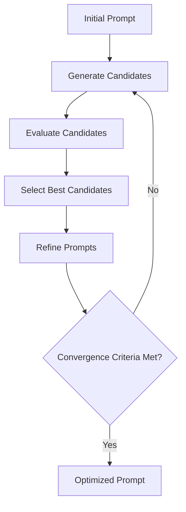
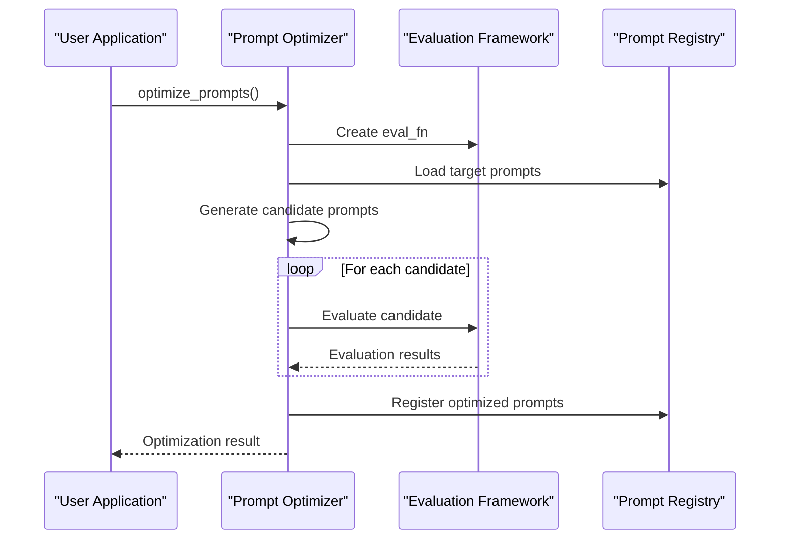
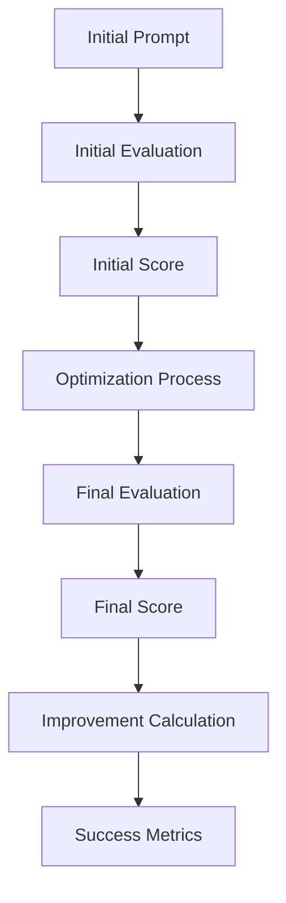
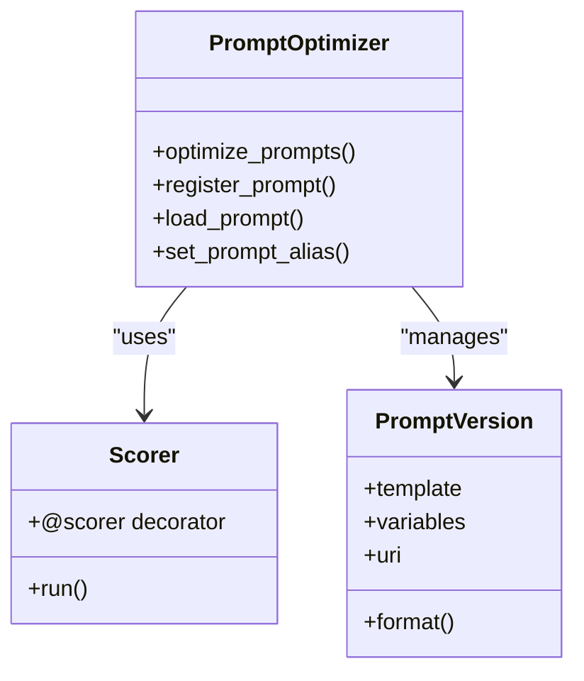
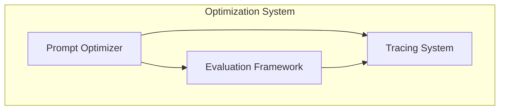

# Prompt Optimization

<cite>
**Referenced Files in This Document**   
- [optimize.py](file://mlflow/genai/optimize/optimize.py)
- [types.py](file://mlflow/genai/optimize/types.py)
- [util.py](file://mlflow/genai/optimize/util.py)
- [gepa_optimizer.py](file://mlflow/genai/optimize/optimizers/gepa_optimizer.py)
- [base.py](file://mlflow/genai/optimize/optimizers/base.py)
- [prompts/__init__.py](file://mlflow/genai/prompts/__init__.py)
- [prompt_version.py](file://mlflow/entities/model_registry/prompt_version.py)
</cite>

## Table of Contents
1. [Introduction](#introduction)
2. [Core Components](#core-components)
3. [Optimization Strategies](#optimization-strategies)
4. [Orchestrating Optimization Jobs](#orchestrating-optimization-jobs)
5. [Measuring Optimization Success](#measuring-optimization-success)
6. [Interfaces for Optimization](#interfaces-for-optimization)
7. [Integration with Evaluation and Tracing](#integration-with-evaluation-and-tracing)
8. [Best Practices and Common Issues](#best-practices-and-common-issues)
9. [Conclusion](#conclusion)

## Introduction
MLflow's prompt optimization system enables automated improvement of prompts through iterative refinement and machine learning techniques. The system provides a comprehensive framework for optimizing prompts by leveraging evaluation metrics, training data, and various optimization algorithms. This documentation explains the implementation details of the optimization system, including different optimization strategies, job orchestration, success measurement, and integration with other MLflow components like evaluation frameworks and tracing systems. The goal is to make prompt optimization accessible to beginners while providing sufficient technical depth for experienced developers.

## Core Components

The prompt optimization system in MLflow consists of several core components that work together to enable automated prompt improvement. The main components include the optimization engine, prompt registry, evaluation framework, and tracing system. The optimization engine is responsible for orchestrating the optimization process, while the prompt registry manages prompt versions and metadata. The evaluation framework provides the metrics and scorers used to assess prompt quality, and the tracing system captures execution details for analysis and debugging.

**Section sources**
- [optimize.py](file://mlflow/genai/optimize/optimize.py#L42-L313)
- [types.py](file://mlflow/genai/optimize/types.py#L1-L145)
- [prompts/__init__.py](file://mlflow/genai/prompts/__init__.py#L1-L423)

## Optimization Strategies

MLflow supports multiple optimization strategies for improving prompt quality. The primary strategy is the GEPA (Genetic-Pareto) optimization algorithm, which uses iterative mutation, reflection, and Pareto-aware candidate selection to improve text components like prompts. GEPA leverages large language models to reflect on system behavior and propose improvements. The optimization process involves creating candidate prompts, evaluating their performance using specified metrics, and selecting the best candidates for further refinement.

**Diagram sources**
- [gepa_optimizer.py](file://mlflow/genai/optimize/optimizers/gepa_optimizer.py#L14-L87)

**Section sources**
- [gepa_optimizer.py](file://mlflow/genai/optimize/optimizers/gepa_optimizer.py#L14-L87)

## Orchestrating Optimization Jobs

Optimization jobs in MLflow are orchestrated through the `optimize_prompts` function, which coordinates the entire optimization process. The function takes several parameters including the target prediction function, training data, prompt URIs, optimizer, scorers, and aggregation function. The optimization process begins by validating the training data and converting it to a suitable format. Then, an evaluation function is created using the provided scorers and objective function. The optimizer is invoked with the evaluation function, training data, and target prompts to perform the optimization. During optimization, candidate prompts are evaluated in parallel using multiple threads to improve efficiency.

**Diagram sources**
- [optimize.py](file://mlflow/genai/optimize/optimize.py#L42-L313)

**Section sources**
- [optimize.py](file://mlflow/genai/optimize/optimize.py#L42-L313)

## Measuring Optimization Success

Success in prompt optimization is measured using evaluation metrics derived from scorers and aggregation functions. The system supports both built-in and custom scorers that evaluate various aspects of prompt performance such as correctness, relevance, and coherence. The optimization process tracks initial and final evaluation scores to measure improvement. The `PromptOptimizationResult` object returned by the optimization process includes the optimized prompts, optimizer name, and evaluation scores. Additionally, the system logs optimization progress and metrics to MLflow runs for tracking and analysis.

**Diagram sources**
- [types.py](file://mlflow/genai/optimize/types.py#L128-L145)

**Section sources**
- [types.py](file://mlflow/genai/optimize/types.py#L128-L145)

## Interfaces for Optimization

MLflow provides several interfaces for initiating optimization runs, configuring optimization parameters, and retrieving optimized prompts. The primary interface is the `optimize_prompts` function, which accepts parameters for the prediction function, training data, prompt URIs, optimizer, scorers, and aggregation function. The system also provides interfaces for registering and loading prompts from the prompt registry, setting prompt aliases, and managing prompt metadata. Custom scorers can be defined using the `@scorer` decorator, allowing users to create domain-specific evaluation metrics.

**Diagram sources**
- [optimize.py](file://mlflow/genai/optimize/optimize.py#L42-L313)
- [prompts/__init__.py](file://mlflow/genai/prompts/__init__.py#L1-L423)
- [prompt_version.py](file://mlflow/entities/model_registry/prompt_version.py#L1-L520)

**Section sources**
- [optimize.py](file://mlflow/genai/optimize/optimize.py#L42-L313)
- [prompts/__init__.py](file://mlflow/genai/prompts/__init__.py#L1-L423)
- [prompt_version.py](file://mlflow/entities/model_registry/prompt_version.py#L1-L520)

## Integration with Evaluation and Tracing

The prompt optimization system integrates closely with MLflow's evaluation framework and tracing system. The evaluation framework provides the metrics and scorers used to assess prompt quality, while the tracing system captures execution details for analysis and debugging. During optimization, traces are captured for each evaluation run, allowing users to analyze the behavior of different prompt versions. The system also supports automatic logging of optimization parameters, datasets, and metrics to MLflow runs, enabling comprehensive tracking and analysis of the optimization process.

**Diagram sources**
- [optimize.py](file://mlflow/genai/optimize/optimize.py#L42-L313)
- [util.py](file://mlflow/genai/optimize/util.py#L1-L197)

**Section sources**
- [optimize.py](file://mlflow/genai/optimize/optimize.py#L42-L313)
- [util.py](file://mlflow/genai/optimize/util.py#L1-L197)

## Best Practices and Common Issues

When using MLflow's prompt optimization system, several best practices should be followed to achieve optimal results. First, ensure that training data is representative of the target use case and includes a diverse set of inputs and outputs. Second, use appropriate scorers that align with the desired optimization goals. Third, avoid overfitting by using a separate validation set to evaluate the final optimized prompts. Common issues include unused prompts during evaluation, which can indicate problems with the prediction function, and non-numerical scorer outputs that require custom aggregation functions. The system provides warnings and error messages to help diagnose and resolve these issues.

**Section sources**
- [optimize.py](file://mlflow/genai/optimize/optimize.py#L42-L313)
- [util.py](file://mlflow/genai/optimize/util.py#L1-L197)

## Conclusion
MLflow's prompt optimization system provides a powerful framework for automated improvement of prompts through iterative refinement and machine learning techniques. The system supports multiple optimization strategies, integrates with evaluation and tracing components, and provides comprehensive interfaces for managing the optimization process. By following best practices and understanding the system's capabilities and limitations, users can effectively optimize prompts to improve the performance of their language model applications.