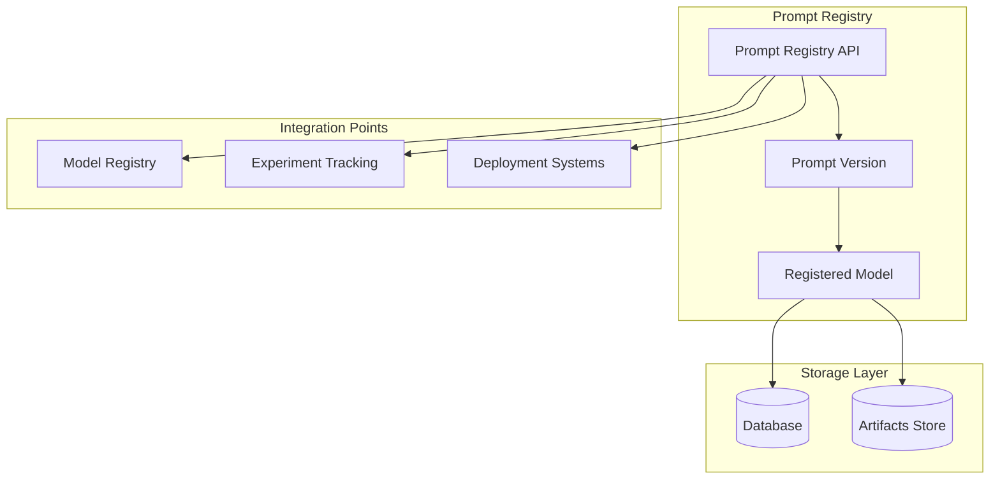
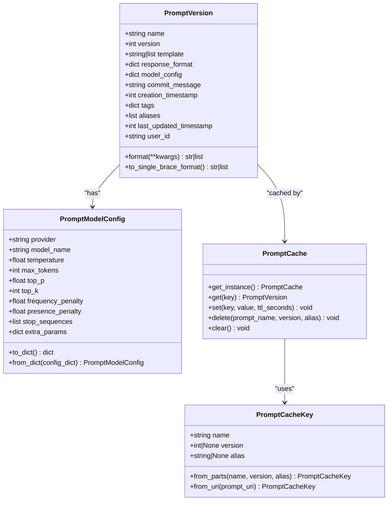
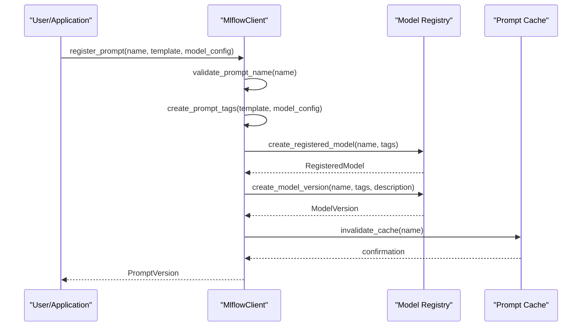
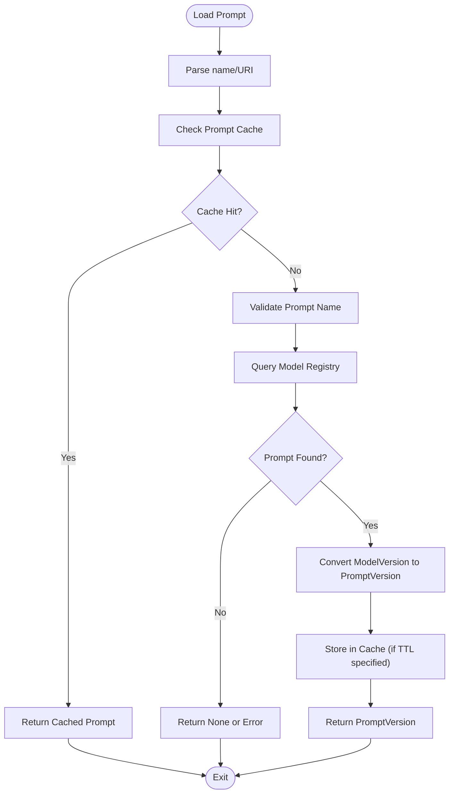
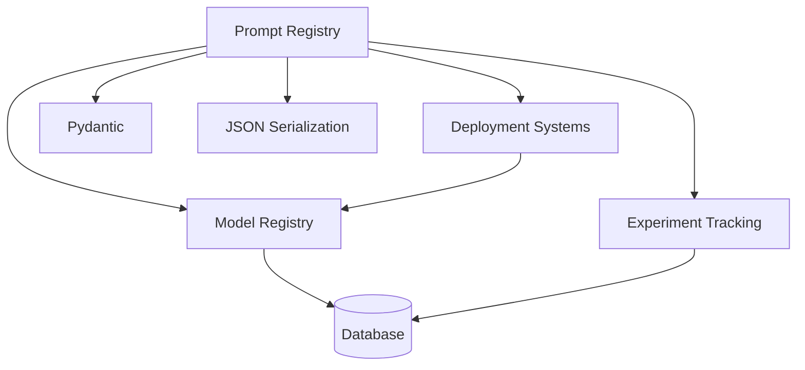

# Prompt Registry

<cite>
**Referenced Files in This Document**   
- [constants.py](file://mlflow/prompt/constants.py)
- [registry_utils.py](file://mlflow/prompt/registry_utils.py)
- [promptlab_model.py](file://mlflow/prompt/promptlab_model.py)
- [prompt_version.py](file://mlflow/entities/model_registry/prompt_version.py)
- [utils.py](file://mlflow/genai/prompts/utils.py)
</cite>

## Table of Contents
1. [Introduction](#introduction)
2. [Core Components](#core-components)
3. [Architecture Overview](#architecture-overview)
4. [Detailed Component Analysis](#detailed-component-analysis)
5. [Dependency Analysis](#dependency-analysis)
6. [Performance Considerations](#performance-considerations)
7. [Troubleshooting Guide](#troubleshooting-guide)
8. [Conclusion](#conclusion)

## Introduction
The MLflow Prompt Registry serves as a centralized repository for organizing and managing prompts across teams and projects. It provides a systematic approach to store, version, and retrieve prompts used in large language model (LLM) applications. The registry integrates with MLflow's existing model registry infrastructure, leveraging the same underlying storage and access control mechanisms while adding specialized functionality for prompt management. This system enables teams to maintain consistency in prompt usage, track prompt evolution over time, and ensure reproducibility of LLM-based applications by associating specific prompts with model versions and experiment runs.

## Core Components

The prompt registry system consists of several key components that work together to provide a comprehensive prompt management solution. These include the PromptVersion entity for representing individual prompt versions, utility functions for prompt validation and caching, and integration points with other MLflow systems like the model registry and deployment services. The implementation leverages MLflow's existing model registry infrastructure while adding prompt-specific functionality through specialized tags and metadata.

**Section sources**
- [constants.py](file://mlflow/prompt/constants.py#L1-L32)
- [registry_utils.py](file://mlflow/prompt/registry_utils.py#L1-L421)
- [prompt_version.py](file://mlflow/entities/model_registry/prompt_version.py#L1-L520)

## Architecture Overview

The prompt registry architecture builds upon MLflow's model registry system, using registered models and model versions as the foundation for prompt storage and management. Prompts are implemented as a specialized type of registered model, distinguished by specific tags that identify them as prompts rather than traditional machine learning models. This approach allows the prompt registry to leverage the existing model registry's capabilities for versioning, access control, and metadata management while adding prompt-specific functionality.

**Diagram sources **
- [constants.py](file://mlflow/prompt/constants.py#L1-L32)
- [registry_utils.py](file://mlflow/prompt/registry_utils.py#L1-L421)

## Detailed Component Analysis

### Prompt Registry Implementation

The prompt registry implementation uses a tagging system to distinguish prompts from regular models in the registry. Special tags like `mlflow.prompt.is_prompt` identify registered models as prompts, while other tags store prompt-specific metadata such as the prompt text, type, and model configuration. This approach allows the system to maintain backward compatibility with the existing model registry while adding prompt-specific functionality.

#### Class Diagram for Prompt Entities

**Diagram sources **
- [prompt_version.py](file://mlflow/entities/model_registry/prompt_version.py#L1-L520)
- [registry_utils.py](file://mlflow/prompt/registry_utils.py#L28-L421)

### Prompt Registration and Management

The prompt registry provides APIs for registering new prompts, searching for prompts by name or metadata, and retrieving prompt configurations. The registration process validates prompt names against specific rules, ensuring they contain only alphanumeric characters, hyphens, underscores, and dots. When registering a prompt, the system stores the prompt template as a tag on a model version, with special handling for chat prompts that store message arrays in JSON format.

#### Sequence Diagram for Prompt Registration

**Diagram sources **
- [registry_utils.py](file://mlflow/prompt/registry_utils.py#L251-L262)
- [prompt_version.py](file://mlflow/entities/model_registry/prompt_version.py#L181-L194)

### Prompt Retrieval and Usage

The prompt registry supports multiple methods for retrieving prompts, including by name, version, URI, or alias. The system implements a thread-safe caching mechanism to improve performance when frequently accessed prompts are retrieved multiple times. The cache supports time-to-live (TTL) settings and can be bypassed when fresh data is required. When loading a prompt, the system can return the latest version by default or a specific version when requested.

#### Flowchart for Prompt Loading Process

**Diagram sources **
- [registry_utils.py](file://mlflow/prompt/registry_utils.py#L332-L421)
- [prompt_version.py](file://mlflow/entities/model_registry/prompt_version.py#L91-L136)

## Dependency Analysis

The prompt registry system has dependencies on several core MLflow components, including the model registry for storage and versioning, the experiment tracking system for associating prompts with runs, and the deployment system for using prompts in production applications. The implementation also depends on external libraries like Pydantic for data validation and JSON serialization for storing complex data structures in tags.

**Diagram sources **
- [constants.py](file://mlflow/prompt/constants.py#L1-L32)
- [registry_utils.py](file://mlflow/prompt/registry_utils.py#L1-L421)

## Performance Considerations

The prompt registry includes several performance optimizations, particularly around caching. The system implements a thread-safe singleton cache that stores recently accessed prompts to reduce the number of registry queries. The cache supports configurable TTL settings, allowing users to balance between freshness and performance. For high-frequency access patterns, the cache can significantly reduce latency and server load. The system also supports bypassing the cache when up-to-date information is required.

**Section sources**
- [registry_utils.py](file://mlflow/prompt/registry_utils.py#L332-L421)

## Troubleshooting Guide

Common issues with the prompt registry include name conflicts between prompts and models, invalid prompt names, and permission issues when accessing shared prompts. The system prevents creating a prompt with the same name as an existing model (and vice versa) to avoid conflicts. Prompt names must adhere to specific rules, allowing only alphanumeric characters, hyphens, underscores, and dots. When organizing prompts in large organizations, it's recommended to use a consistent naming convention and leverage tags for categorization and discovery.

**Section sources**
- [constants.py](file://mlflow/prompt/constants.py#L30-L32)
- [registry_utils.py](file://mlflow/prompt/registry_utils.py#L264-L290)

## Conclusion

The MLflow Prompt Registry provides a robust solution for managing prompts in LLM applications, offering centralized storage, versioning, and access control. By building on the existing model registry infrastructure, the system leverages proven patterns for managing machine learning artifacts while adding prompt-specific functionality. The implementation supports both text and chat prompts, stores model configuration alongside prompts for reproducibility, and provides flexible APIs for registration and retrieval. With its integration with other MLflow components like experiment tracking and deployment systems, the prompt registry enables end-to-end management of LLM applications, from development to production.