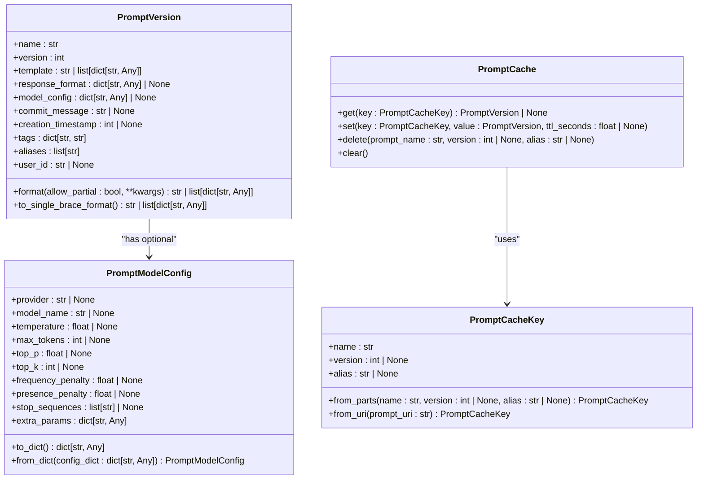
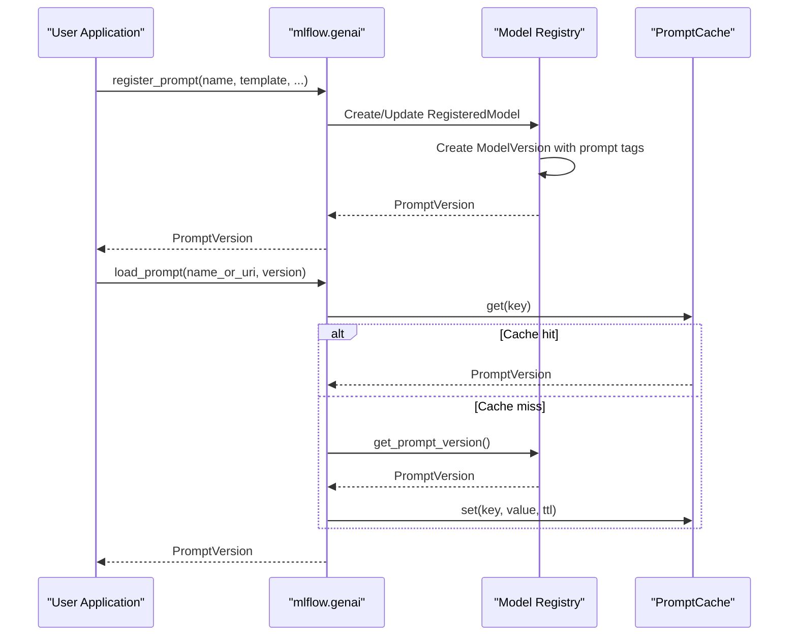
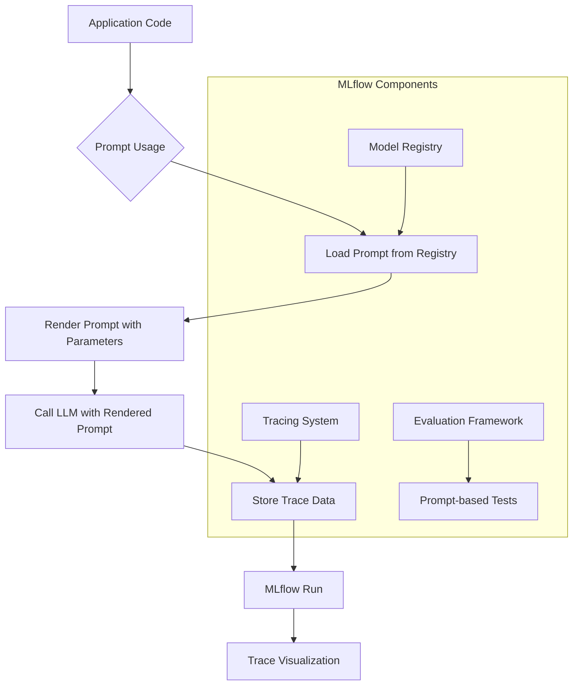
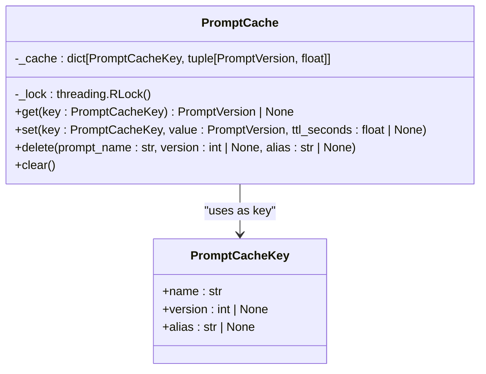

# Prompt Templates

<cite>
**Referenced Files in This Document**   
- [constants.py](file://mlflow/prompt/constants.py)
- [promptlab_model.py](file://mlflow/prompt/promptlab_model.py)
- [registry_utils.py](file://mlflow/prompt/registry_utils.py)
- [prompt.py](file://mlflow/entities/model_registry/prompt.py)
- [prompt_version.py](file://mlflow/entities/model_registry/prompt_version.py)
- [utils.py](file://mlflow/genai/prompts/utils.py)
- [__init__.py](file://mlflow/genai/prompts/__init__.py)
</cite>

## Table of Contents
1. [Introduction](#introduction)
2. [Core Components](#core-components)
3. [Template System Implementation](#template-system-implementation)
4. [Prompt Registration and Management](#prompt-registration-and-management)
5. [Variable Interpolation and Type Safety](#variable-interpolation-and-type-safety)
6. [Integration with MLflow Components](#integration-with-mlflow-components)
7. [Security and Validation](#security-and-validation)
8. [Performance and Caching](#performance-and-caching)
9. [Conclusion](#conclusion)

## Introduction

MLflow's prompt template system provides a robust framework for creating dynamic, parameterized prompts for LLM applications. The system enables developers to define reusable prompt templates with placeholders that can be safely rendered with user-provided data. This documentation explains the implementation details of the template system, including supported formats, variable interpolation, type safety features, and integration with other MLflow components.

The prompt template system is designed to support both text-based and chat-based prompts, allowing for flexible prompt engineering workflows. Prompts are versioned and managed through MLflow's Model Registry, providing a centralized location for prompt governance, collaboration, and deployment.

**Section sources**
- [prompt.py](file://mlflow/entities/model_registry/prompt.py#L1-L72)
- [prompt_version.py](file://mlflow/entities/model_registry/prompt_version.py#L1-L520)

## Core Components

The prompt template system in MLflow consists of several key components that work together to provide a comprehensive solution for prompt management:

1. **Prompt**: Represents a prompt in the registry with its metadata but without version-specific content. It contains information such as name, description, and tags.

2. **PromptVersion**: Represents a specific version of a prompt with its template content. It includes the template text, response format specifications, model configuration, and version-specific metadata.

3. **PromptModelConfig**: Provides a structured way to store model-specific settings alongside prompts, ensuring reproducibility and clarity about which model and parameters were used with a particular prompt version.

4. **PromptCache**: A thread-safe singleton cache for prompts with TTL support, designed to avoid repeated API calls when fetching prompts by name, version, or alias.

5. **PromptCacheKey**: A named tuple that serves as a cache key for prompt lookups, containing the prompt name, version, and alias information.

The system uses a tagging mechanism to distinguish prompts from regular models in the registry, with special tags like `mlflow.prompt.is_prompt` to identify prompt entities. This allows the prompt system to coexist with the traditional model registry while providing specialized functionality for prompt management.

**Section sources**
- [prompt.py](file://mlflow/entities/model_registry/prompt.py#L1-L72)
- [prompt_version.py](file://mlflow/entities/model_registry/prompt_version.py#L1-L520)
- [registry_utils.py](file://mlflow/prompt/registry_utils.py#L1-L421)

## Template System Implementation

### Supported Template Formats

MLflow's prompt template system supports two primary formats for prompt templates:

1. **Text Templates**: String-based templates with variables enclosed in double curly braces (e.g., `{{variable}}`). These are suitable for simple text completion tasks.

2. **Chat Templates**: List-based templates containing dictionaries with 'role' and 'content' keys (e.g., `[{"role": "user", "content": "Hello {{name}}"}]`). These are designed for chat-based LLM interactions.

The system validates chat templates to ensure they conform to the expected structure, raising errors for malformed templates that don't include required fields like 'role'.



**Diagram sources **
- [prompt_version.py](file://mlflow/entities/model_registry/prompt_version.py#L1-L520)
- [registry_utils.py](file://mlflow/prompt/registry_utils.py#L1-L421)

### Template Registration and Versioning

Prompts are registered and versioned through the MLflow Model Registry, leveraging its existing infrastructure for model management. When a prompt is registered, it is stored as a special type of model version with specific tags that identify it as a prompt.

The registration process supports both creating new prompts and updating existing ones with new versions. Each prompt version is immutable once created, ensuring reproducibility of results. The system automatically handles version numbering, incrementing the version number for each new registration of the same prompt name.



**Diagram sources **
- [__init__.py](file://mlflow/genai/prompts/__init__.py#L1-L423)
- [registry_utils.py](file://mlflow/prompt/registry_utils.py#L1-L421)

**Section sources**
- [__init__.py](file://mlflow/genai/prompts/__init__.py#L1-L423)
- [registry_utils.py](file://mlflow/prompt/registry_utils.py#L1-L421)

## Prompt Registration and Management

### Creating and Registering Prompts

The prompt registration system provides a comprehensive API for creating and managing prompts in the MLflow registry. The primary interface is the `register_prompt` function, which allows users to create new prompts or update existing ones with new versions.

```python
import mlflow

# Register a text prompt
mlflow.genai.register_prompt(
    name="greeting_prompt",
    template="Respond to the user's message as a {{style}} AI.",
)

# Register a chat prompt with multiple messages
mlflow.genai.register_prompt(
    name="assistant_prompt",
    template=[
        {"role": "system", "content": "You are a helpful {{style}} assistant."},
        {"role": "user", "content": "{{question}}"},
    ],
    response_format={"type": "object", "properties": {"answer": {"type": "string"}}},
)
```

The registration process validates the prompt name against specific rules, allowing only alphanumeric characters, hyphens, underscores, and dots. It also checks for naming conflicts between prompts and regular models, preventing the same name from being used for both a prompt and a model.

### Loading and Using Prompts

Prompts can be loaded using the `load_prompt` function, which supports multiple ways to specify the prompt version:

```python
# Load the latest version of the prompt
prompt = mlflow.genai.load_prompt("my_prompt")

# Load a specific version of the prompt
prompt = mlflow.genai.load_prompt("my_prompt", version=1)

# Load a specific version of the prompt by URI
prompt = mlflow.genai.load_prompt("prompts:/my_prompt/1")

# Load a prompt version with an alias "production"
prompt = mlflow.genai.load_prompt("prompts:/my_prompt@production")
```

The system supports aliases as mutable pointers to specific prompt versions, allowing for easy promotion of prompt versions through environments (e.g., from staging to production).

### Search and Discovery

The prompt system provides search functionality to discover prompts in the registry:

```python
# Search for prompts with a filter string
prompts = mlflow.genai.search_prompts(filter_string="name LIKE 'greeting%'")

# Get all prompts
all_prompts = mlflow.genai.search_prompts()
```

The search functionality integrates with the existing model registry search capabilities, adding filters to include or exclude prompts from results.

**Section sources**
- [__init__.py](file://mlflow/genai/prompts/__init__.py#L1-L423)
- [registry_utils.py](file://mlflow/prompt/registry_utils.py#L1-L421)

## Variable Interpolation and Type Safety

### Variable Interpolation System

The prompt template system uses a robust variable interpolation mechanism that replaces placeholders in the template with actual values. Placeholders are defined using double curly braces (e.g., `{{variable}}`), following Jinja2 variable naming rules.

The interpolation process is implemented in the `format` method of the `PromptVersion` class, which performs the following steps:

1. Extract all variables from the template using a regular expression pattern
2. Validate that all required variables are provided in the input
3. Replace each variable placeholder with its corresponding value
4. Return the fully rendered template

```python
# Example of template formatting
prompt = mlflow.genai.load_prompt("greeting_prompt")
formatted = prompt.format(style="friendly", name="Alice")
# Result: "Respond to the user's message as a friendly AI."
```

The system supports partial formatting through the `allow_partial=True` parameter, which allows rendering templates with only some variables filled in:

```python
# Partial formatting
partial_prompt = prompt.format(style="friendly", allow_partial=True)
# Result: PromptVersion with template "Respond to the user's message as a friendly AI."
```

### Type Safety Features

The prompt system incorporates several type safety features to ensure reliable prompt rendering:

1. **PromptModelConfig**: A Pydantic model that provides validation and type safety for common model parameters like temperature, max_tokens, and top_p. This ensures that model configuration follows expected data types and constraints.

2. **Response Format Specification**: Support for defining expected response structures using either Pydantic classes or dictionaries. This allows for structured output validation and schema enforcement.

3. **Input Validation**: The system validates input parameters during template rendering, raising errors for missing required variables.

4. **Chat Message Validation**: For chat templates, the system validates that each message dictionary contains the required 'role' and 'content' keys.

The `PromptModelConfig` class provides a structured way to store model-specific settings alongside prompts:

```python
from mlflow.entities.model_registry import PromptModelConfig

# Create a model configuration
config = PromptModelConfig(
    model_name="gpt-4",
    temperature=0.7,
    max_tokens=1000,
    extra_params={"response_metadata": {"cache_control": True}}
)

# Register prompt with model configuration
mlflow.genai.register_prompt(
    name="my-prompt",
    template="Analyze this: {{text}}",
    model_config=config,
)
```

**Section sources**
- [prompt_version.py](file://mlflow/entities/model_registry/prompt_version.py#L1-L520)
- [utils.py](file://mlflow/genai/prompts/utils.py#L1-L13)
- [constants.py](file://mlflow/prompt/constants.py#L1-L32)

## Integration with MLflow Components

### Relationship with Prompt Versioning

The prompt template system is tightly integrated with MLflow's versioning capabilities, leveraging the Model Registry for prompt version management. Each prompt version is stored as a model version with specific tags that identify it as a prompt:

- `mlflow.prompt.is_prompt`: Indicates that the entity is a prompt
- `mlflow.prompt.text`: Stores the prompt text
- `mlflow.prompt.type`: Specifies the prompt type (text or chat)
- `mlflow.prompt.response_format`: Stores the response format specification
- `mlflow.prompt.model_config`: Stores the model configuration

This integration allows prompts to benefit from the same versioning, lineage tracking, and access control features as regular models.

### Evaluation Framework Integration

Prompts can be used within MLflow's evaluation framework to assess the quality of LLM responses. The system supports registering prompts specifically for evaluation purposes, allowing for consistent evaluation across different models and configurations.

The evaluation framework can use registered prompts to generate standardized test cases, ensuring that model comparisons are based on consistent input conditions. This enables fair and reproducible evaluation of different LLMs or model configurations.

### Tracing System Integration

The prompt template system integrates with MLflow's tracing capabilities to provide end-to-end visibility into LLM applications. When prompts are used in traced workflows, the system captures:

1. The prompt template used
2. The rendered prompt with actual values
3. The model configuration applied
4. The LLM response generated

This tracing information is stored as part of the MLflow run, enabling detailed analysis of prompt performance and behavior over time. The tracing system also supports linking prompts to specific model versions, creating a complete lineage from prompt to final output.



**Diagram sources **
- [prompt_version.py](file://mlflow/entities/model_registry/prompt_version.py#L1-L520)
- [registry_utils.py](file://mlflow/prompt/registry_utils.py#L1-L421)

**Section sources**
- [prompt_version.py](file://mlflow/entities/model_registry/prompt_version.py#L1-L520)
- [registry_utils.py](file://mlflow/prompt/registry_utils.py#L1-L421)

## Security and Validation

### Input Validation and Error Handling

The prompt template system implements comprehensive validation to ensure data integrity and prevent common issues:

1. **Prompt Name Validation**: Validates that prompt names follow specific rules, allowing only alphanumeric characters, hyphens, underscores, and dots.

2. **Variable Validation**: Checks that all required variables are provided during template rendering, raising descriptive errors for missing variables.

3. **Chat Template Validation**: Ensures that chat templates contain valid message dictionaries with required 'role' and 'content' keys.

4. **Model Configuration Validation**: Uses Pydantic validation to ensure model configuration parameters follow expected types and constraints.

The system provides clear error messages that help users identify and fix issues with their prompts or input data.

### Injection Attack Prevention

The prompt template system includes several security measures to prevent injection attacks:

1. **Proper Escaping**: The variable interpolation system properly escapes special characters in input values to prevent template injection attacks.

2. **Input Sanitization**: The system sanitizes input values during template rendering, preventing malicious content from being injected into prompts.

3. **Validation of Special Characters**: The system validates and handles special characters in input data to prevent unexpected behavior.

4. **Sandboxed Rendering**: Template rendering occurs in a controlled environment that limits the potential impact of malicious input.

The `format_prompt` function in the utils module implements the core escaping logic:

```python
def format_prompt(prompt: str, **values: Any) -> str:
    """Format double-curly variables in the prompt template."""
    for key, value in values.items():
        # Escape backslashes in the replacement string to prevent re.sub from interpreting
        # them as escape sequences (e.g. \u being treated as Unicode escape)
        replacement = str(value).replace("\\", "\\\\")
        prompt = re.sub(r"\{\{\s*" + key + r"\s*\}\}", replacement, prompt)
    return prompt
```

This implementation ensures that backslashes in input values are properly escaped, preventing them from being interpreted as escape sequences during the substitution process.

**Section sources**
- [utils.py](file://mlflow/genai/prompts/utils.py#L1-L13)
- [prompt_version.py](file://mlflow/entities/model_registry/prompt_version.py#L1-L520)

## Performance and Caching

### Prompt Caching Mechanism

The prompt template system includes a sophisticated caching mechanism to improve performance and reduce API calls. The `PromptCache` class implements a thread-safe singleton cache with TTL (time-to-live) support:



The cache stores prompts with optional TTL values, allowing items to expire after a configurable period. This ensures that cached data remains fresh while still providing performance benefits.

### Cache Configuration and Usage

The caching system supports several configuration options:

1. **Custom TTL**: Users can specify a custom TTL when loading prompts, controlling how long the prompt remains in the cache.

2. **Cache Bypass**: Setting `cache_ttl_seconds=0` bypasses the cache entirely, forcing a fresh fetch from the registry.

3. **Environment Variables**: Default TTL values can be configured using environment variables:
   - `MLFLOW_ALIAS_PROMPT_CACHE_TTL_SECONDS`: Default TTL for alias-based prompts
   - `MLFLOW_VERSION_PROMPT_CACHE_TTL_SECONDS`: Default TTL for version-based prompts

```python
# Load with custom cache TTL (5 minutes)
prompt = mlflow.genai.load_prompt("my_prompt", version=1, cache_ttl_seconds=300)

# Bypass cache entirely
prompt = mlflow.genai.load_prompt("my_prompt", version=1, cache_ttl_seconds=0)
```

The cache is thread-safe and supports concurrent operations, making it suitable for use in multi-threaded applications. The singleton pattern ensures that all parts of the application share the same cache instance, maximizing cache hit rates.

**Section sources**
- [registry_utils.py](file://mlflow/prompt/registry_utils.py#L1-L421)

## Conclusion

MLflow's prompt template system provides a comprehensive solution for managing dynamic, parameterized prompts in LLM applications. The system offers robust features for template creation, versioning, variable interpolation, and integration with other MLflow components.

Key benefits of the system include:

1. **Centralized Management**: Prompts are stored in the MLflow Model Registry, providing version control, access control, and collaboration features.

2. **Flexible Template Formats**: Support for both text and chat templates enables a wide range of LLM applications.

3. **Type Safety**: Integration with Pydantic models ensures that model configurations and response formats follow expected schemas.

4. **Security**: Built-in protection against injection attacks and proper escaping of special characters.

5. **Performance**: Caching mechanism reduces API calls and improves response times.

6. **Integration**: Seamless integration with MLflow's evaluation, tracing, and deployment capabilities.

The prompt template system enables teams to develop, test, and deploy LLM applications with the same rigor and reproducibility as traditional machine learning models, bridging the gap between prompt engineering and MLOps practices.