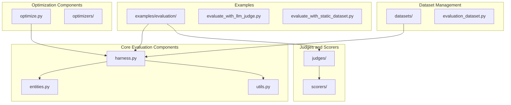
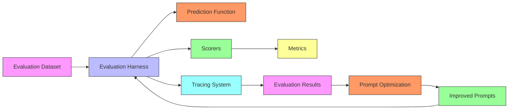
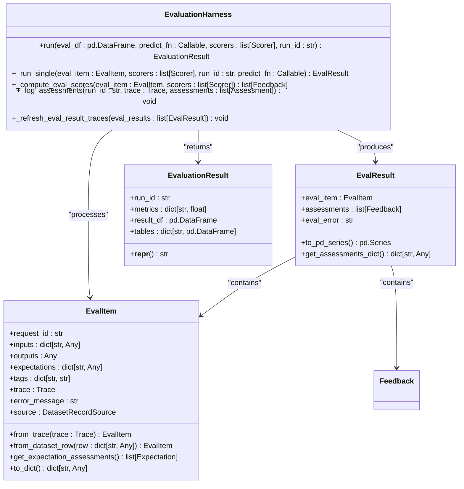
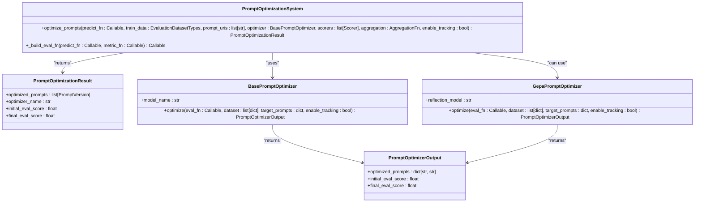
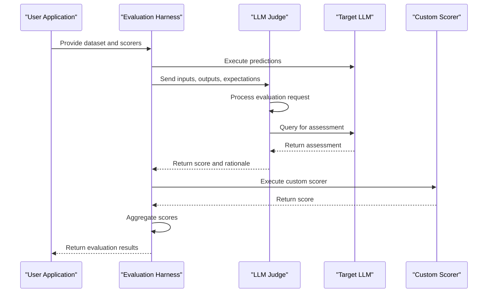
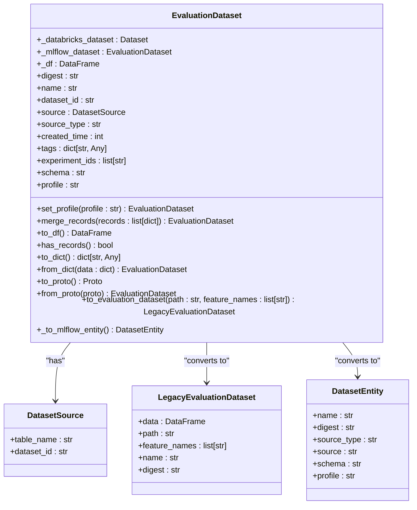
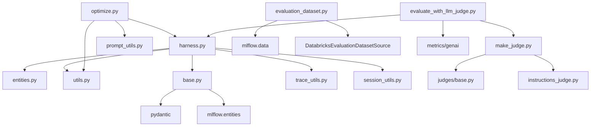

# Prompt Testing

<cite>
**Referenced Files in This Document**   
- [harness.py](file://mlflow/genai/evaluation/harness.py)
- [optimize.py](file://mlflow/genai/optimize/optimize.py)
- [make_judge.py](file://mlflow/genai/judges/make_judge.py)
- [base.py](file://mlflow/genai/scorers/base.py)
- [evaluation_dataset.py](file://mlflow/genai/datasets/evaluation_dataset.py)
- [entities.py](file://mlflow/genai/evaluation/entities.py)
- [utils.py](file://mlflow/genai/evaluation/utils.py)
- [evaluate_with_llm_judge.py](file://examples/evaluation/evaluate_with_llm_judge.py)
- [evaluate_with_static_dataset.py](file://examples/evaluation/evaluate_with_static_dataset.py)
</cite>

## Table of Contents
1. [Introduction](#introduction)
2. [Project Structure](#project-structure)
3. [Core Components](#core-components)
4. [Architecture Overview](#architecture-overview)
5. [Detailed Component Analysis](#detailed-component-analysis)
6. [Dependency Analysis](#dependency-analysis)
7. [Performance Considerations](#performance-considerations)
8. [Troubleshooting Guide](#troubleshooting-guide)
9. [Conclusion](#conclusion)

## Introduction
Prompt testing in MLflow provides a systematic framework for evaluating and optimizing prompts through automated testing. This system enables developers to rigorously assess prompt quality, compare different prompt versions, and leverage LLM judges for objective evaluation. The implementation supports defining test datasets, evaluating prompts against these datasets, measuring results, and comparing performance across iterations. The interfaces allow creating evaluation harnesses, defining test metrics, and running comparative tests between prompt variants. This documentation explains the implementation details, relationships with other components like evaluation metrics and tracing systems, and addresses common issues in prompt testing.

## Project Structure
The prompt testing functionality in MLflow is organized within the `genai` module, which contains specialized components for evaluation, optimization, and dataset management. The core components are located in subdirectories that handle specific aspects of prompt testing:

- `genai/evaluation/`: Contains the evaluation harness and related utilities
- `genai/optimize/`: Houses prompt optimization algorithms and utilities
- `genai/judges/`: Implements LLM judge functionality for evaluation
- `genai/scorers/`: Defines scoring mechanisms and metrics
- `genai/datasets/`: Manages evaluation datasets
- `examples/evaluation/`: Provides practical examples of evaluation usage

This structure supports a comprehensive workflow from dataset creation to prompt optimization and evaluation.

**Diagram sources**
- [harness.py](file://mlflow/genai/evaluation/harness.py)
- [optimize.py](file://mlflow/genai/optimize/optimize.py)
- [make_judge.py](file://mlflow/genai/judges/make_judge.py)
- [base.py](file://mlflow/genai/scorers/base.py)
- [evaluation_dataset.py](file://mlflow/genai/datasets/evaluation_dataset.py)

**Section sources**
- [harness.py](file://mlflow/genai/evaluation/harness.py)
- [optimize.py](file://mlflow/genai/optimize/optimize.py)
- [make_judge.py](file://mlflow/genai/judges/make_judge.py)
- [base.py](file://mlflow/genai/scorers/base.py)
- [evaluation_dataset.py](file://mlflow/genai/datasets/evaluation_dataset.py)

## Core Components
The prompt testing system in MLflow consists of several core components that work together to enable systematic evaluation and optimization of prompts. The evaluation harness serves as the central component, coordinating the evaluation process by managing datasets, executing predictions, and computing scores. The optimization framework builds upon this foundation to automatically improve prompt quality based on evaluation metrics. LLM judges provide sophisticated evaluation capabilities by using language models to assess prompt quality, while the scorer system offers flexible metric definition and computation.

The system supports both static datasets and dynamic evaluation using traces, allowing for comprehensive testing across different scenarios. The architecture is designed to be extensible, enabling custom scorers and evaluation metrics while maintaining compatibility with MLflow's tracking and logging capabilities.

**Section sources**
- [harness.py](file://mlflow/genai/evaluation/harness.py)
- [optimize.py](file://mlflow/genai/optimize/optimize.py)
- [make_judge.py](file://mlflow/genai/judges/make_judge.py)
- [base.py](file://mlflow/genai/scorers/base.py)

## Architecture Overview
The prompt testing architecture in MLflow follows a modular design that separates concerns while enabling seamless integration between components. The system operates on a pipeline model where datasets flow through evaluation stages, with results being aggregated and analyzed at each step.

**Diagram sources**
- [harness.py](file://mlflow/genai/evaluation/harness.py)
- [optimize.py](file://mlflow/genai/optimize/optimize.py)
- [utils.py](file://mlflow/genai/evaluation/utils.py)

## Detailed Component Analysis

### Evaluation Harness
The evaluation harness is the core component that orchestrates the prompt testing process. It manages the evaluation workflow by coordinating dataset processing, prediction execution, and score computation. The harness operates in parallel across multiple evaluation items, using thread pools to maximize efficiency while maintaining isolation between evaluation tasks.

The harness supports both single-turn and multi-turn evaluations, with special handling for session-based assessments. It integrates with MLflow's tracing system to capture execution details and provides comprehensive progress tracking during evaluation. The component is designed to handle various input formats, including pandas DataFrames, Spark DataFrames, and lists of dictionaries, making it flexible for different use cases.

#### For Object-Oriented Components:

**Diagram sources**
- [harness.py](file://mlflow/genai/evaluation/harness.py)
- [entities.py](file://mlflow/genai/evaluation/entities.py)

### Prompt Optimization Framework
The prompt optimization framework provides automated methods for improving prompt quality based on evaluation metrics. It uses optimization algorithms to iteratively refine prompts, leveraging evaluation results to guide the improvement process. The framework supports various optimization strategies and allows for custom objective functions that combine multiple evaluation metrics.

The optimization process is designed to work seamlessly with MLflow's tracking system, automatically logging optimization progress, intermediate results, and final outcomes. This enables reproducible optimization runs and facilitates comparison between different optimization approaches.

#### For Object-Oriented Components:

**Diagram sources**
- [optimize.py](file://mlflow/genai/optimize/optimize.py)

### LLM Judges and Scoring System
The LLM judges and scoring system provides sophisticated evaluation capabilities by leveraging language models to assess prompt quality. The system supports both built-in metrics and custom scorers, allowing for flexible evaluation strategies. LLM judges can be configured with specific instructions and models to perform targeted evaluations, such as assessing response quality, correctness, or adherence to guidelines.

The scoring system is designed to be extensible, enabling developers to create custom scorers using decorators or by implementing the Scorer interface. The system handles various data types and provides aggregation functions to compute overall performance metrics from individual scores.

#### For API/Service Components:

**Diagram sources**
- [make_judge.py](file://mlflow/genai/judges/make_judge.py)
- [base.py](file://mlflow/genai/scorers/base.py)

### Dataset Management System
The dataset management system provides a unified interface for handling evaluation datasets in MLflow. It supports both standard MLflow evaluation datasets and Databricks managed datasets, offering a consistent API across different storage backends. The system handles dataset creation, merging, and conversion to various formats, making it easy to work with evaluation data.

The dataset system integrates with MLflow's tracking capabilities, allowing datasets to be logged and versioned alongside models and experiments. It supports various data formats and provides utilities for data validation and preprocessing, ensuring that evaluation datasets are properly formatted for testing.

#### For Object-Oriented Components:

**Diagram sources**
- [evaluation_dataset.py](file://mlflow/genai/datasets/evaluation_dataset.py)

## Dependency Analysis
The prompt testing system in MLflow has a well-defined dependency structure that enables modularity while maintaining integration between components. The evaluation harness serves as the central component, depending on various subsystems for specific functionality.

**Diagram sources**
- [harness.py](file://mlflow/genai/evaluation/harness.py)
- [optimize.py](file://mlflow/genai/optimize/optimize.py)
- [make_judge.py](file://mlflow/genai/judges/make_judge.py)
- [base.py](file://mlflow/genai/scorers/base.py)
- [evaluation_dataset.py](file://mlflow/genai/datasets/evaluation_dataset.py)

**Section sources**
- [harness.py](file://mlflow/genai/evaluation/harness.py)
- [optimize.py](file://mlflow/genai/optimize/optimize.py)
- [make_judge.py](file://mlflow/genai/judges/make_judge.py)
- [base.py](file://mlflow/genai/scorers/base.py)
- [evaluation_dataset.py](file://mlflow/genai/datasets/evaluation_dataset.py)

## Performance Considerations
The prompt testing system in MLflow is designed with performance in mind, leveraging parallel execution and efficient resource management. The evaluation harness uses thread pools to process multiple evaluation items concurrently, maximizing throughput while respecting system resource constraints. The system includes configurable parameters for controlling the number of workers, allowing users to balance performance with resource usage.

For large datasets, the system provides streaming capabilities and memory-efficient processing to minimize memory footprint. The optimization framework includes caching mechanisms to avoid redundant computations, and the scoring system supports batch processing for improved efficiency. When working with external LLM APIs, the system implements rate limiting and retry mechanisms to handle API constraints gracefully.

## Troubleshooting Guide
When working with the prompt testing system in MLflow, several common issues may arise. For dataset-related problems, ensure that the dataset contains the required columns (inputs, outputs, expectations) and that the data types are correct. When using traces as input, verify that the traces include span data by using `include_spans=True` in `search_traces()`.

For evaluation failures, check that the predict function is correctly implemented and that it uses the prompt registry appropriately. When using custom scorers, ensure that they return valid types (int, float, bool, str, or Feedback objects). For optimization issues, verify that the prompt URIs are correct and that the target prompts are registered in the prompt registry.

When encountering LLM judge errors, check that the model URI is valid and that the necessary API keys are configured. For performance issues, consider adjusting the worker counts using the MLFLOW_GENAI_EVAL_MAX_WORKERS environment variable.

**Section sources**
- [harness.py](file://mlflow/genai/evaluation/harness.py)
- [optimize.py](file://mlflow/genai/optimize/optimize.py)
- [make_judge.py](file://mlflow/genai/judges/make_judge.py)
- [base.py](file://mlflow/genai/scorers/base.py)
- [utils.py](file://mlflow/genai/evaluation/utils.py)

## Conclusion
The prompt testing system in MLflow provides a comprehensive framework for systematic evaluation and optimization of prompts. By combining automated testing, LLM judges, and optimization algorithms, the system enables developers to rigorously assess and improve prompt quality. The modular architecture supports extensibility while maintaining integration with MLflow's tracking and logging capabilities. With support for various data formats, scoring mechanisms, and optimization strategies, the system offers a flexible solution for prompt testing needs. The implementation balances performance, usability, and robustness, making it suitable for both beginners and experienced developers working with generative AI applications.