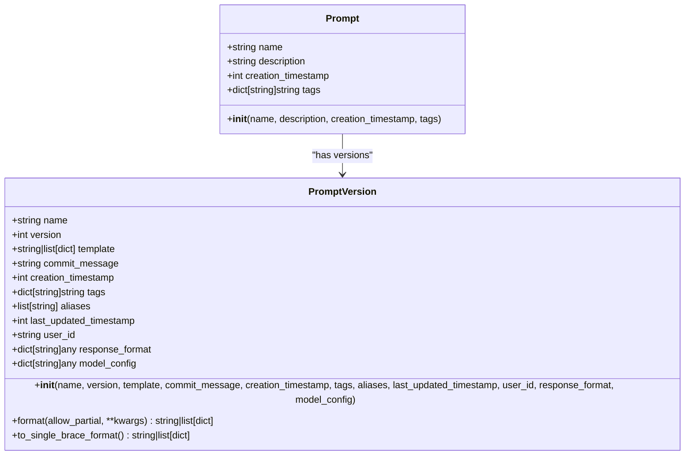
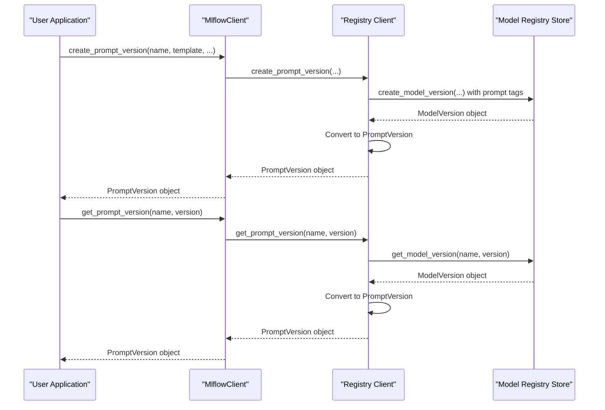
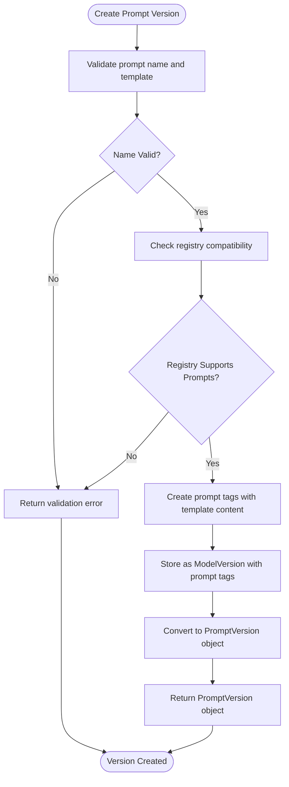
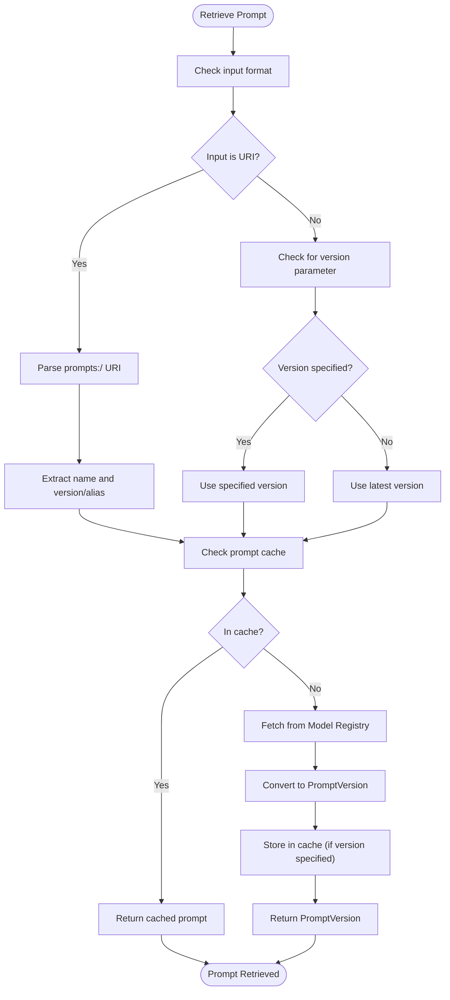
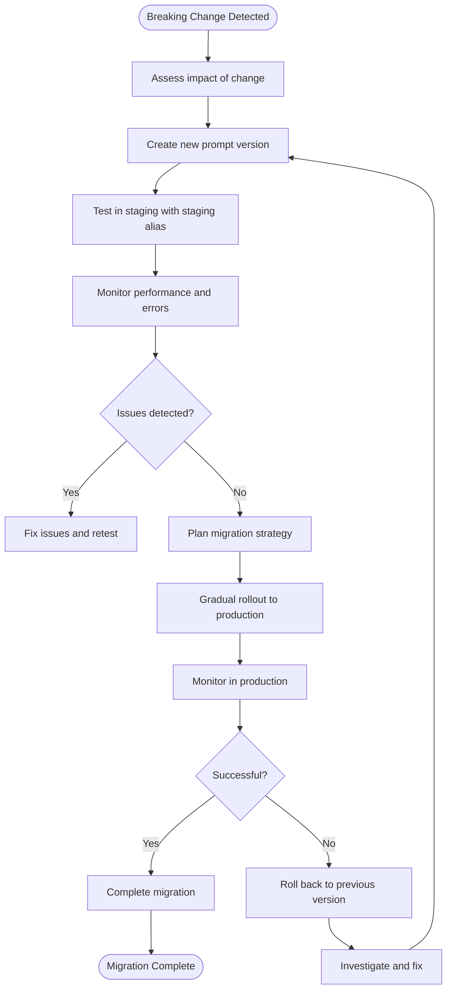

# Prompt Versioning

<cite>
**Referenced Files in This Document**   
- [constants.py](file://mlflow/prompt/constants.py)
- [promptlab_model.py](file://mlflow/prompt/promptlab_model.py)
- [registry_utils.py](file://mlflow/prompt/registry_utils.py)
- [prompt.py](file://mlflow/entities/model_registry/prompt.py)
- [prompt_version.py](file://mlflow/entities/model_registry/prompt_version.py)
- [client.py](file://mlflow/tracking/client.py)
</cite>

## Table of Contents
1. [Introduction](#introduction)
2. [Core Concepts](#core-concepts)
3. [Prompt Versioning Implementation](#prompt-versioning-implementation)
4. [Creating and Managing Prompt Versions](#creating-and-managing-prompt-versions)
5. [Retrieving Prompt Versions](#retrieving-prompt-versions)
6. [Relationship with Experiments, Runs, and Traces](#relationship-with-experiments-runs-and-traces)
7. [Handling Breaking Changes and Migration](#handling-breaking-changes-and-migration)
8. [Best Practices](#best-practices)

## Introduction

Prompt versioning in MLflow provides a systematic approach to managing the evolution of prompts used in Large Language Model (LLM) applications. This system enables reproducibility and traceability by treating prompts as first-class citizens in the MLflow Model Registry, allowing teams to track changes, maintain historical versions, and ensure consistent results across different deployments. The versioning system is built on top of MLflow's existing model registry infrastructure but extends it with prompt-specific functionality, including template storage, variable management, and response format specifications.

The prompt versioning system addresses key challenges in LLM development, such as tracking prompt iterations, comparing performance across different prompt versions, and maintaining consistency between development and production environments. By providing a structured approach to prompt management, MLflow enables teams to treat prompt engineering as a rigorous, reproducible process rather than an ad-hoc activity.

**Section sources**
- [constants.py](file://mlflow/prompt/constants.py#L1-L32)
- [prompt.py](file://mlflow/entities/model_registry/prompt.py#L1-L72)

## Core Concepts

The prompt versioning system in MLflow is built around several key concepts that enable comprehensive management of prompts throughout their lifecycle. At the foundation is the distinction between a **Prompt** and a **PromptVersion**. A Prompt represents the logical entity with metadata such as name, description, and prompt-level tags, while a PromptVersion contains the specific template content, version-specific tags, and other version-specific information.

Prompt templates support two formats: text prompts and chat prompts. Text prompts are simple string templates with variables enclosed in double curly braces (e.g., `{{variable}}`), while chat prompts are structured as lists of message dictionaries with 'role' and 'content' keys. This dual format support enables the system to handle both simple text generation tasks and complex conversational AI applications.

The system uses special tags to store prompt-specific information within the Model Registry. The `mlflow.prompt.is_prompt` tag identifies a registered model as a prompt, while `mlflow.prompt.text` stores the actual template content. Additional tags handle response formats, model configurations, and associated run IDs. This tagging approach allows MLflow to extend the existing model registry without requiring structural changes to the underlying storage.



**Diagram sources **
- [prompt.py](file://mlflow/entities/model_registry/prompt.py#L9-L72)
- [prompt_version.py](file://mlflow/entities/model_registry/prompt_version.py#L146-L520)

**Section sources**
- [prompt.py](file://mlflow/entities/model_registry/prompt.py#L1-L72)
- [prompt_version.py](file://mlflow/entities/model_registry/prompt_version.py#L1-L520)
- [constants.py](file://mlflow/prompt/constants.py#L1-L32)

## Prompt Versioning Implementation

The implementation of prompt versioning in MLflow leverages the existing Model Registry infrastructure while adding prompt-specific functionality through a layer of abstraction. When a prompt is created, it is registered as a special type of model with the `mlflow.prompt.is_prompt` tag set to "true". Each prompt version is stored as a model version with the template content encoded in the `mlflow.prompt.text` tag. This design allows MLflow to reuse the robust versioning, access control, and metadata management capabilities of the Model Registry while extending it for prompt-specific needs.

The system supports both text and chat prompt types through the `mlflow.prompt.type` tag, which can have values of "text" or "chat". For chat prompts, the template is stored as a JSON-serialized list of message dictionaries, enabling structured conversation management. The implementation also includes support for response format specifications, allowing users to define expected output structures using Pydantic models or dictionaries.

A key aspect of the implementation is the use of a thread-safe singleton cache for prompt lookups. The `PromptCache` class stores frequently accessed prompts to reduce API calls and improve performance. The cache uses `PromptCacheKey` objects that combine prompt name, version, and alias information to uniquely identify cached items. Items in the cache can have time-to-live (TTL) settings, ensuring that stale data is automatically removed.



**Diagram sources **
- [registry_utils.py](file://mlflow/prompt/registry_utils.py#L28-L421)
- [prompt_version.py](file://mlflow/entities/model_registry/prompt_version.py#L146-L520)
- [client.py](file://mlflow/tracking/client.py#L5905-L6000)

**Section sources**
- [registry_utils.py](file://mlflow/prompt/registry_utils.py#L1-L421)
- [prompt_version.py](file://mlflow/entities/model_registry/prompt_version.py#L1-L520)
- [client.py](file://mlflow/tracking/client.py#L5905-L6000)

## Creating and Managing Prompt Versions

Creating new prompt versions in MLflow is accomplished through the `create_prompt_version` method of the `MlflowClient` class. This method accepts the prompt name, template content, optional description, version-specific tags, response format specifications, and model configuration. When called, it creates a new version of the specified prompt, storing the template content and associated metadata in the Model Registry.

The template parameter can accept either a string for text prompts or a list of dictionaries for chat prompts. For text prompts, variables are specified using double curly braces (e.g., `{{variable}}`), which can later be replaced using the `format` method. Chat prompts are structured as lists of message objects, each containing a 'role' (e.g., "system", "user", "assistant") and 'content' field.

Version management includes support for aliases, which provide human-readable names for specific versions (e.g., "production", "staging"). Aliases can be set using the `set_prompt_alias` method and provide a stable reference point that can be updated as new versions are promoted to different environments. The system also supports version deletion through the `delete_prompt_version` method, allowing cleanup of obsolete versions.



**Diagram sources **
- [promptlab_model.py](file://mlflow/prompt/promptlab_model.py#L105-L198)
- [client.py](file://mlflow/tracking/client.py#L5905-L5927)
- [registry_utils.py](file://mlflow/prompt/registry_utils.py#L223-L248)

**Section sources**
- [client.py](file://mlflow/tracking/client.py#L5905-L5927)
- [promptlab_model.py](file://mlflow/prompt/promptlab_model.py#L105-L198)
- [registry_utils.py](file://mlflow/prompt/registry_utils.py#L223-L248)

## Retrieving Prompt Versions

Retrieving prompt versions in MLflow can be accomplished through several methods, providing flexibility for different use cases. The primary method is `get_prompt_version`, which retrieves a specific version by name and version number or alias. For example, `client.get_prompt_version("my_prompt", "1")` retrieves version 1, while `client.get_prompt_version("my_prompt", "production")` retrieves the version with the "production" alias.

The system also supports retrieving prompts by URI using the "prompts:/" scheme. URIs can specify versions (e.g., "prompts:/my_prompt/1") or aliases (e.g., "prompts:/my_prompt@production"). This URI format enables consistent referencing of prompts across different contexts and applications. The `parse_prompt_name_or_uri` function handles the parsing and validation of these URIs, ensuring proper format and resolving any conflicts between version and alias specifications.

For applications that require frequent access to the same prompt, the built-in prompt cache can significantly improve performance. The cache is automatically used when retrieving prompts by name and version, reducing the number of API calls to the registry. The cache can be bypassed by retrieving prompts by URI or by using the "latest" alias, which always fetches the most recent version from the registry.



**Diagram sources **
- [registry_utils.py](file://mlflow/prompt/registry_utils.py#L293-L331)
- [client.py](file://mlflow/tracking/client.py#L5958-L5983)
- [prompt_version.py](file://mlflow/entities/model_registry/prompt_version.py#L433-L520)

**Section sources**
- [client.py](file://mlflow/tracking/client.py#L5958-L5983)
- [registry_utils.py](file://mlflow/prompt/registry_utils.py#L293-L331)
- [prompt_version.py](file://mlflow/entities/model_registry/prompt_version.py#L433-L520)

## Relationship with Experiments, Runs, and Traces

Prompt versions in MLflow are designed to integrate seamlessly with experiments, runs, and traces, creating a comprehensive lineage system for LLM applications. When a prompt is used in an experiment, the specific version can be recorded as a parameter or tag in the run, establishing a direct link between the prompt and the experimental results. This linkage enables researchers to analyze how different prompt versions affect model performance and to reproduce results using the exact prompt version that was used.

The system supports associating runs with prompts through the `mlflow.prompt.associatedRunIds` tag, which stores a comma-separated list of run IDs that have used a particular prompt version. This bidirectional relationship allows users to trace from a prompt version to the experiments that used it and from a run to the prompt version that was employed. For more complex analyses, the `mlflow.prompt.experimentIds` tag can store experiment IDs associated with a prompt, facilitating cohort analysis across multiple runs.

Tracing systems can leverage prompt versioning to provide detailed insights into LLM applications. When a trace is recorded, it can include a reference to the prompt version that generated the response, enabling post-hoc analysis of prompt effectiveness. This integration is particularly valuable for debugging and optimizing LLM applications, as it allows developers to correlate specific prompt versions with user interactions, error patterns, and performance metrics.

```mermaid
graph TB
subgraph "Prompt Management"
PV[Prompt Version]
P[Prompt]
PV --> P
end
subgraph "Experimentation"
E[Experiment]
R[Run]
E --> R
end
subgraph "Observability"
T[Trace]
M[Metrics]
end
PV --> R : "Used in"
PV --> T : "Generates"
R --> M : "Produces"
T --> M : "Contains"
P --> E : "Configures"
R --> T : "Creates"
style PV fill:#f9f,stroke:#333
style P fill:#f9f,stroke:#333
style R fill:#bbf,stroke:#333
style T fill:#f96,stroke:#333
```

**Diagram sources **
- [constants.py](file://mlflow/prompt/constants.py#L1-L32)
- [client.py](file://mlflow/tracking/client.py#L5905-L6000)
- [prompt_version.py](file://mlflow/entities/model_registry/prompt_version.py#L1-L520)

**Section sources**
- [constants.py](file://mlflow/prompt/constants.py#L1-L32)
- [client.py](file://mlflow/tracking/client.py#L5905-L6000)
- [prompt_version.py](file://mlflow/entities/model_registry/prompt_version.py#L1-L520)

## Handling Breaking Changes and Migration

Managing breaking changes in prompt versions requires careful planning and systematic migration strategies. MLflow's prompt versioning system supports several approaches for handling breaking changes, including gradual rollout, A/B testing, and feature flagging. When a breaking change is introduced in a new prompt version, the system allows the old version to remain available while the new version is tested and validated.

One effective strategy is to use aliases to manage the transition between versions. For example, an application might initially point to the "production" alias, which references version 1 of a prompt. When version 2 is ready for testing, the "staging" alias can be updated to point to version 2, allowing testing in a controlled environment. Once validated, the "production" alias can be updated to point to version 2, completing the migration.

The system also supports comparison between prompt versions, enabling developers to identify breaking changes before deployment. By retrieving and analyzing multiple versions of a prompt, teams can detect changes in variable names, response formats, or expected outputs that might cause compatibility issues. The `format` method with `allow_partial=True` can be used to test how a new prompt version handles inputs designed for older versions, helping to identify potential issues.



**Diagram sources **
- [prompt_version.py](file://mlflow/entities/model_registry/prompt_version.py#L433-L520)
- [client.py](file://mlflow/tracking/client.py#L6063-L6087)
- [registry_utils.py](file://mlflow/prompt/registry_utils.py#L332-L365)

**Section sources**
- [prompt_version.py](file://mlflow/entities/model_registry/prompt_version.py#L433-L520)
- [client.py](file://mlflow/tracking/client.py#L6063-L6087)
- [registry_utils.py](file://mlflow/prompt/registry_utils.py#L332-L365)

## Best Practices

Effective use of MLflow's prompt versioning system requires adherence to several best practices that ensure reliability, reproducibility, and maintainability. First, prompt names should follow a consistent naming convention that reflects their purpose and domain, using alphanumeric characters, hyphens, underscores, and dots as allowed by the `PROMPT_NAME_RULE` pattern. Descriptive names make it easier to understand a prompt's function without examining its content.

When creating prompt versions, include meaningful commit messages that explain the rationale for changes, such as "Improved clarity of instructions" or "Added safety guardrails". These messages provide valuable context for future analysis and help team members understand the evolution of prompts over time. Version-specific tags should be used to record metadata such as the author, date, and testing results, creating a rich history of prompt development.

For production deployments, use aliases like "production", "staging", and "development" to provide stable references that can be updated without changing application code. This approach enables seamless rollouts and rollbacks while maintaining application stability. Regularly review and clean up obsolete prompt versions to maintain a manageable registry, but retain sufficient history to support reproducibility requirements.

**Section sources**
- [constants.py](file://mlflow/prompt/constants.py#L1-L32)
- [prompt_version.py](file://mlflow/entities/model_registry/prompt_version.py#L1-L520)
- [client.py](file://mlflow/tracking/client.py#L5905-L6000)