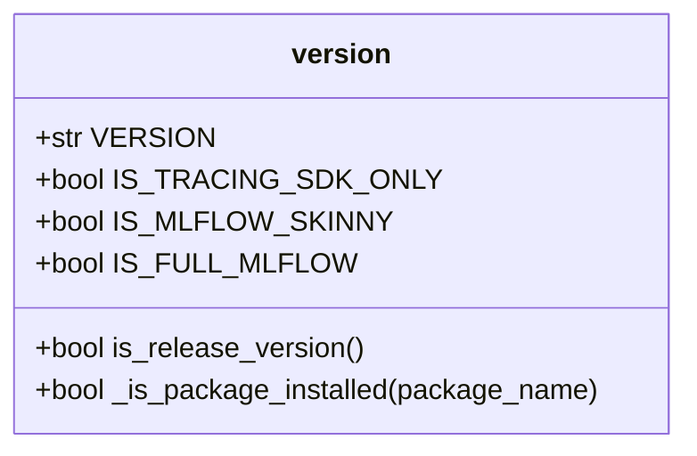
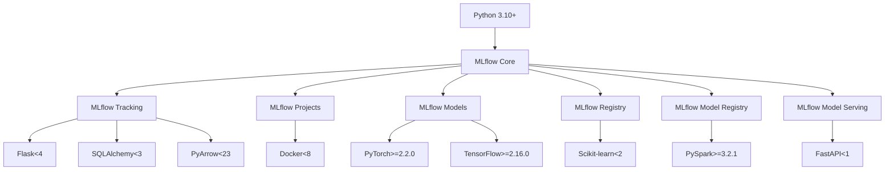
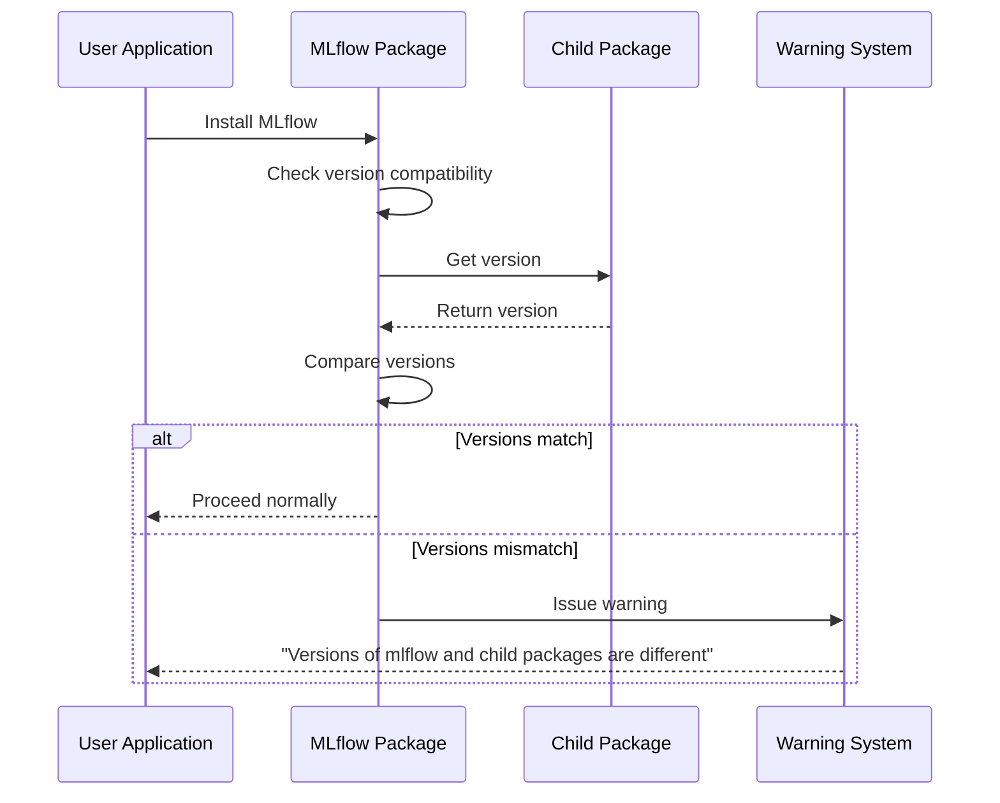
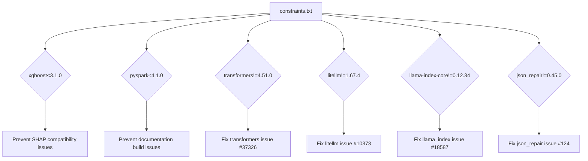
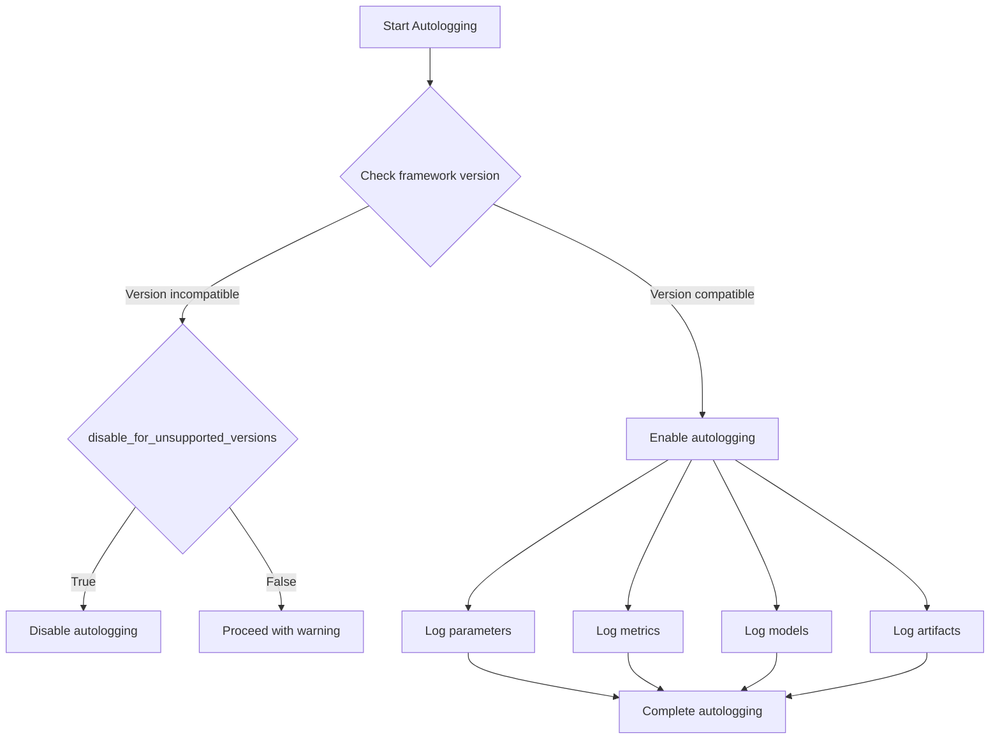
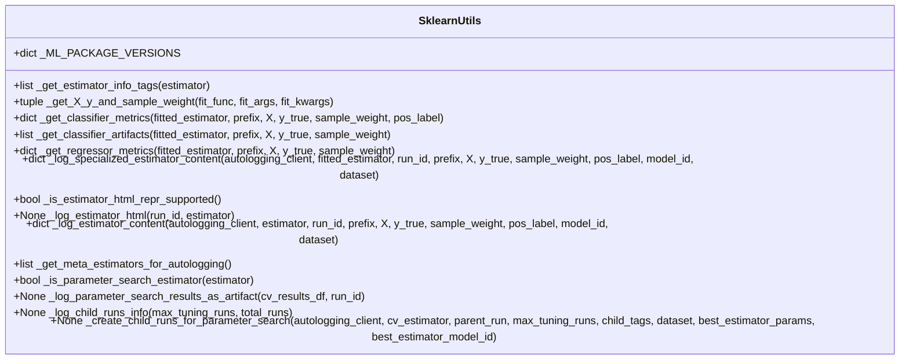
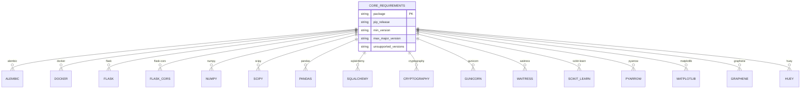

# Compatibility Issues

<cite>
**Referenced Files in This Document**   
- [version.py](file://mlflow/version.py)
- [ml_package_versions.py](file://mlflow/ml_package_versions.py)
- [mismatch.py](file://mlflow/mismatch.py)
- [pyproject.toml](file://pyproject.toml)
- [constraints.txt](file://requirements/constraints.txt)
- [core-requirements.yaml](file://requirements/core-requirements.yaml)
- [sklearn/utils.py](file://mlflow/sklearn/utils.py)
- [pytorch/__init__.py](file://mlflow/pytorch/__init__.py)
- [tensorflow/__init__.py](file://mlflow/tensorflow/__init__.py)
- [xgboost/__init__.py](file://mlflow/xgboost/__init__.py)
</cite>

## Table of Contents
1. [Introduction](#introduction)
2. [Version Compatibility Framework](#version-compatibility-framework)
3. [MLflow Framework Compatibility Matrix](#mlflow-framework-compatibility-matrix)
4. [Python Version Compatibility](#python-version-compatibility)
5. [Dependency Management and Version Pinning](#dependency-management-and-version-pinning)
6. [Autologging Compatibility Mechanisms](#autologging-compatibility-mechanisms)
7. [Model Serialization and Serving Compatibility](#model-serialization-and-serving-compatibility)
8. [Common Compatibility Issues and Migration Strategies](#common-compatibility-issues-and-migration-strategies)
9. [Conclusion](#conclusion)

## Introduction
MLflow maintains compatibility across various machine learning frameworks, Python versions, and dependency libraries through a comprehensive version management system. This document details the implementation of version compatibility checks, dependency validation, and backward compatibility mechanisms within MLflow. The system ensures stable integration between MLflow and popular ML frameworks such as scikit-learn, PyTorch, TensorFlow, and XGBoost, while addressing common compatibility issues like breaking changes in API signatures, deprecated functionality, and dependency conflicts. The compatibility framework is designed to provide users with clear migration paths and version pinning recommendations to ensure smooth upgrades and deployments.

## Version Compatibility Framework

MLflow implements a robust version compatibility framework that manages relationships between MLflow versions and various ML frameworks. The system uses explicit version ranges to define compatibility, preventing integration issues between different package versions. The framework includes mechanisms for detecting version mismatches and providing appropriate warnings to users.

The core version management is implemented in `mlflow/version.py`, which defines the current MLflow version and provides utilities for checking package installation status:



**Diagram sources**
- [version.py](file://mlflow/version.py#L1-L30)

**Section sources**
- [version.py](file://mlflow/version.py#L1-L30)

## MLflow Framework Compatibility Matrix

MLflow maintains a comprehensive compatibility matrix that defines supported version ranges for various ML frameworks. This matrix is implemented in `mlflow/ml_package_versions.py` and specifies minimum and maximum compatible versions for each framework.

```mermaid
erDiagram
MLFRAMEWORKS {
string framework PK
string pip_release
string minimum_version
string maximum_version
string autologging_support
string model_support
}
MLFRAMEWORKS ||--o{ SCIKIT_LEARN : "scikit-learn"
MLFRAMEWORKS ||--o{ PYTORCH : "pytorch"
MLFRAMEWORKS ||--o{ TENSORFLOW : "tensorflow"
MLFRAMEWORKS ||--o{ XGBOOST : "xgboost"
MLFRAMEWORKS ||--o{ LIGHTGBM : "lightgbm"
MLFRAMEWORKS ||--o{ KERAS : "keras"
MLFRAMEWORKS ||--o{ ONNX : "onnx"
MLFRAMEWORKS ||--o{ SPACY : "spacy"
MLFRAMEWORKS ||--o{ STATSMODELS : "statsmodels"
MLFRAMEWORKS ||--o{ SPARK : "spark"
MLFRAMEWORKS ||--o{ PROPHET : "prophet"
MLFRAMEWORKS ||--o{ PMDARIMA : "pmdarima"
MLFRAMEWORKS ||--o{ H2O : "h2o"
MLFRAMEWORKS ||--o{ SHAP : "shap"
MLFRAMEWORKS ||--o{ PADDLE : "paddle"
MLFRAMEWORKS ||--o{ TRANSFORMERS : "transformers"
MLFRAMEWORKS ||--o{ HAYSTACK : "haystack"
MLFRAMEWORKS ||--o{ JOHN_SNOW_LABS : "johnsnowlabs"
MLFRAMEWORKS ||--o{ OPENAI : "openai"
MLFRAMEWORKS ||--o{ DANTAL : "dspy"
MLFRAMEWORKS ||--o{ LANGCHAIN : "langchain"
MLFRAMEWORKS ||--o{ LLAMA_INDEX : "llama_index"
MLFRAMEWORKS ||--o{ AUTOGENT : "ag2"
MLFRAMEWORKS ||--o{ AUTOGENT_CHAT : "autogen"
MLFRAMEWORKS ||--o{ GEMINI : "gemini"
MLFRAMEWORKS ||--o{ ANTHROPIC : "anthropic"
MLFRAMEWORKS ||--o{ CREWAI : "crewai"
MLFRAMEWORKS ||--o{ AGNO : "agno"
MLFRAMEWORKS ||--o{ PYDANTIC_AI : "pydantic_ai"
MLFRAMEWORKS ||--o{ SMOLAGENTS : "smolagents"
MLFRAMEWORKS ||--o{ STRANDS : "strands"
MLFRAMEWORKS ||--o{ MISTRAL : "mistral"
MLFRAMEWORKS ||--o{ LITELLM : "litellm"
MLFRAMEWORKS ||--o{ GROQ : "groq"
MLFRAMEWORKS ||--o{ BEDROCK : "bedrock"
MLFRAMEWORKS ||--o{ SEMANTIC_KERNEL : "semantic_kernel"
```



**Diagram sources**
- [ml_package_versions.py](file://mlflow/ml_package_versions.py#L1-L491)

**Section sources**
- [ml_package_versions.py](file://mlflow/ml_package_versions.py#L1-L491)

The compatibility matrix defines specific version ranges for each framework:

| Framework | Minimum Version | Maximum Version | Autologging Support | Model Support |
|---------|----------------|----------------|-------------------|-------------|
| scikit-learn | 1.4.0 | 1.8.0 | Yes | Yes |
| PyTorch | 2.2.0 | 2.9.1 | Yes | Yes |
| TensorFlow | 2.16.0 | 2.20.0 | Yes | Yes |
| XGBoost | 2.1.0 | 3.1.2 | Yes | Yes |
| LightGBM | 4.2.0 | 4.6.0 | Yes | Yes |
| Keras | 3.0.2 | 3.13.0 | Yes | Yes |
| ONNX | 1.17.0 | 1.20.0 | No | Yes |
| spaCy | 3.7.4 | 3.8.11 | No | Yes |
| statsmodels | 0.14.2 | 0.14.6 | Yes | Yes |
| Spark | 3.2.1 | 4.1.0 | Yes | Yes |
| Prophet | 1.1.6 | 1.2.1 | No | Yes |
| pmdarima | 2.1.0 | 2.1.1 | No | Yes |
| H2O | 3.44.0.3 | 3.46.0.9 | No | Yes |
| SHAP | 0.44.1 | 0.50.0 | No | Yes |
| PaddlePaddle | 2.6.2 | 3.2.2 | Yes | Yes |
| Transformers | 4.38.2 | 4.57.3 | Yes | Yes |
| Haystack | 2.0.0 | 2.21.0 | Yes | No |
| John Snow Labs | 5.2.0 | 6.2.0 | No | Yes |
| OpenAI | 1.59.2 | 2.13.0 | Yes | Yes |
| DSPy | 2.6.0 | 3.0.4 | Yes | Yes |
| LangChain | 0.3.14 | 1.2.0 | Yes | Yes |
| LlamaIndex | 0.12.7 | 0.14.10 | Yes | Yes |
| AutoGen | 0.7.0 | 0.10.2 | Yes | No |
| AutoGen Chat | 0.4.9 | 0.7.5 | Yes | No |
| Gemini | 1.0.0 | 1.56.0 | Yes | No |
| Anthropic | 0.43.0 | 0.75.0 | Yes | No |
| CrewAI | 0.95.0 | 1.7.1 | Yes | No |
| Agno | 1.7.0 | 2.3.14 | Yes | No |
| Pydantic AI | 0.1.9 | 1.35.0 | Yes | No |
| SmolAgents | 1.14.0 | 1.23.0 | Yes | No |
| Strands | 1.4.0 | 1.20.0 | Yes | No |
| Mistral | 1.2.6 | 1.10.0 | Yes | No |
| LiteLLM | 1.63.14 | 1.74.9 | Yes | No |
| Groq | 0.14.0 | 1.0.0 | Yes | No |
| Bedrock | 1.35.85 | 1.42.12 | Yes | No |
| Semantic Kernel | 1.34.0 | 1.39.0 | Yes | No |

## Python Version Compatibility

MLflow maintains compatibility with specific Python versions as defined in the `pyproject.toml` file. The system requires Python 3.10 or higher, ensuring compatibility with modern Python features while maintaining stability across different environments.



**Diagram sources**
- [pyproject.toml](file://pyproject.toml#L1-L529)

**Section sources**
- [pyproject.toml](file://pyproject.toml#L1-L529)

## Dependency Management and Version Pinning

MLflow implements comprehensive dependency management through multiple mechanisms including constraints files, requirements specifications, and automated version checking. The system prevents dependency conflicts and ensures consistent behavior across different deployment environments.

### Version Mismatch Detection

MLflow includes a mechanism to detect and warn about version mismatches between the main MLflow package and child packages like `mlflow-skinny` and `mlflow-tracing`:



**Diagram sources**
- [mismatch.py](file://mlflow/mismatch.py#L1-L43)

**Section sources**
- [mismatch.py](file://mlflow/mismatch.py#L1-L43)

### Constraint Management

MLflow uses constraint files to manage known problematic dependency versions:



**Diagram sources**
- [constraints.txt](file://requirements/constraints.txt#L1-L17)

**Section sources**
- [constraints.txt](file://requirements/constraints.txt#L1-L17)

## Autologging Compatibility Mechanisms

MLflow's autologging functionality includes sophisticated compatibility mechanisms that ensure seamless integration with various ML frameworks while maintaining backward compatibility.

### Autologging Version Validation

The system validates framework versions before enabling autologging features:



**Section sources**
- [xgboost/__init__.py](file://mlflow/xgboost/__init__.py#L452-L800)

### Framework-Specific Compatibility

Different frameworks have specific compatibility requirements and implementation details:

#### Scikit-learn Compatibility


**Diagram sources**
- [sklearn/utils.py](file://mlflow/sklearn/utils.py#L1-L800)

**Section sources**
- [sklearn/utils.py](file://mlflow/sklearn/utils.py#L1-L800)

#### PyTorch Compatibility
```mermaid
classDiagram
class PyTorch {
+str FLAVOR_NAME
+str _SERIALIZED_TORCH_MODEL_FILE_NAME
+str _TORCH_STATE_DICT_FILE_NAME
+str _PICKLE_MODULE_INFO_FILE_NAME
+str _EXTRA_FILES_KEY
+str _TORCH_CPU_DEVICE_NAME
+str _TORCH_DEFAULT_GPU_DEVICE_NAME
+Version MIN_REQ_VERSION
+Version MAX_REQ_VERSION
+str _MODEL_DATA_SUBPATH
+list get_default_pip_requirements()
+dict get_default_conda_env()
+ModelInfo log_model(pytorch_model, artifact_path, conda_env, code_paths, pickle_module, registered_model_name, signature, input_example, await_registration_for, extra_files, pip_requirements, extra_pip_requirements, metadata, name, params, tags, model_type, step, model_id, **kwargs)
+None save_model(pytorch_model, path, conda_env, mlflow_model, code_paths, pickle_module, signature, input_example, extra_files, pip_requirements, extra_pip_requirements, metadata, **kwargs)
+object _load_model(path, device, **kwargs)
+object load_model(model_uri, dst_path, **kwargs)
+bool _is_forecasting_model(model)
+object _load_pyfunc(path, model_config, weights_only)
+class _PyTorchWrapper {
+object pytorch_model
+str device
+bool _is_forecasting_model
+object get_raw_model()
+object predict(data, params)
}
+None log_state_dict(state_dict, artifact_path, **kwargs)
}
```

**Diagram sources**
- [pytorch/__init__.py](file://mlflow/pytorch/__init__.py#L1-L800)

**Section sources**
- [pytorch/__init__.py](file://mlflow/pytorch/__init__.py#L1-L800)

#### TensorFlow Compatibility
```mermaid
classDiagram
class TensorFlow {
+str FLAVOR_NAME
+str _CUSTOM_OBJECTS_SAVE_PATH
+str _GLOBAL_CUSTOM_OBJECTS_SAVE_PATH
+str _KERAS_MODULE_SPEC_PATH
+str _KERAS_SAVE_FORMAT_PATH
+str _MODEL_SAVE_PATH
+str _MODEL_TYPE_KERAS
+str _MODEL_TYPE_TF1_ESTIMATOR
+str _MODEL_TYPE_TF2_MODULE
+str _KERAS_MODEL_DATA_PATH
+str _TF2MODEL_SUBPATH
+object MLflowCallback
+list get_default_pip_requirements(include_cloudpickle)
+dict get_default_conda_env()
+object get_global_custom_objects()
+ModelInfo log_model(model, artifact_path, custom_objects, conda_env, code_paths, signature, input_example, registered_model_name, await_registration_for, pip_requirements, extra_pip_requirements, saved_model_kwargs, keras_model_kwargs, metadata, name, params, tags, model_type, step, model_id)
+None save_model(model, path, conda_env, code_paths, mlflow_model, custom_objects, signature, input_example, pip_requirements, extra_pip_requirements, saved_model_kwargs, keras_model_kwargs, metadata)
+None _save_keras_custom_objects(path, custom_objects, file_name)
+str _NO_MODEL_SIGNATURE_WARNING
+object load_model(model_uri, dst_path, saved_model_kwargs, keras_model_kwargs)
+object _load_tf1_estimator_saved_model(tf_saved_model_dir, tf_meta_graph_tags, tf_signature_def_key)
+object _load_pyfunc(path)
+class _TF2Wrapper {
+object model
+object infer
+object get_raw_model()
+object predict(data, params)
}
+class _KerasModelWrapper {
+object keras_model
+object signature
+object get_raw_model()
+object predict(data, params)
}
+class _TF2ModuleWrapper {
+object tf_module
+object signature
+object get_raw_model()
+object predict(data, params)
}
}
```

**Diagram sources**
- [tensorflow/__init__.py](file://mlflow/tensorflow/__init__.py#L1-L800)

**Section sources**
- [tensorflow/__init__.py](file://mlflow/tensorflow/__init__.py#L1-L800)

#### XGBoost Compatibility
```mermaid
classDiagram
class XGBoost {
+str FLAVOR_NAME
+list get_default_pip_requirements()
+dict get_default_conda_env()
+None save_model(xgb_model, path, conda_env, code_paths, mlflow_model, signature, input_example, pip_requirements, extra_pip_requirements, model_format, metadata)
+ModelInfo log_model(xgb_model, artifact_path, conda_env, code_paths, registered_model_name, signature, input_example, await_registration_for, pip_requirements, extra_pip_requirements, model_format, metadata, name, params, tags, model_type, step, model_id, **kwargs)
+object _load_model(path)
+object _load_pyfunc(path)
+object load_model(model_uri, dst_path)
+class _XGBModelWrapper {
+object xgb_model
+object get_raw_model()
+object predict(dataframe, params)
}
+object _exclude_unrecognized_kwargs(predict_fn, kwargs)
+object _wrapped_xgboost_model_predict_fn(model, validate_features)
+object _wrapped_xgboost_model_predict_proba_fn(model, validate_features)
+None autolog(importance_types, log_input_examples, log_model_signatures, log_models, log_datasets, disable, exclusive, disable_for_unsupported_versions, silent, registered_model_name, model_format, extra_tags)
}
```

**Diagram sources**
- [xgboost/__init__.py](file://mlflow/xgboost/__init__.py#L1-L800)

**Section sources**
- [xgboost/__init__.py](file://mlflow/xgboost/__init__.py#L1-L800)

## Model Serialization and Serving Compatibility

MLflow ensures compatibility across model serialization formats and serving environments through standardized interfaces and version-aware loading mechanisms.

### Core Requirements


**Diagram sources**
- [core-requirements.yaml](file://requirements/core-requirements.yaml#L1-L79)

**Section sources**
- [core-requirements.yaml](file://requirements/core-requirements.yaml#L1-L79)

## Common Compatibility Issues and Migration Strategies

### Common Issues
1. **Breaking API Changes**: Framework updates may introduce breaking changes in function signatures or class interfaces
2. **Dependency Conflicts**: Conflicting version requirements between different packages
3. **Deprecated Functionality**: Removal of deprecated functions or parameters
4. **Serialization Incompatibility**: Model files created with older versions may not load with newer versions
5. **Performance Regressions**: New versions may introduce performance issues

### Migration Strategies
1. **Version Pinning**: Pin specific versions in requirements files to ensure consistency
2. **Gradual Upgrades**: Upgrade one component at a time to isolate compatibility issues
3. **Testing Matrix**: Test across different version combinations before production deployment
4. **Feature Flags**: Use feature flags to enable new functionality gradually
5. **Backward Compatibility**: Maintain backward compatibility for critical interfaces

### Version Pinning Recommendations
- Pin MLflow and child packages to the same version
- Use the compatibility matrix to select framework versions
- Pin core dependencies to specific major versions
- Regularly update to supported versions to receive security patches
- Test thoroughly after any version upgrade

## Conclusion
MLflow's compatibility system provides a robust framework for managing version relationships between MLflow and various ML frameworks, Python versions, and dependency libraries. The system uses explicit version ranges, automated compatibility checks, and comprehensive dependency management to prevent integration issues. The compatibility matrix defines supported versions for each framework, while autologging mechanisms ensure seamless integration with proper version validation. Users should follow version pinning recommendations and migration strategies to ensure smooth upgrades and deployments. The system is designed to balance innovation with stability, allowing users to leverage new features while maintaining production reliability.