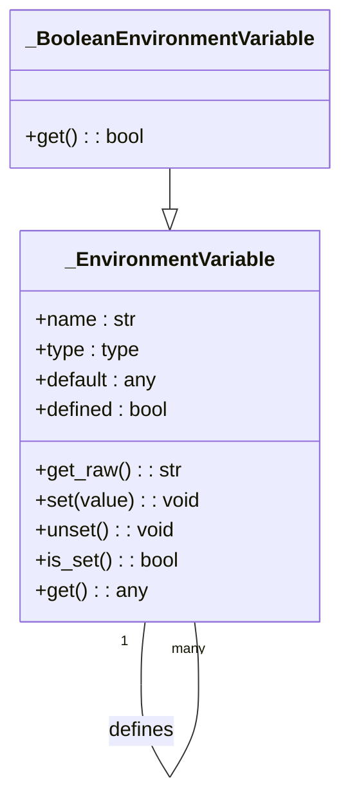
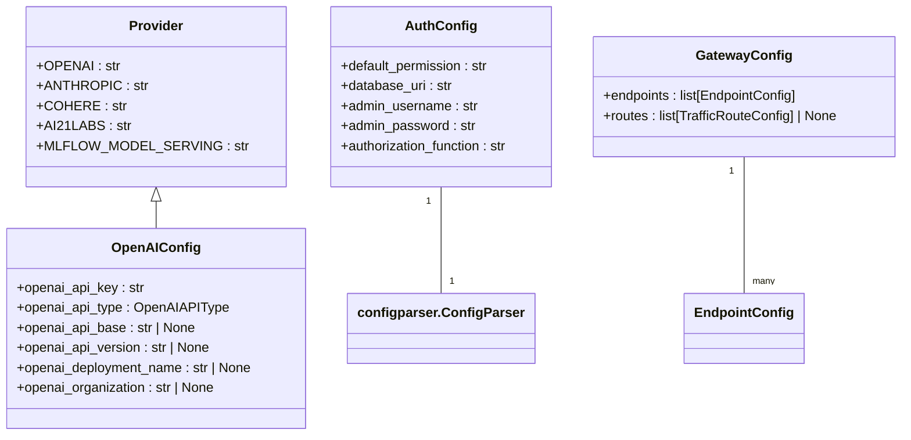
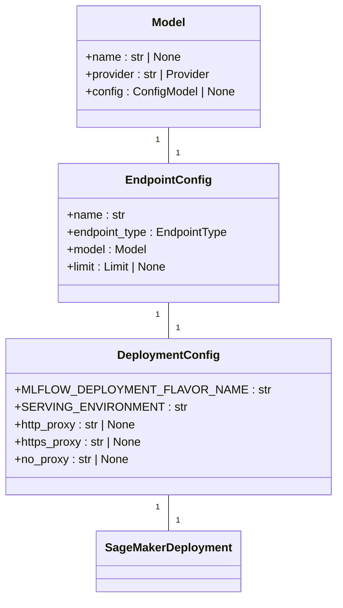
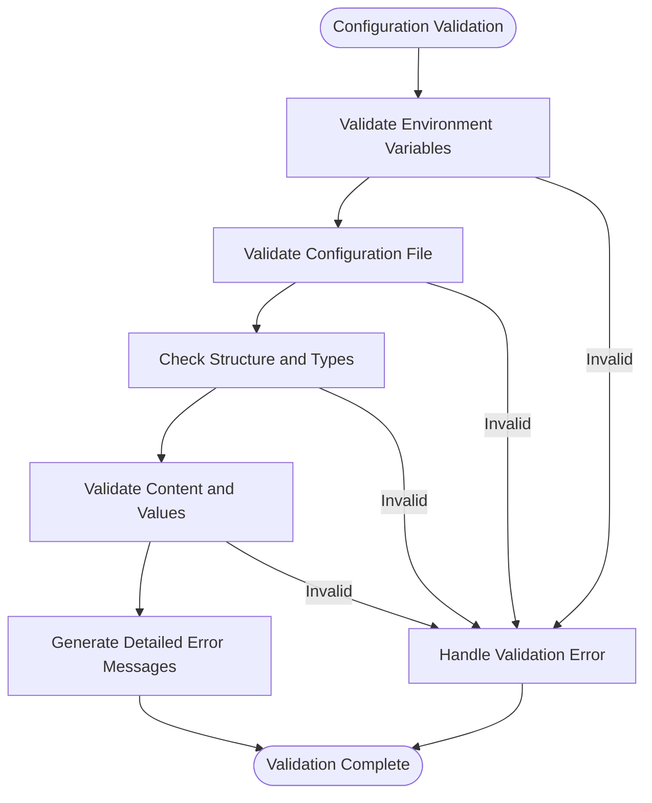

# Configuration Errors

<cite>
**Referenced Files in This Document**   
- [environment_variables.py](file://mlflow/environment_variables.py)
- [config.py](file://mlflow/config/__init__.py)
- [gateway/config.py](file://mlflow/gateway/config.py)
- [server/auth/config.py](file://mlflow/server/auth/config.py)
- [tracking/_tracking_service/utils.py](file://mlflow/tracking/_tracking_service/utils.py)
- [store/tracking/__init__.py](file://mlflow/store/tracking/__init__.py)
- [deployments/server/config.py](file://mlflow/deployments/server/config.py)
</cite>

## Table of Contents
1. [Introduction](#introduction)
2. [Core Configuration Components](#core-configuration-components)
3. [Environment Variables](#environment-variables)
4. [Server Configuration Files](#server-configuration-files)
5. [Deployment Settings](#deployment-settings)
6. [Configuration Validation and Debugging](#configuration-validation-and-debugging)
7. [Common Configuration Issues](#common-configuration-issues)
8. [Conclusion](#conclusion)

## Introduction
This document provides a comprehensive analysis of configuration errors in MLflow, focusing on the implementation details of configuration management across the system. It covers environment variables, server configuration files, and deployment settings, with concrete examples from the actual codebase. The document details the complete set of configuration options, their valid values, and default behaviors, while explaining relationships between configuration settings and components like the tracking server, model deployment system, and authentication modules.

## Core Configuration Components

MLflow's configuration system is built around several key components that work together to manage settings across different environments and deployment scenarios. The system uses a hierarchical approach with environment variables as the primary configuration mechanism, supplemented by configuration files for more complex setups. The core components include environment variable management, server configuration files, deployment settings, and authentication configuration.

The configuration system is designed to be flexible and extensible, allowing users to configure MLflow for various deployment scenarios from local development to enterprise-scale production environments. The implementation uses a combination of environment variables, configuration files, and API-based configuration methods to provide a comprehensive configuration management solution.

**Section sources**
- [environment_variables.py](file://mlflow/environment_variables.py#L1-L800)
- [config.py](file://mlflow/config/__init__.py#L1-L57)

## Environment Variables

MLflow uses a comprehensive set of environment variables to configure its behavior. These variables follow a consistent naming convention where public variables begin with `MLFLOW_` and internal-use variables start with `_MLFLOW_`. The environment variable system is implemented through the `_EnvironmentVariable` and `_BooleanEnvironmentVariable` classes in `environment_variables.py`, which provide type-safe access to configuration values.

Key environment variables include:

- **MLFLOW_TRACKING_URI**: Specifies the tracking URI for the MLflow server
- **MLFLOW_REGISTRY_URI**: Specifies the registry URI for model storage
- **MLFLOW_S3_ENDPOINT_URL**: Specifies the S3 endpoint URL for artifact storage
- **MLFLOW_TRACKING_TOKEN**: Specifies the authentication token for the tracking server
- **MLFLOW_DEPLOYMENTS_TARGET**: Specifies the deployment target for model serving
- **MLFLOW_GATEWAY_URI**: Specifies the URI for the MLflow Gateway server

The environment variable system includes validation and type conversion capabilities. For boolean variables, the system accepts values like 'true', 'false', '1', and '0' (case-insensitive). The system also provides default values for all variables and includes validation to ensure configuration integrity.

**Diagram sources**
- [environment_variables.py](file://mlflow/environment_variables.py#L13-L98)

**Section sources**
- [environment_variables.py](file://mlflow/environment_variables.py#L1-L800)

## Server Configuration Files

MLflow server configuration is managed through configuration files that define the server's behavior and integration points. The primary configuration file for the MLflow Gateway is defined in `gateway/config.py`, which uses Pydantic models to validate configuration structure and content.

The Gateway configuration supports multiple providers including OpenAI, Anthropic, Cohere, AI21Labs, and various MLflow model serving options. Each provider has specific configuration requirements that are validated at load time. For example, the OpenAI configuration requires different settings depending on whether it's using the standard OpenAI API or Azure AD authentication.

Authentication configuration is managed through the `server/auth/config.py` file, which reads configuration from an INI file or environment variables. The default configuration file is `basic_auth.ini` located in the server auth directory, but this can be overridden using the `MLFLOW_AUTH_CONFIG_PATH` environment variable.

**Diagram sources**
- [gateway/config.py](file://mlflow/gateway/config.py#L37-L543)
- [server/auth/config.py](file://mlflow/server/auth/config.py#L8-L35)

**Section sources**
- [gateway/config.py](file://mlflow/gateway/config.py#L1-L543)
- [server/auth/config.py](file://mlflow/server/auth/config.py#L1-L35)

## Deployment Settings

Deployment configuration in MLflow is managed through a combination of environment variables and deployment-specific configuration. The deployment system supports various targets including SageMaker, Databricks, and OpenAI, each with its own configuration requirements.

For SageMaker deployments, the configuration includes settings for the serving environment, proxy configuration, and custom deployment parameters. The `_get_deployment_config` function in the SageMaker module constructs the deployment configuration dictionary, incorporating environment variables for proxy settings when they are present.

Deployment targets are specified using the `MLFLOW_DEPLOYMENTS_TARGET` environment variable, which determines which deployment plugin to use. Additional configuration can be provided through the `MLFLOW_DEPLOYMENTS_CONFIG` environment variable, which points to a configuration file for the specific deployment target.

**Diagram sources**
- [sagemaker/__init__.py](file://mlflow/sagemaker/__init__.py#L1343-L1364)
- [deployments/server/config.py](file://mlflow/deployments/server/config.py#L7-L28)

**Section sources**
- [sagemaker/__init__.py](file://mlflow/sagemaker/__init__.py#L1343-L1364)
- [deployments/server/config.py](file://mlflow/deployments/server/config.py#L1-L28)

## Configuration Validation and Debugging

MLflow includes comprehensive validation mechanisms to ensure configuration correctness. The system validates configuration at multiple levels, from individual environment variables to complex configuration files. For environment variables, the system performs type conversion and validation, raising exceptions for invalid values.

Configuration file validation is implemented using Pydantic models in the gateway configuration, which provide automatic validation of structure and data types. The `_load_gateway_config` function in `gateway/config.py` validates the configuration against the defined schema and raises detailed error messages for invalid configurations.

Debugging configuration issues can be approached through several methods:
1. Checking environment variable values using `os.getenv()`
2. Validating configuration files with the `_validate_config` function
3. Examining server logs for configuration-related error messages
4. Using the MLflow CLI to test configuration settings

The system also provides default values for many configuration options, which helps prevent configuration errors in simple deployment scenarios.

**Diagram sources**
- [gateway/config.py](file://mlflow/gateway/config.py#L504-L543)
- [environment_variables.py](file://mlflow/environment_variables.py#L46-L51)

**Section sources**
- [gateway/config.py](file://mlflow/gateway/config.py#L504-L543)
- [environment_variables.py](file://mlflow/environment_variables.py#L46-L51)

## Common Configuration Issues

Several common configuration issues can occur when setting up MLflow:

1. **Incorrect tracking URI settings**: This occurs when the `MLFLOW_TRACKING_URI` environment variable is set to an invalid URL or when the tracking server is not running at the specified location.

2. **Misconfigured artifact storage backends**: Issues with S3, Azure Blob Storage, or other artifact storage backends often stem from incorrect endpoint URLs, missing credentials, or permission issues.

3. **Invalid deployment target parameters**: When deploying models to external services, incorrect configuration of deployment targets can prevent successful deployment.

4. **Malformed connection strings**: Connection strings for database backends or artifact storage must follow specific formats, and deviations can cause connection failures.

5. **Incorrect permission settings**: Authentication and authorization configuration must be properly set up, especially in multi-user environments.

6. **Incompatible backend configurations**: Some configuration options are incompatible with each other, such as using certain authentication methods with specific storage backends.

The system provides error messages and validation to help identify and resolve these issues. For example, when an invalid OpenAI API type is specified, the system raises a detailed error message explaining the valid options.

**Section sources**
- [gateway/config.py](file://mlflow/gateway/config.py#L130-L159)
- [environment_variables.py](file://mlflow/environment_variables.py#L101-L103)
- [server/auth/config.py](file://mlflow/server/auth/config.py#L22-L35)

## Conclusion

MLflow's configuration system provides a comprehensive and flexible approach to managing settings across different environments and deployment scenarios. The system uses environment variables as the primary configuration mechanism, supplemented by configuration files for more complex setups. The implementation includes robust validation and error handling to ensure configuration integrity and provide helpful error messages when issues occur.

Understanding the relationships between different configuration settings and components is crucial for successful MLflow deployment. The system's modular design allows for easy extension and customization, while maintaining consistency across different deployment targets and use cases.