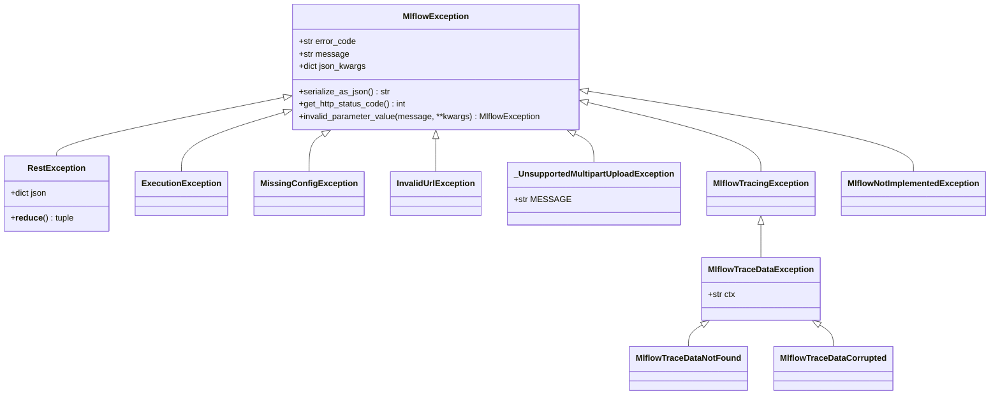
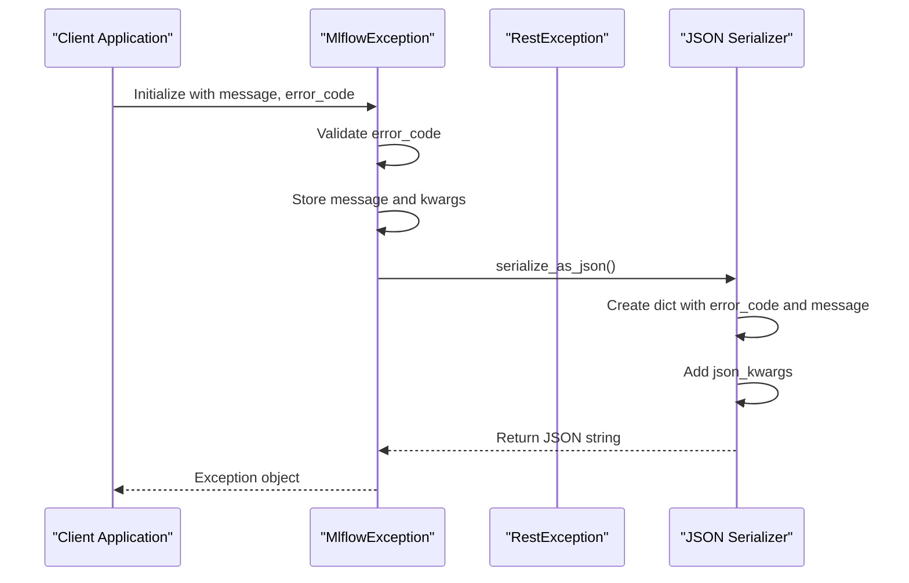
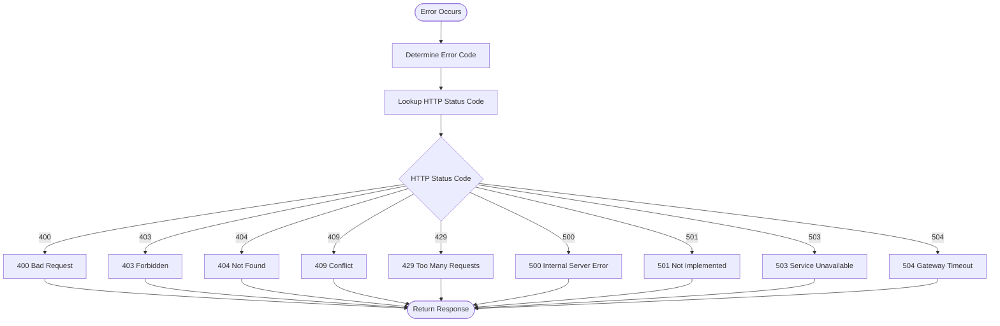
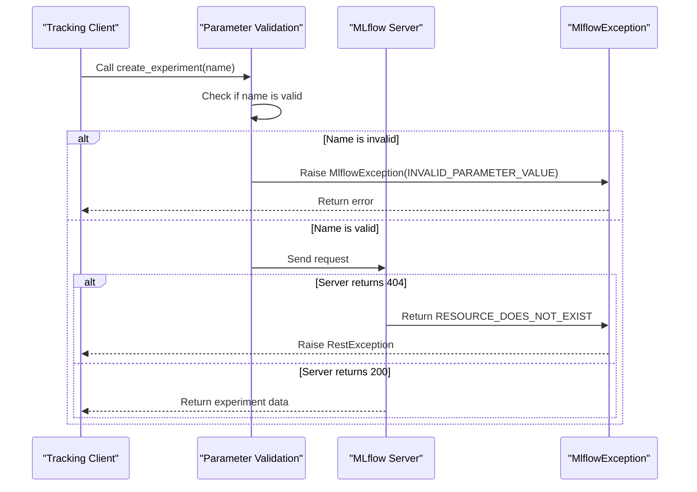
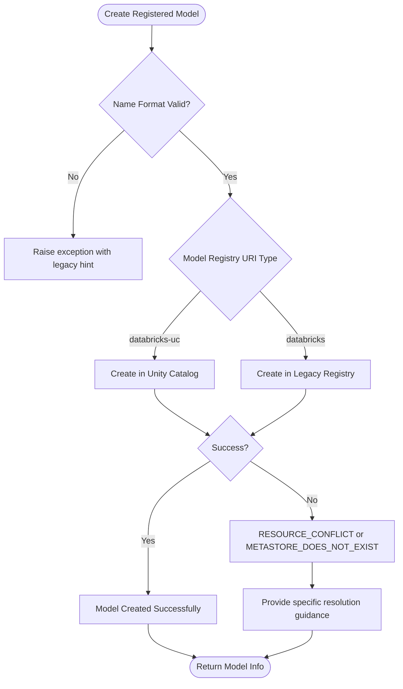
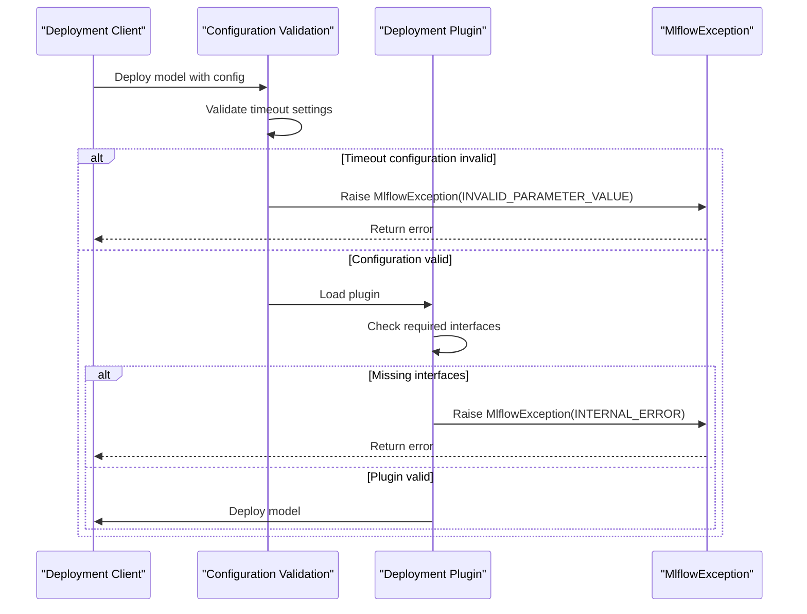
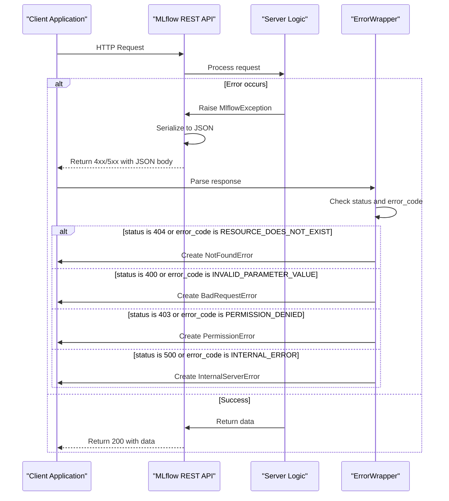
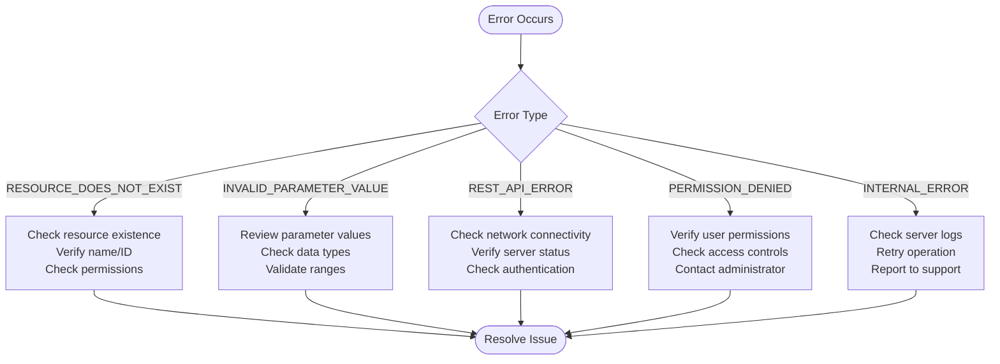
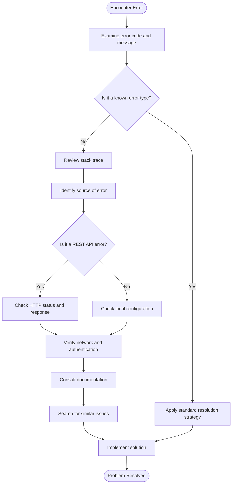

# Error Messages

<cite>
**Referenced Files in This Document**   
- [exceptions.py](file://mlflow/exceptions.py)
- [gateway/exceptions.py](file://mlflow/gateway/exceptions.py)
- [tracing/utils/exception.py](file://mlflow/tracing/utils/exception.py)
- [utils/exception_utils.py](file://mlflow/utils/exception_utils.py)
- [tracking/client.py](file://mlflow/tracking/client.py)
- [server/js/src/common/utils/ErrorWrapper.ts](file://mlflow/server/js/src/common/utils/ErrorWrapper.ts)
- [server/js/src/shared/web-shared/errors/PredefinedErrors.test.tsx](file://mlflow/server/js/src/shared/web-shared/errors/PredefinedErrors.test.tsx)
- [server/js/src/model-registry/components/ModelVersionPage.enzyme.test.tsx](file://mlflow/server/js/src/model-registry/components/ModelVersionPage.enzyme.test.tsx)
- [server/js/src/experiment-tracking/components/experiment-page/hooks/useExperimentRuns.intg.test.tsx](file://mlflow/server/js/src/experiment-tracking/components/experiment-page/hooks/useExperimentRuns.intg.test.tsx)
- [server/js/src/shared/web-shared/metrics/UserActionErrorHandler.tsx](file://mlflow/server/js/src/shared/web-shared/metrics/UserActionErrorHandler.tsx)
</cite>

## Table of Contents
1. [Introduction](#introduction)
2. [Exception Hierarchy](#exception-hierarchy)
3. [Core Exception Classes](#core-exception-classes)
4. [Error Code Mapping](#error-code-mapping)
5. [Tracking Client Errors](#tracking-client-errors)
6. [Model Registry Exceptions](#model-registry-exceptions)
7. [Deployment Failures](#deployment-failures)
8. [REST API Error Handling](#rest-api-error-handling)
9. [Common Error Scenarios](#common-error-scenarios)
10. [Debugging Guidance](#debugging-guidance)
11. [Conclusion](#conclusion)

## Introduction
MLflow implements a comprehensive error handling system designed to provide clear, actionable feedback to users while maintaining robust internal error management. The system is built around a hierarchy of exception classes that standardize error reporting across different components including tracking, model registry, and deployments. This documentation details the implementation of exception handling throughout the MLflow codebase, explaining how errors are raised, propagated, and formatted for user consumption.

The error system is designed to balance technical accuracy with user-friendliness, providing sufficient detail for debugging while avoiding information overload. Errors are consistently formatted with standardized error codes and HTTP status mappings, enabling predictable client behavior and simplifying integration with external systems.

**Section sources**
- [exceptions.py](file://mlflow/exceptions.py#L1-L220)
- [gateway/exceptions.py](file://mlflow/gateway/exceptions.py#L1-L15)

## Exception Hierarchy
MLflow's exception system is built on a hierarchical structure that allows for specialized error handling while maintaining a consistent interface. At the base of this hierarchy is the `MlflowException` class, which serves as the foundation for all MLflow-specific exceptions.

**Diagram sources**
- [exceptions.py](file://mlflow/exceptions.py#L67-L220)

**Section sources**
- [exceptions.py](file://mlflow/exceptions.py#L67-L220)

## Core Exception Classes
The MLflow exception system is centered around the `MlflowException` class, which provides a standardized interface for error reporting across the platform. This base class includes essential functionality for error serialization, HTTP status code mapping, and JSON representation.

The `MlflowException` class accepts three primary parameters: a message describing the error, an error code from the `ErrorCode` enum, and additional keyword arguments that are included in the serialized JSON representation. The class automatically maps error codes to appropriate HTTP status codes through the `ERROR_CODE_TO_HTTP_STATUS` dictionary.

Specialized exception classes extend this base functionality for specific use cases. For example, `RestException` is designed to handle non-200-level responses from the REST API, while `MlflowTracingException` is used for errors that occur within tracing logic and should not block the main execution flow.

**Diagram sources**
- [exceptions.py](file://mlflow/exceptions.py#L67-L148)

**Section sources**
- [exceptions.py](file://mlflow/exceptions.py#L67-L148)

## Error Code Mapping
MLflow implements a comprehensive mapping between error codes and HTTP status codes to ensure consistent error handling across different components and integration points. This mapping is defined in the `ERROR_CODE_TO_HTTP_STATUS` dictionary, which translates MLflow-specific error codes to standard HTTP status codes.

The system also maintains a reverse mapping in `HTTP_STATUS_TO_ERROR_CODE`, allowing for bidirectional translation between HTTP status codes and MLflow error codes. This bidirectional mapping enables seamless integration with HTTP-based clients and servers, ensuring that errors are properly interpreted regardless of the communication direction.

The error code mapping covers a wide range of scenarios, from client errors (4xx) to server errors (5xx). For example, `INVALID_PARAMETER_VALUE` and `BAD_REQUEST` both map to HTTP status code 400, while `RESOURCE_DOES_NOT_EXIST` and `NOT_FOUND` map to 404. Server-side errors like `INTERNAL_ERROR` map to 500, providing clear indication of server problems.

**Diagram sources**
- [exceptions.py](file://mlflow/exceptions.py#L29-L56)

**Section sources**
- [exceptions.py](file://mlflow/exceptions.py#L29-L56)

## Tracking Client Errors
The MLflow tracking client implements comprehensive error handling for operations related to experiments, runs, and metrics. When errors occur during tracking operations, they are raised as `MlflowException` instances with appropriate error codes that reflect the nature of the problem.

For example, when attempting to access a resource that does not exist, the tracking client raises an `MlflowException` with the `RESOURCE_DOES_NOT_EXIST` error code. This is implemented through helper functions like `_model_not_found()` which create standardized error messages for common scenarios.

The tracking client also validates parameters before making API calls, raising `INVALID_PARAMETER_VALUE` exceptions when invalid inputs are detected. This proactive validation helps prevent unnecessary network calls and provides immediate feedback to users about incorrect usage.

**Diagram sources**
- [tracking/client.py](file://mlflow/tracking/client.py#L163-L167)
- [tracking/client.py](file://mlflow/tracking/client.py#L170-L176)

**Section sources**
- [tracking/client.py](file://mlflow/tracking/client.py#L163-L176)

## Model Registry Exceptions
The model registry component of MLflow implements specialized error handling for operations related to registered models and model versions. When working with the model registry, users may encounter specific exceptions that reflect the hierarchical nature of the registry's data model.

One common scenario is attempting to create a registered model in Unity Catalog without specifying a complete three-level name (catalog.schema.model). In this case, the system raises an exception with a helpful hint suggesting alternative approaches, such as using the legacy Workspace Model Registry instead.

The model registry also handles resource conflicts, such as when attempting to create a model version that already exists. These conflicts are reported with the `RESOURCE_CONFLICT` error code, allowing clients to implement appropriate retry or resolution logic.

**Diagram sources**
- [store/_unity_catalog/registry/rest_store.py](file://mlflow/store/_unity_catalog/registry/rest_store.py#L478-L499)

**Section sources**
- [store/_unity_catalog/registry/rest_store.py](file://mlflow/store/_unity_catalog/registry/rest_store.py#L478-L499)

## Deployment Failures
Deployment operations in MLflow are subject to various failure modes that are captured through specific exception handling. The deployment system validates configuration parameters before attempting deployment, raising `INVALID_PARAMETER_VALUE` exceptions when invalid settings are detected.

For example, when configuring deployment timeouts, the system validates that the total retry timeout is not less than the single request timeout. If this validation fails, an `MlflowException` with `INVALID_PARAMETER_VALUE` is raised, preventing potentially problematic deployment configurations.

Plugin-based deployments also have specialized error handling to ensure that deployment plugins implement the required interfaces. If a plugin is missing required interfaces or has multiple deployment classes, an `MlflowException` with `INTERNAL_ERROR` is raised, helping users identify and resolve plugin compatibility issues.

**Diagram sources**
- [utils/rest_utils.py](file://mlflow/utils/rest_utils.py#L371-L384)
- [deployments/plugin_manager.py](file://mlflow/deployments/plugin_manager.py#L110-L143)

**Section sources**
- [utils/rest_utils.py](file://mlflow/utils/rest_utils.py#L371-L384)
- [deployments/plugin_manager.py](file://mlflow/deployments/plugin_manager.py#L110-L143)

## REST API Error Handling
MLflow's REST API implements a robust error handling system that translates internal exceptions into standardized JSON responses. When an error occurs on the server side, it is serialized into a JSON format that includes both an error code and a descriptive message.

The `RestException` class plays a crucial role in this process, handling non-200-level responses from the REST API. This exception class can parse JSON responses containing error information and reconstruct the appropriate exception on the client side, preserving the original error context.

On the client side, JavaScript components use the `ErrorWrapper` class to translate API error responses into specific error instances that can be easily handled by the UI. This translation process maps HTTP status codes and error codes to predefined error classes like `NotFoundError`, `BadRequestError`, and `PermissionError`, enabling consistent error handling across the application.

**Diagram sources**
- [exceptions.py](file://mlflow/exceptions.py#L116-L148)
- [server/js/src/common/utils/ErrorWrapper.ts](file://mlflow/server/js/src/common/utils/ErrorWrapper.ts#L71-L94)

**Section sources**
- [exceptions.py](file://mlflow/exceptions.py#L116-L148)
- [server/js/src/common/utils/ErrorWrapper.ts](file://mlflow/server/js/src/common/utils/ErrorWrapper.ts#L71-L94)

## Common Error Scenarios
MLflow users commonly encounter several specific error scenarios that have standardized error codes and resolution strategies. Understanding these common errors helps users quickly diagnose and resolve issues in their MLflow workflows.

### RESOURCE_DOES_NOT_EXIST
This error occurs when attempting to access a resource that does not exist, such as a non-existent experiment, run, or registered model. The error typically has an HTTP status code of 404 and suggests verifying the resource name or ID and checking if the resource was deleted.

### INVALID_PARAMETER_VALUE
This error indicates that one or more parameters passed to an MLflow function have invalid values. Common causes include invalid metric or parameter names, out-of-range values, or incorrect data types. The error has an HTTP status code of 400 and suggests reviewing the function's parameter requirements.

### REST_API_ERROR
This generic error covers various HTTP communication issues between the MLflow client and server. It may indicate network connectivity problems, server unavailability, or authentication issues. The specific cause can often be determined from the accompanying error message and HTTP status code.

**Diagram sources**
- [exceptions.py](file://mlflow/exceptions.py#L22-L23)
- [exceptions.py](file://mlflow/exceptions.py#L14-L15)
- [server/js/src/common/utils/ErrorWrapper.ts](file://mlflow/server/js/src/common/utils/ErrorWrapper.ts#L71-L94)

**Section sources**
- [exceptions.py](file://mlflow/exceptions.py#L14-L23)
- [server/js/src/common/utils/ErrorWrapper.ts](file://mlflow/server/js/src/common/utils/ErrorWrapper.ts#L71-L94)

## Debugging Guidance
Effective debugging of MLflow errors requires understanding how to interpret stack traces and logs to identify the root cause of issues. The system provides several tools and patterns to assist with debugging.

The `get_stacktrace()` function in `exception_utils.py` helps capture detailed error information by combining the error message with the full traceback. This comprehensive error report can be invaluable for diagnosing complex issues.

When encountering errors, users should first examine the error code and message to understand the general nature of the problem. Then, they should review the stack trace to identify the specific function call that triggered the error. For REST API errors, examining the HTTP status code and response body can provide additional context.

For tracing-related errors, the `raise_as_trace_exception` decorator ensures that any exceptions raised within tracing logic are converted to `MlflowTracingException`, making it easier to distinguish between tracing errors and other types of failures.

**Diagram sources**
- [utils/exception_utils.py](file://mlflow/utils/exception_utils.py#L4-L10)
- [tracing/utils/exception.py](file://mlflow/tracing/utils/exception.py#L6-L21)

**Section sources**
- [utils/exception_utils.py](file://mlflow/utils/exception_utils.py#L4-L10)
- [tracing/utils/exception.py](file://mlflow/tracing/utils/exception.py#L6-L21)

## Conclusion
MLflow's error handling system provides a comprehensive framework for managing exceptions across its various components. By standardizing error codes, HTTP status mappings, and exception hierarchies, MLflow ensures consistent and predictable error reporting that facilitates both user troubleshooting and system integration.

The system balances technical precision with user-friendliness, providing detailed error information while maintaining clear, actionable messages. Through specialized exception classes for different components like tracking, model registry, and deployments, MLflow can provide context-specific error handling that addresses the unique requirements of each subsystem.

Understanding the error handling patterns in MLflow enables users to more effectively diagnose and resolve issues, reducing downtime and improving productivity. The combination of standardized error codes, comprehensive documentation, and robust debugging tools makes MLflow's error system a key component of its overall reliability and usability.