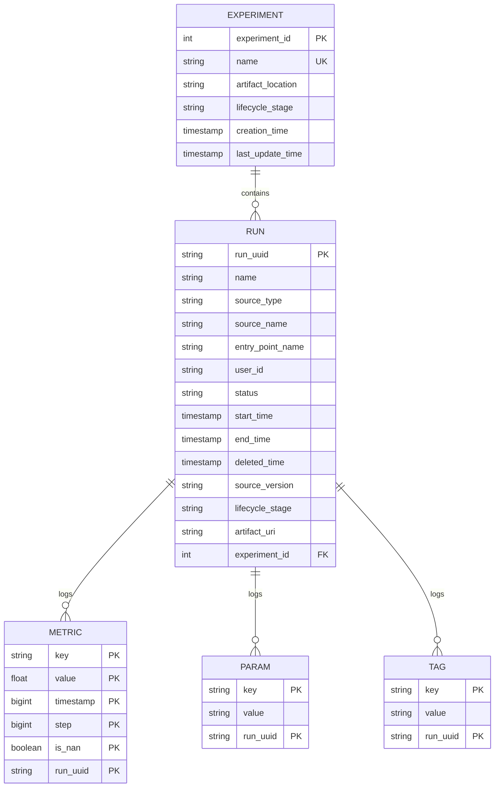
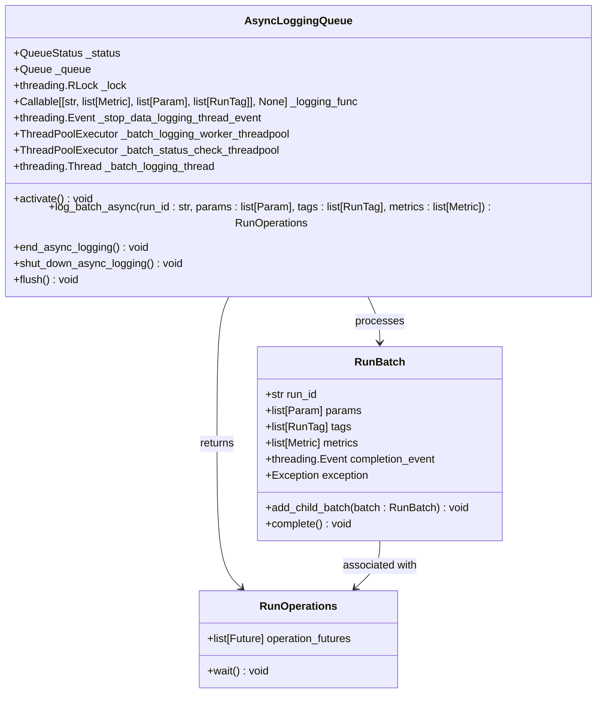
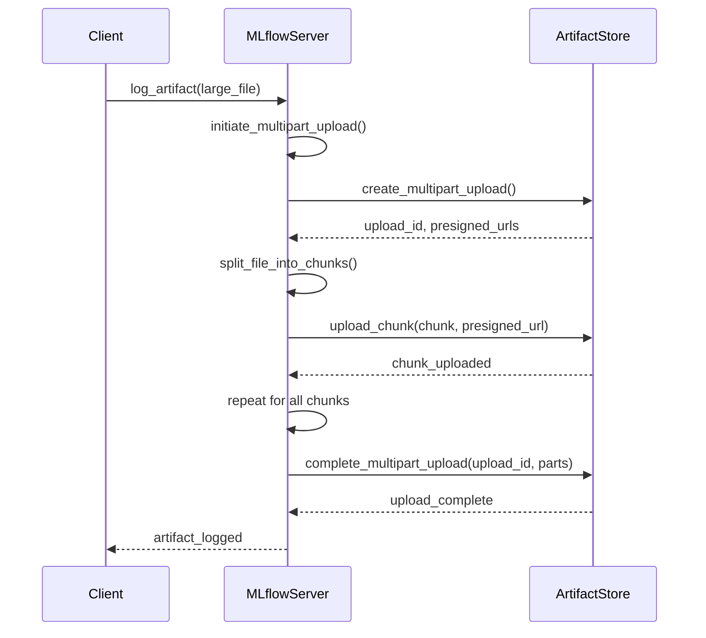

# Performance Problems

<cite>
**Referenced Files in This Document**   
- [sqlalchemy_store.py](file://mlflow/store/tracking/sqlalchemy_store.py)
- [async_logging_queue.py](file://mlflow/utils/async_logging/async_logging_queue.py)
- [artifact_repo.py](file://mlflow/store/artifact/artifact_repo.py)
- [environment_variables.py](file://mlflow/environment_variables.py)
- [models.py](file://mlflow/store/tracking/dbmodels/models.py)
- [db/utils.py](file://mlflow/store/db/utils.py)
</cite>

## Table of Contents
1. [Introduction](#introduction)
2. [Performance Bottlenecks in MLflow](#performance-bottlenecks-in-mlflow)
3. [Database Performance and Indexing](#database-performance-and-indexing)
4. [Asynchronous Logging Implementation](#asynchronous-logging-implementation)
5. [Artifact Storage and Upload Optimization](#artifact-storage-and-upload-optimization)
6. [Configuration Options for Performance Tuning](#configuration-options-for-performance-tuning)
7. [Component Relationships and Performance Characteristics](#component-relationships-and-performance-characteristics)
8. [Common Performance Issues and Optimization Strategies](#common-performance-issues-and-optimization-strategies)
9. [Conclusion](#conclusion)

## Introduction
MLflow is a comprehensive platform for managing the machine learning lifecycle, including tracking experiments, packaging code into reproducible runs, and sharing and deploying models. However, as the scale of machine learning operations grows, performance issues can arise, particularly in tracking large volumes of metrics, logging artifacts at scale, and querying large experiment datasets. This document provides a detailed analysis of these performance problems, focusing on implementation details, configuration options, and optimization strategies.

## Performance Bottlenecks in MLflow
MLflow's performance bottlenecks primarily stem from three areas: tracking large volumes of metrics, logging artifacts at scale, and querying large experiment datasets. These bottlenecks are exacerbated by the underlying database operations, asynchronous logging mechanisms, and artifact storage strategies.

### Tracking Large Volumes of Metrics
Tracking large volumes of metrics involves frequent database operations, which can lead to performance degradation. The SQLAlchemy backend store, which is used for tracking experiments and runs, relies on database transactions to log metrics. Each metric logging operation involves inserting a record into the `metrics` table, which can become a bottleneck when dealing with high-frequency metric updates.

### Logging Artifacts at Scale
Logging artifacts at scale involves uploading large files to remote storage systems, which can be time-consuming and resource-intensive. MLflow supports various artifact repositories, including local file systems, Amazon S3, and Google Cloud Storage. The performance of artifact logging is influenced by the network bandwidth, storage system performance, and the efficiency of the upload process.

### Querying Large Experiment Datasets
Querying large experiment datasets involves retrieving and processing large amounts of data from the database. The performance of queries is affected by the database schema, indexing strategies, and the complexity of the queries. Inefficient queries can lead to slow response times and high resource utilization.

## Database Performance and Indexing
The performance of MLflow's database operations is critical to its overall performance. The SQLAlchemy backend store uses a relational database to store experiment and run metadata, metrics, parameters, and tags. The choice of database, indexing strategies, and connection pooling configuration can significantly impact performance.

### Database Schema and Indexing
The database schema in MLflow is designed to support efficient querying and indexing. The `metrics` table, for example, has a composite primary key consisting of `key`, `timestamp`, `step`, `run_uuid`, `value`, and `is_nan`. This design allows for efficient retrieval of metrics based on these attributes. Additionally, indexes are created on frequently queried columns, such as `run_uuid`, to improve query performance.

**Diagram sources**
- [models.py](file://mlflow/store/tracking/dbmodels/models.py#L98-L404)

### Connection Pooling Configuration
Connection pooling is a technique used to reuse database connections, reducing the overhead of establishing new connections. MLflow allows configuring connection pooling through environment variables such as `MLFLOW_SQLALCHEMYSTORE_POOL_SIZE`, `MLFLOW_SQLALCHEMYSTORE_MAX_OVERFLOW`, and `MLFLOW_SQLALCHEMYSTORE_POOL_RECYCLE`. Proper configuration of these parameters can improve database performance by reducing connection latency and resource utilization.

**Section sources**
- [db/utils.py](file://mlflow/store/db/utils.py#L332-L404)
- [environment_variables.py](file://mlflow/environment_variables.py#L229-L247)

## Asynchronous Logging Implementation
Asynchronous logging is a key feature in MLflow that helps mitigate performance bottlenecks by decoupling the logging process from the main execution flow. This allows for non-blocking logging of metrics, parameters, and tags, improving the overall responsiveness of the system.

### Async Logging Queue
The `AsyncLoggingQueue` class in MLflow implements an asynchronous logging mechanism using a queue-based approach. It uses a thread pool to process logging operations in the background, ensuring that the main execution thread is not blocked by database operations.

**Diagram sources**
- [async_logging_queue.py](file://mlflow/utils/async_logging/async_logging_queue.py#L47-L367)

### Batch Logging
Batch logging is another optimization technique used in MLflow to reduce the number of database transactions. Instead of logging each metric, parameter, or tag individually, MLflow batches these operations and logs them in a single transaction. This reduces the overhead of database operations and improves performance.

**Section sources**
- [async_logging_queue.py](file://mlflow/utils/async_logging/async_logging_queue.py#L135-L172)
- [sqlalchemy_store.py](file://mlflow/store/tracking/sqlalchemy_store.py#L193-L199)

## Artifact Storage and Upload Optimization
Efficient artifact storage and upload are critical for MLflow's performance, especially when dealing with large models and datasets. MLflow supports various artifact repositories and provides mechanisms for optimizing the upload process.

### Multipart Upload
Multipart upload is a technique used to upload large files in smaller chunks, improving the reliability and efficiency of the upload process. MLflow enables multipart upload for large files, allowing for parallel uploads and resumable transfers in case of network failures.

**Diagram sources**
- [artifact_repo.py](file://mlflow/store/artifact/artifact_repo.py#L417-L470)
- [databricks_artifact_repo.py](file://mlflow/store/artifact/databricks_artifact_repo.py#L341-L366)

### Artifact Repository Configuration
MLflow allows configuring the artifact repository through the `artifact_uri` parameter. The choice of artifact repository can significantly impact performance. For example, using a cloud storage system like Amazon S3 or Google Cloud Storage can provide better scalability and reliability compared to a local file system.

**Section sources**
- [artifact_repo.py](file://mlflow/store/artifact/artifact_repo.py#L81-L117)
- [environment_variables.py](file://mlflow/environment_variables.py#L537-L557)

## Configuration Options for Performance Tuning
MLflow provides several configuration options for performance tuning, allowing users to optimize the system based on their specific requirements and constraints.

### Batch Logging Parameters
Batch logging parameters control the size and frequency of batch logging operations. The `MLFLOW_ASYNC_LOGGING_BUFFERING_SECONDS` environment variable specifies the time interval for buffering log data before it is flushed to the database. Adjusting this parameter can help balance the trade-off between logging latency and database load.

**Section sources**
- [environment_variables.py](file://mlflow/environment_variables.py#L774-L778)
- [async_logging_queue.py](file://mlflow/utils/async_logging/async_logging_queue.py#L186-L193)

### Database Connection Pooling
Database connection pooling can be configured using environment variables such as `MLFLOW_SQLALCHEMYSTORE_POOL_SIZE`, `MLFLOW_SQLALCHEMYSTORE_MAX_OVERFLOW`, and `MLFLOW_SQLALCHEMYSTORE_POOL_RECYCLE`. These parameters control the size of the connection pool, the maximum number of overflow connections, and the connection recycle time, respectively.

**Section sources**
- [environment_variables.py](file://mlflow/environment_variables.py#L229-L247)
- [db/utils.py](file://mlflow/store/db/utils.py#L332-L369)

### Artifact Storage Settings
Artifact storage settings can be configured to optimize the performance of artifact logging and retrieval. The `MLFLOW_MULTIPART_UPLOAD_MINIMUM_FILE_SIZE` and `MLFLOW_MULTIPART_UPLOAD_CHUNK_SIZE` environment variables control the minimum file size for multipart uploads and the size of each upload chunk, respectively.

**Section sources**
- [environment_variables.py](file://mlflow/environment_variables.py#L537-L557)
- [artifact_repo.py](file://mlflow/store/artifact/artifact_repo.py#L417-L470)

## Component Relationships and Performance Characteristics
Understanding the relationships between MLflow's components and their performance characteristics is essential for optimizing the system. The SQLAlchemy backend store, async logging queue, and artifact repository are key components that interact to provide the tracking and logging functionality.

### SQLAlchemy Backend Store
The SQLAlchemy backend store is responsible for storing experiment and run metadata, metrics, parameters, and tags in a relational database. It uses SQLAlchemy to interact with the database, providing a high-level API for database operations. The performance of the backend store is influenced by the database schema, indexing strategies, and connection pooling configuration.

**Section sources**
- [sqlalchemy_store.py](file://mlflow/store/tracking/sqlalchemy_store.py#L211-L233)
- [models.py](file://mlflow/store/tracking/dbmodels/models.py#L98-L404)

### Async Logging Queue
The async logging queue is responsible for processing logging operations in the background, ensuring that the main execution thread is not blocked by database operations. It uses a thread pool to process logging operations, allowing for parallel execution and improved performance.

**Section sources**
- [async_logging_queue.py](file://mlflow/utils/async_logging/async_logging_queue.py#L47-L367)
- [sqlalchemy_store.py](file://mlflow/store/tracking/sqlalchemy_store.py#L193-L199)

### Artifact Repository
The artifact repository is responsible for storing and retrieving artifacts, such as models and datasets. It supports various storage systems, including local file systems, Amazon S3, and Google Cloud Storage. The performance of the artifact repository is influenced by the choice of storage system, network bandwidth, and upload optimization techniques.

**Section sources**
- [artifact_repo.py](file://mlflow/store/artifact/artifact_repo.py#L73-L117)
- [databricks_artifact_repo.py](file://mlflow/store/artifact/databricks_artifact_repo.py#L341-L366)

## Common Performance Issues and Optimization Strategies
Common performance issues in MLflow include slow query responses, high memory usage during model logging, and latency in trace visualization. These issues can be addressed through various optimization strategies, such as proper indexing, connection pooling configuration, and efficient artifact organization.

### Slow Query Responses
Slow query responses can be caused by inefficient queries, lack of proper indexing, or high database load. To optimize query performance, ensure that frequently queried columns are indexed, and use efficient query patterns. Additionally, consider using connection pooling to reduce the overhead of database connections.

**Section sources**
- [sqlalchemy_store.py](file://mlflow/store/tracking/sqlalchemy_store.py#L403-L445)
- [models.py](file://mlflow/store/tracking/dbmodels/models.py#L98-L404)

### High Memory Usage During Model Logging
High memory usage during model logging can be caused by large model files or inefficient serialization. To reduce memory usage, consider using model compression techniques, such as quantization or pruning. Additionally, ensure that the artifact repository is configured to handle large files efficiently.

**Section sources**
- [artifact_repo.py](file://mlflow/store/artifact/artifact_repo.py#L128-L138)
- [pyfunc/model.py](file://mlflow/pyfunc/model.py#L100-L150)

### Latency in Trace Visualization
Latency in trace visualization can be caused by slow data retrieval or inefficient data processing. To reduce latency, ensure that trace data is stored in a format that supports efficient retrieval and processing. Additionally, consider using asynchronous logging to decouple the logging process from the main execution flow.

**Section sources**
- [tracing/trace_data.py](file://mlflow/tracing/trace_data.py#L1-L50)
- [server/js/src/experiment-tracking/components/trace/TraceVisualization.tsx](file://mlflow/server/js/src/experiment-tracking/components/trace/TraceVisualization.tsx#L1-L100)

## Conclusion
Performance problems in MLflow can significantly impact the efficiency and scalability of machine learning operations. By understanding the underlying causes of these issues and implementing appropriate optimization strategies, users can improve the performance of their MLflow deployments. Key areas for optimization include database performance, asynchronous logging, and artifact storage. Proper configuration of these components can help ensure that MLflow remains a reliable and efficient platform for managing the machine learning lifecycle.