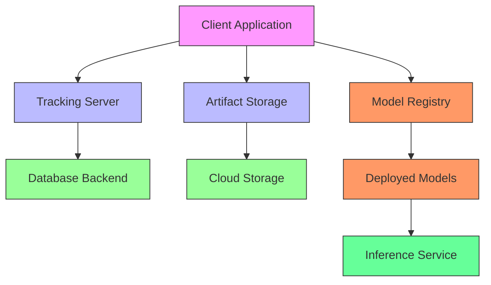
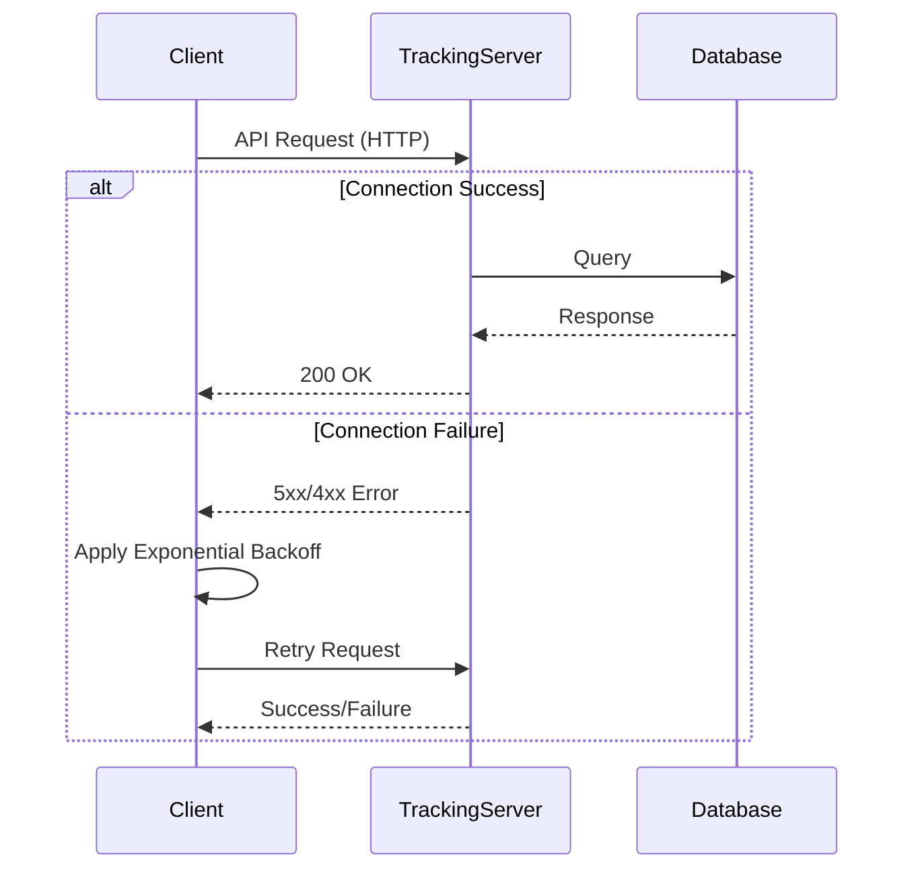
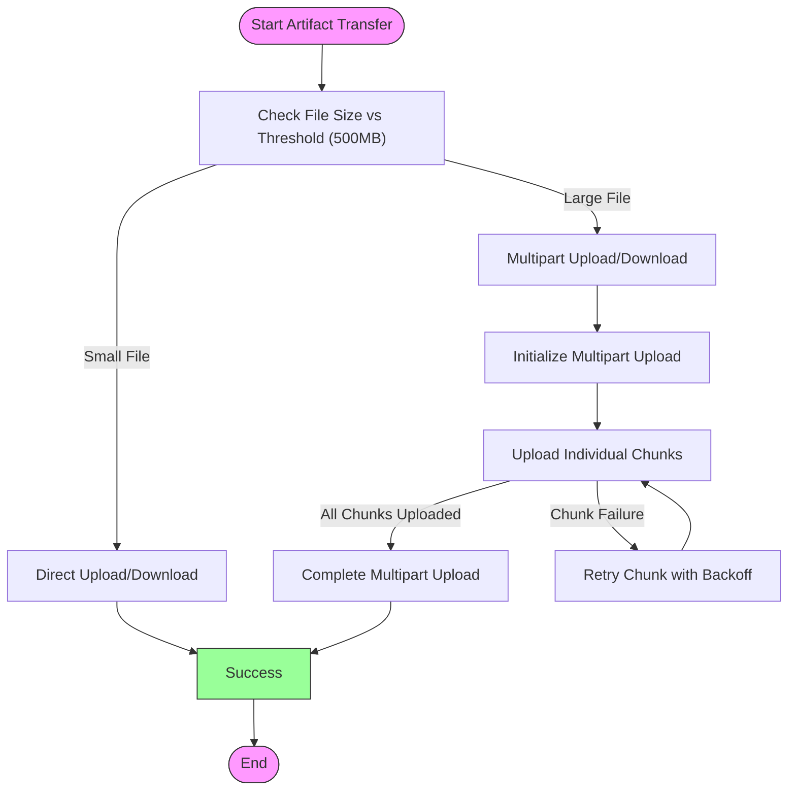
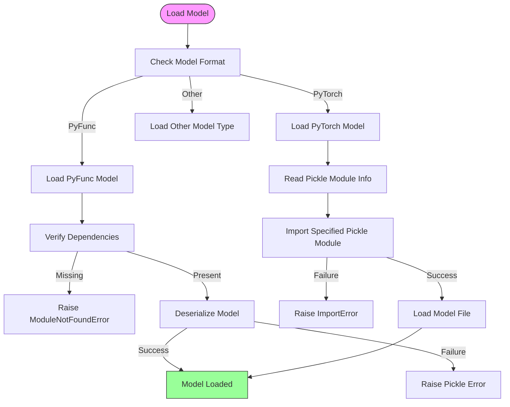
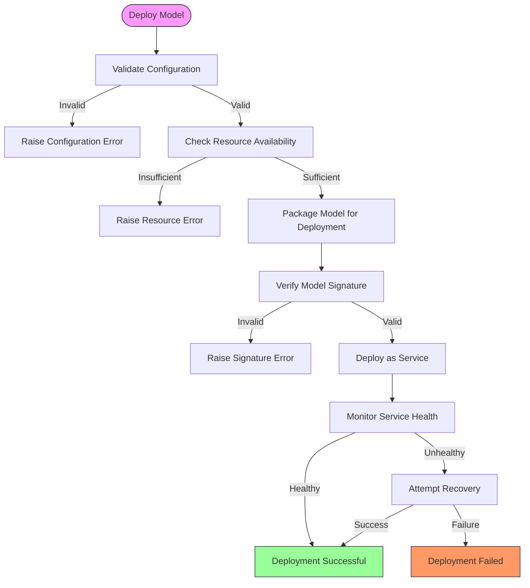
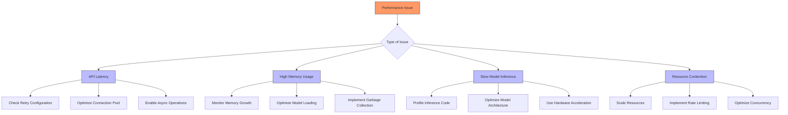
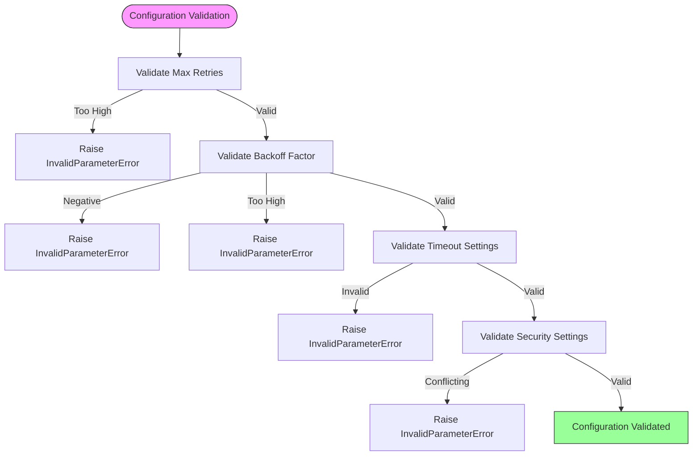
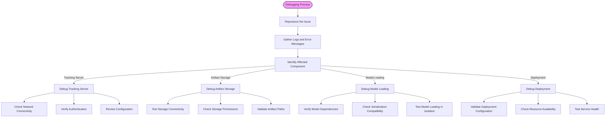

# Troubleshooting and FAQ

<cite>
**Referenced Files in This Document**   
- [mlflow/exceptions.py](file://mlflow/exceptions.py)
- [mlflow/utils/rest_utils.py](file://mlflow/utils/rest_utils.py)
- [mlflow/pyfunc/__init__.py](file://mlflow/pyfunc/__init__.py)
- [mlflow/pytorch/__init__.py](file://mlflow/pytorch/__init__.py)
- [mlflow/deployments/constants.py](file://mlflow/deployments/constants.py)
- [mlflow/environment_variables.py](file://mlflow/environment_variables.py)
- [mlflow/server/js/src/common/utils/ArtifactUtils.ts](file://mlflow/server/js/src/common/utils/ArtifactUtils.ts)
- [mlflow/server/js/src/experiment-tracking/components/ArtifactPage.enzyme.test.tsx](file://mlflow/server/js/src/experiment-tracking/components/ArtifactPage.enzyme.test.tsx)
- [mlflow/server/js/src/experiment-tracking/components/experiment-page/components/traces-v3/TracesV3PageWrapper.tsx](file://mlflow/server/js/src/experiment-tracking/components/experiment-page/components/traces-v3/TracesV3PageWrapper.tsx)
- [mlflow/telemetry/client.py](file://mlflow/telemetry/client.py)
- [mlflow/telemetry/test_client.py](file://mlflow/tests/telemetry/test_client.py)
- [mlflow/java/client/src/main/java/org/mlflow/api/proto/Assessments.java](file://mlflow/mlflow/java/client/src/main/java/org/mlflow/api/proto/Assessments.java)
- [mlflow/java/client/src/main/java/com/databricks/api/proto/databricks/Databricks.java](file://mlflow/mlflow/java/client/src/main/java/com/databricks/api/proto/databricks/Databricks.java)
- [mlflow/protos/databricks.proto](file://mlflow/mlflow/protos/databricks.proto)
- [mlflow/tracking/client.py](file://mlflow/mlflow/tracking/client.py)
- [mlflow/models/model.py](file://mlflow/mlflow/models/model.py)
- [mlflow/server/js/src/common/utils/FetchUtils.ts](file://mlflow/mlflow/server/js/src/common/utils/FetchUtils.ts)
- [mlflow/server/js/src/common/utils/FetchUtils.test.tsx](file://mlflow/mlflow/server/js/src/common/utils/FetchUtils.test.tsx)
</cite>

## Table of Contents
1. [Introduction](#introduction)
2. [Common Failure Points](#common-failure-points)
3. [Tracking Server Connectivity Issues](#tracking-server-connectivity-issues)
4. [Artifact Storage Access Problems](#artifact-storage-access-problems)
5. [Model Loading Errors](#model-loading-errors)
6. [Deployment Failures](#deployment-failures)
7. [Performance Issues](#performance-issues)
8. [Configuration Errors](#configuration-errors)
9. [Compatibility Issues](#compatibility-issues)
10. [Debugging Strategies](#debugging-strategies)
11. [FAQ](#faq)
12. [Conclusion](#conclusion)

## Introduction
This document provides comprehensive troubleshooting guidance for MLflow users, addressing common issues encountered when using the platform. The purpose is to reduce support burden and accelerate problem resolution by providing structured solutions for the most frequent failure points. The content is organized to serve both beginners seeking conceptual understanding and experienced developers requiring technical details.

The document covers the architecture of common failure points including tracking server connectivity, artifact storage access, model loading errors, and deployment failures. It includes practical examples demonstrating diagnostic procedures, log analysis, and solution implementation. Common issues are documented in a structured format, organized by component and severity, with specific error messages users might encounter.

**Section sources**
- [mlflow/exceptions.py](file://mlflow/exceptions.py#L1-L220)
- [mlflow/utils/rest_utils.py](file://mlflow/utils/rest_utils.py#L1-L724)

## Common Failure Points
MLflow's architecture consists of several interconnected components that can experience various types of failures. The primary failure points include tracking server connectivity issues, artifact storage access problems, model loading errors, and deployment failures. Each of these components has specific error patterns and diagnostic approaches.

The tracking server manages experiment and run metadata, while artifact storage handles model binaries and other large files. Model loading involves deserializing trained models for inference, and deployment failures typically occur when serving models in production environments. Understanding the architecture of these components is essential for effective troubleshooting.

**Diagram sources**
- [mlflow/tracking/client.py](file://mlflow/mlflow/tracking/client.py#L212-L280)
- [mlflow/models/model.py](file://mlflow/mlflow/models/model.py#L391-L774)

**Section sources**
- [mlflow/exceptions.py](file://mlflow/exceptions.py#L1-L220)
- [mlflow/utils/rest_utils.py](file://mlflow/utils/rest_utils.py#L1-L724)

## Tracking Server Connectivity Issues
Tracking server connectivity issues are among the most common problems encountered by MLflow users. These issues typically manifest as connection timeouts, authentication failures, or network connectivity problems. The MLflow client uses exponential backoff with jitter for retrying failed requests, with default settings of 7 maximum retries and a backoff factor of 2 seconds.

Common error codes for tracking server issues include 429 (Too Many Requests), 500 (Internal Server Error), 503 (Service Unavailable), and 401 (Unauthorized). The `RestException` class in `mlflow/exceptions.py` handles non-200 level responses from the REST API, providing detailed error information including error codes and messages.

**Diagram sources**
- [mlflow/utils/rest_utils.py](file://mlflow/utils/rest_utils.py#L60-L260)
- [mlflow/exceptions.py](file://mlflow/exceptions.py#L116-L143)

**Section sources**
- [mlflow/utils/rest_utils.py](file://mlflow/utils/rest_utils.py#L60-L260)
- [mlflow/exceptions.py](file://mlflow/exceptions.py#L116-L143)

## Artifact Storage Access Problems
Artifact storage access problems occur when MLflow cannot read from or write to artifact repositories. These issues can stem from permission problems, network connectivity issues, or configuration errors. The system uses multipart upload for large files (default threshold: 500MB) and supports various storage backends including S3, GCS, Azure Blob Storage, and DBFS.

Common error patterns include:
- `MlflowException` with error code `RESOURCE_DOES_NOT_EXIST` when artifacts are not found
- Permission denied errors when accessing cloud storage
- Timeout errors during large file transfers
- Chunk download failures in multipart operations

The artifact system implements retry logic with configurable parameters such as `MLFLOW_HTTP_REQUEST_MAX_RETRIES` (default: 7) and `MLFLOW_HTTP_REQUEST_BACKOFF_FACTOR` (default: 2). For Databricks environments, the system may use DBFS FUSE mount or UC Volume FUSE mount for artifact access.

**Diagram sources**
- [mlflow/server/js/src/common/utils/ArtifactUtils.ts](file://mlflow/server/js/src/common/utils/ArtifactUtils.ts#L70-L114)
- [mlflow/environment_variables.py](file://mlflow/environment_variables.py#L350-L557)

**Section sources**
- [mlflow/server/js/src/common/utils/ArtifactUtils.ts](file://mlflow/server/js/src/common/utils/ArtifactUtils.ts#L70-L114)
- [mlflow/environment_variables.py](file://mlflow/environment_variables.py#L350-L557)

## Model Loading Errors
Model loading errors occur when MLflow cannot deserialize or instantiate saved models. These issues are typically related to dependency mismatches, pickle module incompatibilities, or corrupted model files. The `pyfunc` model flavor is particularly susceptible to these issues as it relies on Python's pickle serialization.

Common error scenarios include:
- `ModuleNotFoundError` when required dependencies are not installed
- Pickle module incompatibilities between save and load environments
- Feature Store model loading issues with specific error messages
- Corrupted model files or incomplete downloads

The system handles these errors through specific exception types like `MlflowException` with appropriate error codes. For PyTorch models, the system stores the pickle module name used for serialization and attempts to import the same module during loading, raising a descriptive error if the module cannot be imported.

**Diagram sources**
- [mlflow/pyfunc/__init__.py](file://mlflow/pyfunc/__init__.py#L1166-L1192)
- [mlflow/pytorch/__init__.py](file://mlflow/pytorch/__init__.py#L546-L573)

**Section sources**
- [mlflow/pyfunc/__init__.py](file://mlflow/pyfunc/__init__.py#L1166-L1192)
- [mlflow/pytorch/__init__.py](file://mlflow/pytorch/__init__.py#L546-L573)

## Deployment Failures
Deployment failures occur when MLflow models cannot be served in production environments. These issues are often related to configuration errors, resource constraints, or compatibility problems between the model and deployment environment. The deployment system implements specific retry logic for different types of errors.

The `MLFLOW_DEPLOYMENT_CLIENT_REQUEST_RETRY_CODES` constant defines which error codes should trigger retries: 429 (Too Many Requests), 500 (Server Error), 502 (Bad Gateway), and 503 (Service Unavailable). Notably, timeouts are excluded from retryable conditions as they often indicate underlying issues with the model or query parameters.

Common deployment issues include:
- Configuration mismatches between development and production environments
- Resource exhaustion (memory, CPU, GPU)
- Model signature incompatibilities
- Missing dependencies in the deployment environment

**Diagram sources**
- [mlflow/deployments/constants.py](file://mlflow/deployments/constants.py#L1-L13)
- [mlflow/environment_variables.py](file://mlflow/environment_variables.py#L565-L586)

**Section sources**
- [mlflow/deployments/constants.py](file://mlflow/deployments/constants.py#L1-L13)
- [mlflow/environment_variables.py](file://mlflow/environment_variables.py#L565-L586)

## Performance Issues
Performance issues in MLflow can manifest as slow API responses, high memory usage, or inefficient model serving. These problems often stem from suboptimal configuration, resource constraints, or inefficient code patterns. The system provides several configuration options to address performance bottlenecks.

Key performance-related environment variables include:
- `MLFLOW_HTTP_REQUEST_MAX_RETRIES`: Controls the maximum number of retries for HTTP requests
- `MLFLOW_HTTP_REQUEST_BACKOFF_FACTOR`: Sets the backoff increase factor between failures
- `MLFLOW_SCORING_SERVER_REQUEST_TIMEOUT`: Specifies the request timeout for the scoring server
- `MLFLOW_ENABLE_ASYNC_LOGGING`: Enables asynchronous logging to improve performance

For large-scale deployments, consider adjusting the connection pool settings (`MLFLOW_HTTP_POOL_CONNECTIONS` and `MLFLOW_HTTP_POOL_MAXSIZE`) to handle higher concurrency. The system also supports asynchronous logging with configurable thread pool size via `MLFLOW_ASYNC_LOGGING_THREADPOOL_SIZE`.

**Section sources**
- [mlflow/environment_variables.py](file://mlflow/environment_variables.py#L116-L169)
- [mlflow/environment_variables.py](file://mlflow/environment_variables.py#L592-L598)

## Configuration Errors
Configuration errors are a common source of issues in MLflow deployments. These errors typically occur when environment variables are set incorrectly, configuration files are malformed, or there are mismatches between different configuration sources. The system validates configuration parameters and raises descriptive errors when invalid values are detected.

Common configuration pitfalls include:
- Setting `MLFLOW_HTTP_REQUEST_MAX_RETRIES` beyond the limit of 10
- Using negative values for backoff factors or timeouts
- Mismatched tracking and registry URIs
- Incorrect authentication credentials

The system implements validation for critical parameters, such as checking that `backoff_factor` is non-negative and within allowable limits. For Databricks environments, the system validates that only one of `ignore_tls_verification` or `server_cert_path` is set, preventing conflicting security configurations.

**Section sources**
- [mlflow/utils/rest_utils.py](file://mlflow/utils/rest_utils.py#L338-L383)
- [mlflow/environment_variables.py](file://mlflow/environment_variables.py#L161-L169)

## Compatibility Issues
Compatibility issues arise when there are version mismatches between different components of the MLflow ecosystem. These include Python version incompatibilities, library version conflicts, and differences between MLflow versions used for saving versus loading models.

Key compatibility considerations:
- The `mlflow_version` field in the MLmodel file tracks which MLflow version was used to save the model
- Pickle module compatibility between save and load environments
- Python version compatibility for serialized models
- Dependency version conflicts in conda or pip environments

The system attempts to handle some compatibility issues automatically, such as importing the same pickle module used during model serialization. However, significant version mismatches may require manual intervention, such as recreating environments or updating dependencies.

**Section sources**
- [mlflow/models/model.py](file://mlflow/mlflow/models/model.py#L86-L87)
- [mlflow/pytorch/__init__.py](file://mlflow/pytorch/__init__.py#L561-L570)

## Debugging Strategies
Effective debugging of MLflow issues requires a systematic approach combining log analysis, configuration review, and targeted testing. The following strategies can help identify and resolve common problems:

1. **Log Analysis**: Examine MLflow client and server logs for error messages, stack traces, and warning messages. Enable debug logging to capture detailed information about API requests and responses.

2. **Configuration Audit**: Verify all environment variables and configuration files for correctness. Check for conflicting settings and ensure values are within acceptable ranges.

3. **Network Diagnostics**: Use tools like curl or Postman to test connectivity to the tracking server and artifact storage endpoints independently of MLflow.

4. **Incremental Testing**: Test components in isolation (e.g., model loading, artifact upload) before integrating them into the full workflow.

5. **Version Verification**: Confirm compatibility between MLflow versions, Python versions, and library dependencies.

The system provides several debugging aids, including detailed error messages with stack traces (truncated to 1000 characters), comprehensive exception handling, and configurable retry behavior. For complex issues, consider enabling verbose logging and examining the sequence of API calls.

**Section sources**
- [mlflow/exceptions.py](file://mlflow/exceptions.py#L1294-L1984)
- [mlflow/server/js/src/experiment-tracking/components/experiment-page/components/traces-v3/TracesV3PageWrapper.tsx](file://mlflow/server/js/src/experiment-tracking/components/experiment-page/components/traces-v3/TracesV3PageWrapper.tsx#L1-L6)

## FAQ
**Q: What should I do when I receive a "RESOURCE_DOES_NOT_EXIST" error?**
A: This error typically indicates that the requested resource (experiment, run, model, or artifact) cannot be found. Verify the resource ID or path is correct, check your tracking URI configuration, and ensure you have appropriate permissions to access the resource.

**Q: How can I resolve timeout issues when connecting to the tracking server?**
A: Increase the timeout value using the `MLFLOW_HTTP_REQUEST_TIMEOUT` environment variable (default: 120 seconds). Also verify network connectivity and check if the server is under heavy load. For Databricks environments, ensure the Databricks SDK is properly configured.

**Q: Why am I getting a ModuleNotFoundError when loading a PyFunc model?**
A: This occurs when dependencies required by the model are not installed in the current environment. Ensure all packages listed in the model's conda.yaml or requirements.txt are installed. You can also check the model's dependencies by examining the MLmodel file.

**Q: What causes "Pickle module" import errors when loading PyTorch models?**
A: MLflow stores the name of the pickle module used during model serialization. If this module is not available during loading, an ImportError occurs. Ensure the same Python environment and package versions are used for both saving and loading the model.

**Q: How do I troubleshoot slow model inference performance?**
A: First, profile the inference code to identify bottlenecks. Check if hardware acceleration (GPU) is being utilized. Consider optimizing the model architecture or using model quantization. Adjust the `MLFLOW_SCORING_SERVER_REQUEST_TIMEOUT` if needed for long-running predictions.

**Q: What are the retry policies for MLflow HTTP requests?**
A: MLflow implements exponential backoff with jitter for transient failures. By default, it retries up to 7 times with a backoff factor of 2 seconds. Retryable status codes include 429, 500, 502, and 503. The exact behavior can be configured using environment variables like `MLFLOW_HTTP_REQUEST_MAX_RETRIES`.

**Section sources**
- [mlflow/exceptions.py](file://mlflow/exceptions.py#L1-L220)
- [mlflow/utils/rest_utils.py](file://mlflow/utils/rest_utils.py#L60-L260)
- [mlflow/environment_variables.py](file://mlflow/environment_variables.py#L116-L169)

## Conclusion
Effective troubleshooting of MLflow issues requires understanding the system architecture, common failure points, and appropriate diagnostic techniques. By following the structured approach outlined in this document, users can efficiently resolve most common problems encountered when using MLflow.

The key to successful troubleshooting is systematic analysis: start by identifying the affected component, gather relevant logs and error messages, verify configuration settings, and test components in isolation when possible. The comprehensive error handling and detailed exception messages in MLflow provide valuable information for diagnosing issues.

For persistent problems, consider enabling verbose logging, reviewing the MLflow source code for the relevant components, and consulting the community forums or issue tracker. Regularly updating to the latest MLflow version can also resolve known issues and provide access to improved error handling and diagnostic capabilities.

**Section sources**
- [mlflow/exceptions.py](file://mlflow/exceptions.py#L1-L220)
- [mlflow/utils/rest_utils.py](file://mlflow/utils/rest_utils.py#L1-L724)
- [mlflow/environment_variables.py](file://mlflow/environment_variables.py#L1-L800)